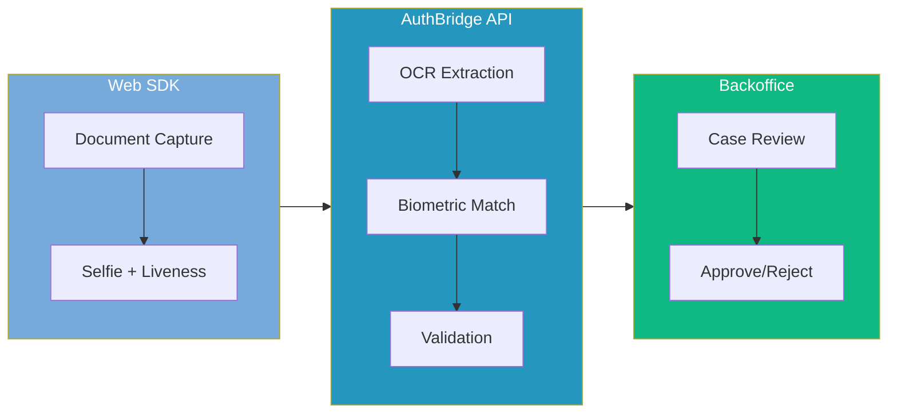

<div align="center">

# AuthBridge

**Botswana's Trusted Identity Verification Partner**

[](LICENSE)
[](https://nodejs.org/)
[](https://www.typescriptlang.org/)
[](https://pnpm.io/)
[](https://bitc.co.bw)

*Local expertise, enterprise standards, accessible to all.*

</div>

---

## Overview

AuthBridge is Botswana's first locally-focused identity verification platform, purpose-built to serve enterprises and mid-market businesses with compliant KYC/KYB verification. The platform delivers Botswana-specific capabilities including Omang verification, CIPA/BURS integration, and Data Protection Act 2024 compliance.

**#PushaBW** — AuthBridge proudly supports the national Buy Botswana initiative launched by BITC (Botswana Investment and Trade Centre) in 2018 under Brand Botswana. The campaign rallies Batswana to support local products, services, and businesses — reducing the national import bill and driving domestic investment. In 2023/24, #PushaBW helped achieve P3.58 billion in domestic investment. We're building local technology for local businesses because when you buy local, you create jobs, grow industries, and drive Botswana forward.



## Key Features

| Feature | Description |
|---------|-------------|
| **Omang Verification** | OCR extraction, format validation, and biometric matching for Botswana National ID |
| **KYB Verification** | CIPA registration and BURS TIN validation for business verification |
| **Embeddable Web SDK** | Svelte 5 SDK with document capture, selfie, and liveness detection |
| **Case Management** | React 19 dashboard for compliance officers to review and approve cases |
| **REST API** | Complete API with webhooks for custom integrations |
| **Data Residency** | AWS Cape Town (af-south-1) for African data sovereignty |
| **Compliance** | Data Protection Act 2024, FIA AML/KYC, Bank of Botswana aligned |

## Architecture

```
authbridge/
├── apps/
│   ├── backoffice/          # React 19 + Mantine 8 Case Management Dashboard
│   ├── docs/                # Documentation site
│   └── workflow-builder/    # Visual workflow editor
├── packages/
│   ├── common/              # Shared types and utilities
│   ├── config/              # Shared configurations
│   └── ui-components/       # Shared UI components
├── sdks/
│   └── web-sdk/             # Svelte 5 Embeddable Verification SDK
├── services/
│   └── backend/             # AWS Lambda + API Gateway Backend
└── infrastructure/          # CloudFormation & deployment scripts
```

## Tech Stack

| Layer | Technology |
|-------|------------|
| **Runtime** | Node.js 22 LTS, TypeScript 5.8 |
| **Frontend** | React 19.2 (Backoffice), Svelte 5.46 (SDK), Vite 7.2 |
| **Backend** | AWS Lambda, API Gateway, DynamoDB, S3 |
| **Auth** | AWS Cognito (passwordless: passkeys, email OTP) |
| **AI/ML** | AWS Textract (OCR), Rekognition (biometrics) |
| **Payments** | Dodo Payments (Merchant of Record) |
| **Monorepo** | Nx 22.1, pnpm 10.26 |

## Quick Start

### Prerequisites

- Node.js 22.x
- pnpm 10.x
- AWS CLI configured with af-south-1 access

### Installation

```bash
# Clone the repository
git clone https://github.com/emoaborern/authbridge.git
cd authbridge

# Install dependencies
pnpm install

# Set up environment variables
cp .env.example .env.local
# Edit .env.local with your AWS credentials and configuration
```

### Development

```bash
# Start the Backoffice dashboard
pnpm backoffice:dev

# Start the Web SDK development server
pnpm web-sdk:dev

# Run all tests
pnpm test

# Run E2E tests
pnpm e2e

# Run load tests (requires k6)
./scripts/load-test.sh smoke staging    # Quick validation
./scripts/load-test.sh load staging     # Standard load test
./scripts/load-test.sh all staging      # Run all test types
```

### Integration Tests

Integration tests require DynamoDB Local running on port 8000. See [Integration Test Setup Guide](services/verification/tests/integration/README.md) for detailed instructions.

```bash
# Quick start: Start DynamoDB Local
docker run -p 8000:8000 amazon/dynamodb-local

# Run integration tests
pnpm --filter @authbridge/verification-service test:integration

# Skip integration tests if DynamoDB Local not available
pnpm test -- --testPathIgnorePatterns=integration
```

### Load Testing

Load testing uses k6 to validate API performance under various load conditions. See [Load Testing Guide](docs/load-testing-guide.md) for comprehensive documentation.

```bash
# Install k6
brew install k6  # macOS
# or visit https://k6.io/docs/getting-started/installation/

# Run smoke test (1 min, 1 VU)
./scripts/load-test.sh smoke staging

# Run load test (5 min, 10-50 VUs)
./scripts/load-test.sh load staging

# Run stress test (10 min, 10-200 VUs)
./scripts/load-test.sh stress staging

# Run all test types
./scripts/load-test.sh all staging
```

**Performance Targets:**
- Health Check: p95 < 500ms
- Case List: p95 < 1000ms
- Approve/Reject: p95 < 2000ms
- Error Rate: < 5%

### Build

```bash
# Build all packages
pnpm build

# Build specific package
pnpm --filter @authbridge/backoffice build
pnpm --filter @authbridge/web-sdk build
```

## Web SDK Integration

### CDN

```html
<script src="https://sdk.authbridge.io/v1/authbridge.umd.js"></script>
<script>
  AuthBridge.init({
    clientId: 'your-client-id',
    onComplete: (result) => console.log('Verification complete:', result),
    onError: (error) => console.error('Verification error:', error)
  });

  AuthBridge.open();
</script>
```

### NPM

```bash
npm install @authbridge/web-sdk
```

```typescript
import { AuthBridge } from '@authbridge/web-sdk';

const authbridge = new AuthBridge({
  clientId: 'your-client-id',
  theme: {
    primaryColor: '#75AADB',
    logo: 'https://your-company.com/logo.png'
  }
});

authbridge.on('complete', (result) => {
  console.log('Verification complete:', result);
});

authbridge.open();
```

## API Usage

### Create Verification

```bash
curl -X POST https://api.authbridge.io/v1/verifications \
  -H "Authorization: Bearer YOUR_API_KEY" \
  -H "Content-Type: application/json" \
  -d '{
    "customerEmail": "customer@example.com",
    "documentType": "omang",
    "redirectUrl": "https://your-app.com/callback"
  }'
```

### Response

```json
{
  "data": {
    "verificationId": "vrf_abc123",
    "sdkUrl": "https://sdk.authbridge.io/v/vrf_abc123",
    "sessionToken": "sess_xyz789",
    "expiresAt": "2026-01-13T11:00:00Z"
  },
  "meta": {
    "requestId": "req_def456",
    "timestamp": "2026-01-13T10:00:00Z"
  }
}
```

### Webhooks

Configure webhook endpoints to receive real-time status updates:

```json
{
  "event": "verification.approved",
  "data": {
    "verificationId": "vrf_abc123",
    "status": "approved",
    "customerName": "MOEPSWA EDMOND",
    "omangNumber": "123456789",
    "biometricScore": 92
  },
  "timestamp": "2026-01-13T10:30:00Z"
}
```

## Documentation

| Document | Description |
|----------|-------------|
| [Architecture](/_bmad-output/planning-artifacts/architecture.md) | Technical architecture and ADRs |
| [UX Design Spec](/_bmad-output/planning-artifacts/ux-design-spec.md) | Complete UI/UX specifications |
| [Epics & Stories](/_bmad-output/planning-artifacts/epics.md) | Implementation breakdown |
| [Product Brief](/_bmad-output/planning-artifacts/product-brief-AuthBridge-2026-01-13.md) | Business strategy and roadmap |
| [PRD](/_bmad-output/planning-artifacts/prd.md) | Complete product requirements |

## Pricing (BWP)

| Tier | Monthly | Included | Per-Check | Overage |
|------|---------|----------|-----------|---------|
| **Starter** | P750 | 50 verifications | P15 | P20 |
| **Professional** | P2,500 | 200 verifications | P12.50 | P18 |
| **Business** | P7,500 | 750 verifications | P10 | P15 |
| **Enterprise** | P25,000+ | 3,000+ verifications | P8.33 | P12 |
| **Pay-As-You-Go** | - | - | P25 | - |

All tiers maintain 90%+ profit margins. Payments via Dodo Payments with Adaptive Currency (BWP).

## Compliance

AuthBridge is designed for regulatory compliance in Botswana:

- **Data Protection Act 2024** — 72-hour breach notification, DPO support
- **FIA AML/KYC** — 5-year data retention, audit trails
- **Bank of Botswana** — Fintech Sandbox participant
- **NBFIRA** — Non-bank financial institution compliance

## National Development Alignment

AuthBridge is strategically aligned with Botswana's Vision 2036 and NDP 12:

| National Priority | AuthBridge Alignment |
|-------------------|---------------------|
| Digital transformation | Core enabler of digital services |
| Knowledge-based economy | Local tech IP creation |
| Financial inclusion | Enables digital financial services |
| Economic diversification | Non-diamond tech sector |
| Job creation | Tech jobs, internships, fellowships |

## Long-Term Vision: AuthBridge Impact

When profitable, AuthBridge commits to giving back:

- **AuthBridge Launchpad** — Startup credits program (Year 3+)
- **Fellowship Program** — Annual fellowships for top graduates
- **Talent Development** — Paid internships, graduate programs
- **Government Partnerships** — Support national digital transformation

## Contributing

Contributions welcome! Please see [CONTRIBUTING.md](CONTRIBUTING.md) for guidelines.

## License

This project is licensed under the MIT License — see the [LICENSE](LICENSE) file for details.

---

<div align="center">

**[#PushaBW](https://brandbotswana.co.bw/living-the-brand/) 🇧🇼**

*"Pusha" = support, encourage, drive forward*

**Built in Botswana by Edmond Moepswa**

[Website](https://authbridge.io) · [Documentation](https://docs.authbridge.io) · [API Reference](https://api.authbridge.io/docs)

</div>
