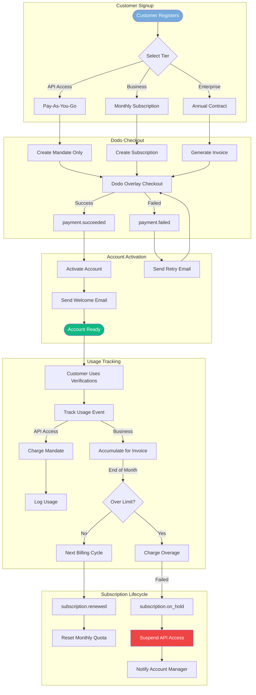
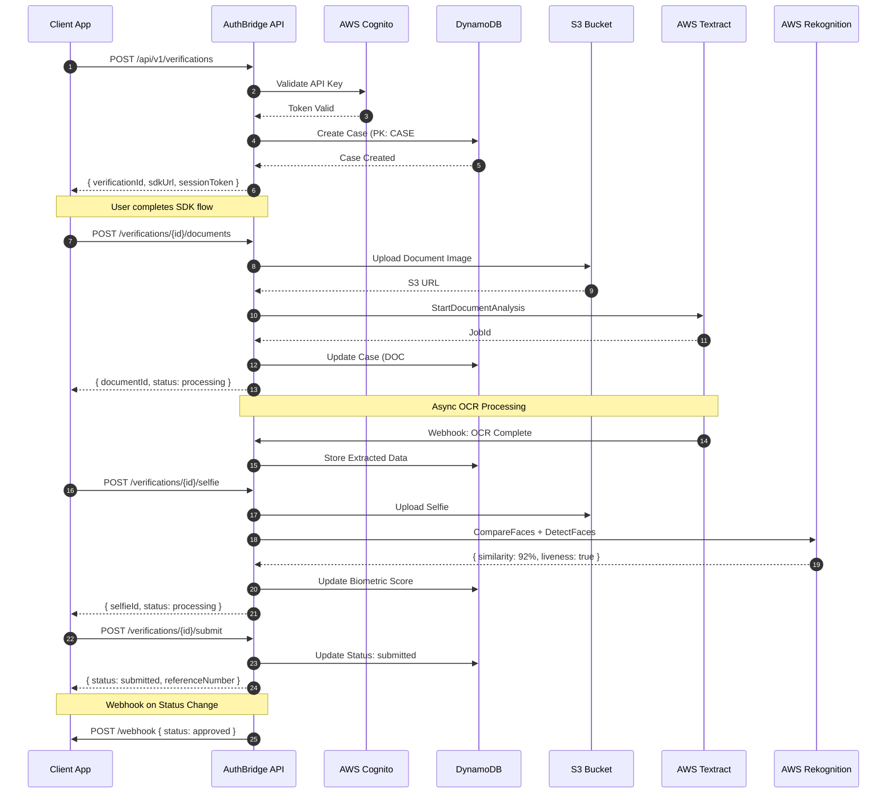
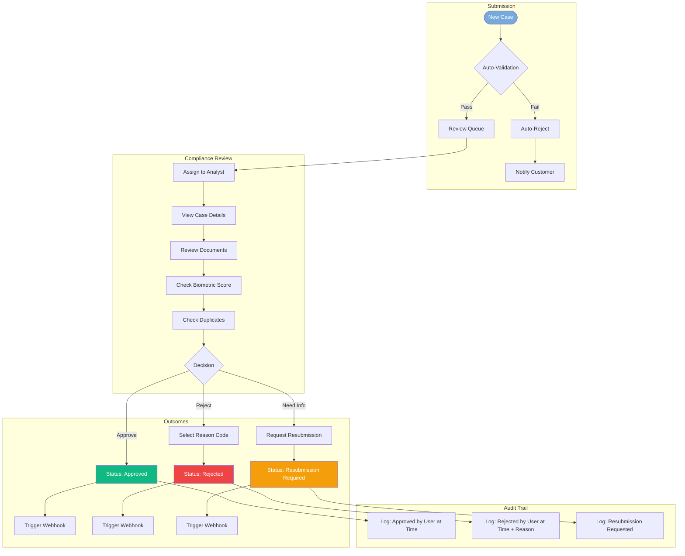

# Architecture Decision Document - AuthBridge

**Botswana's Trusted Identity Verification Partner**

---

## Document Control

| Version | Date | Author | Changes |
|---------|------|--------|---------|
| 1.0 | 2026-01-13 | Winston (Architect) | Complete architecture document |
| 1.1 | 2026-01-16 | Bob (SM Agent) | Added documentation references, JWT implementation notes |

---

## Table of Contents

1. [Project Context Analysis](#project-context-analysis)
2. [Technology Stack & Versions](#technology-stack--versions)
3. [Core Architectural Decisions](#core-architectural-decisions)
4. [Implementation Patterns & Consistency Rules](#implementation-patterns--consistency-rules)
5. [Project Structure & Boundaries](#project-structure--boundaries)
6. [Architecture Validation Results](#architecture-validation-results)
7. [Architecture Completion Summary](#architecture-completion-summary)

---

## 1. Project Context Analysis

### Requirements Overview

**Functional Requirements:**

AuthBridge is a dual-track identity verification platform serving:
- **Enterprise Track (60%):** Banks, insurance, government with annual contracts (P200K-1M/year)
- **Mid-Market Subscription Track (40%):** Tiered subscriptions (P750-P25,000+/month)

**Core Capabilities:**
- KYC Verification (Omang, Passport, Driver's License)
- KYB Verification (CIPA, BURS integration)
- Case Management Dashboard (Backoffice)
- Embeddable Web SDK
- REST API with webhooks
- White-label solutions for enterprise

**Non-Functional Requirements:**
- **Performance:** API response <500ms (p95), SDK load <2s
- **Scalability:** 10K verifications/month initially → 100K by Year 2
- **Security:** Data Protection Act 2024 compliant, 72-hour breach notification
- **Data Residency:** AWS Cape Town (af-south-1) mandatory
- **Availability:** 99.5% uptime SLA
- **Compliance:** FIA AML/KYC, Bank of Botswana, NBFIRA

### Scale & Complexity Assessment

- **Project Complexity:** HIGH (enterprise-grade, multi-tenant, regulatory compliance)
- **Primary Domain:** Full-stack identity verification platform
- **Technical Domain:** Serverless AWS architecture with React/Svelte frontends
- **Estimated Components:** 15+ major architectural components

### Technical Constraints & Dependencies

1. **Brownfield Project:** Built on Ballerine open-source platform (existing codebase)
2. **Monorepo Structure:** Nx workspace with pnpm
3. **AWS Region Lock:** af-south-1 (Cape Town) for data residency
4. **Runtime Constraint:** AWS Lambda Node.js 22+ (Node.js 18 EOL March 2026)
5. **Existing Tech:** React 18 + Mantine UI (Backoffice), Svelte (Web SDK)

### Cross-Cutting Concerns

- **Authentication:** AWS Cognito with passwordless support (passkeys, email OTP)
- **Authorization:** Casbin RBAC for role-based access control
- **Audit Logging:** Complete audit trail for compliance (5-year retention)
- **Error Handling:** Standardized error responses across all services
- **Monitoring:** CloudWatch metrics, alarms, and dashboards
- **Localization:** English (UK) default, Setswana support (Phase 2)

---

## 2. Technology Stack & Versions

### Runtime & Language (LATEST VERSIONS - January 2026)

| Technology | Version | Rationale |
|------------|---------|-----------|
| **Node.js** | 22.21.x LTS | AWS Lambda supported, Node.js 18 EOL March 2026 |
| **TypeScript** | 5.8.x | Latest stable, improved type inference |
| **pnpm** | 10.26.x | Workspace management, security improvements |
| **Nx** | 22.1.x | Monorepo orchestration, caching |

### Frontend Stack

| Technology | Version | Usage |
|------------|---------|-------|
| **React** | 19.2.x | Backoffice dashboard |
| **Svelte** | 5.46.x | Web SDK (embeddable) |
| **Vite** | 7.2.x | Build tooling (Rolldown bundler) |
| **Mantine** | 8.3.x | UI component library (Backoffice) |
| **Refine** | 5.x | Admin panel framework |
| **TanStack Query** | 5.x | Data fetching & caching |

### Backend Stack

| Technology | Version | Usage |
|------------|---------|-------|
| **AWS Lambda** | Node.js 22 runtime | Serverless compute |
| **API Gateway** | REST API | API management |
| **DynamoDB** | On-demand | Primary database |
| **S3** | Standard | Document storage |
| **Cognito** | User Pools v3.12 | Authentication |
| **Textract** | Latest | OCR for documents |
| **Rekognition** | Face Liveness | Biometric verification |

### Infrastructure & DevOps

| Technology | Version | Usage |
|------------|---------|-------|
| **Serverless Framework** | 4.x | IaC deployment |
| **AWS SDK** | v3 | AWS service integration |
| **Netlify** | Latest | Frontend hosting |
| **CloudFront** | Latest | CDN for SDK |
| **CloudWatch** | Latest | Monitoring & logging |

### Testing & Quality

| Technology | Version | Usage |
|------------|---------|-------|
| **Vitest** | 4.x | Unit testing |
| **Playwright** | Latest | E2E testing |
| **ESLint** | 9.x | Linting |
| **Prettier** | 3.x | Code formatting |

---

## 3. Core Architectural Decisions

### ADR-001: AWS Serverless Architecture

**Decision:** Use AWS serverless services (Lambda, API Gateway, DynamoDB, S3) for all backend infrastructure.

**Rationale:**
- Cost-effective for variable workloads (pay-per-use)
- Auto-scaling without infrastructure management
- AWS free tier optimization for Year 1
- af-south-1 (Cape Town) availability for data residency

**Consequences:**
- Cold start latency (~1s) acceptable for verification workflows
- DynamoDB single-table design required for efficiency
- Lambda 15-minute timeout sufficient for all operations

### ADR-002: Node.js 22 Runtime

**Decision:** Use Node.js 22 LTS for all Lambda functions.

**Rationale:**
- AWS Lambda Node.js 18 EOL: March 9, 2026
- Node.js 22 LTS supported until April 2027
- Performance improvements over Node.js 18
- Native fetch API, improved ESM support

**Migration Required:**
- Update all Lambda functions from Node.js 18 → 22
- Update Serverless Framework runtime configuration
- Test all dependencies for Node.js 22 compatibility

### ADR-003: DynamoDB Single-Table Design

**Decision:** Use single-table design pattern for DynamoDB.

**Rationale:**
- Minimizes read/write operations (cost optimization)
- Enables efficient access patterns with GSIs
- Supports all entity types (Users, Cases, Documents, Audit)
- On-demand billing scales with usage

**Entity Patterns:**
```
PK: USER#<userId>     SK: PROFILE
PK: CASE#<caseId>     SK: META
PK: CASE#<caseId>     SK: DOC#<docId>
PK: AUDIT#<date>      SK: <timestamp>#<eventId>
```

**Global Secondary Indexes:**
- GSI1: User's cases sorted by date
- StatusIndex: Cases by status for dashboard queries

**Entity Relationship Diagram:**

```mermaid
erDiagram
    USER ||--o{ CASE : creates
    CASE ||--|{ DOCUMENT : contains
    CASE ||--o{ NOTE : has
    CASE ||--|{ AUDIT : generates
    USER ||--o{ AUDIT : performs
    CLIENT ||--o{ USER : employs
    CLIENT ||--o{ CASE : owns

    USER {
        string PK "USER#userId"
        string SK "PROFILE"
        string email
        string name
        string role "admin|analyst|reviewer"
        string clientId
        datetime createdAt
        datetime lastLogin
    }

    CASE {
        string PK "CASE#caseId"
        string SK "META"
        string GSI1PK "CLIENT#clientId"
        string GSI1SK "2026-01-13#caseId"
        string status "pending|approved|rejected"
        string customerName
        string omangNumber "encrypted"
        string documentType
        number biometricScore
        string assigneeId
        datetime createdAt
        datetime updatedAt
    }

    DOCUMENT {
        string PK "CASE#caseId"
        string SK "DOC#docId"
        string type "omang_front|omang_back|selfie"
        string s3Key
        json ocrData
        number confidence
        datetime uploadedAt
    }

    AUDIT {
        string PK "AUDIT#date"
        string SK "timestamp#eventId"
        string GSI1PK "USER#userId"
        string GSI1SK "timestamp"
        string action "CASE_CREATED|APPROVED|REJECTED"
        string resourceId
        string ipAddress
        json metadata
    }

    NOTE {
        string PK "CASE#caseId"
        string SK "NOTE#timestamp"
        string authorId
        string content
        datetime createdAt
    }

    CLIENT {
        string PK "CLIENT#clientId"
        string SK "PROFILE"
        string companyName
        string tier "api_access|business|enterprise"
        string webhookUrl
        string apiKeyHash
        datetime createdAt
    }
```

### ADR-004: AWS Cognito with Passwordless Authentication

**Decision:** Use AWS Cognito User Pools with passwordless authentication support.

**Rationale:**
- Native AWS integration with Lambda authorizers
- Passwordless support (passkeys, email OTP) - November 2024 feature
- FIDO2/WebAuthn for phishing-resistant authentication
- Managed MFA and security features

**Configuration:**
- Passkey authentication enabled
- Email OTP as fallback
- JWT tokens for API authentication
- 1-hour access token expiry

### ADR-004a: Email Delivery Strategy (Budget Constraints)

**Decision:** Use phased email delivery approach based on domain availability.

**Phase 1: MVP (No Custom Domain)**
- **Email Provider:** Cognito Default Email
- **Sender:** `no-reply@verificationemail.com` (AWS managed)
- **Limit:** 50 emails/day
- **Cost:** FREE
- **Use Case:** Pilot customers, development, testing

**Phase 2: Post-Funding (Custom Domain)**
- **Domain:** Purchase via Route 53 (~$3-12/year, payable with AWS credits)
- **Email Provider:** AWS SES (production mode)
- **Sender:** `noreply@authbridge.click` (or chosen domain)
- **Cost:** ~$0.10 per 1,000 emails
- **Unlocks:** Branded emails, higher limits, better deliverability

**Cognito Configuration (Phase 1):**
```yaml
EmailConfiguration:
  EmailSendingAccount: COGNITO_DEFAULT
```

**Cognito Configuration (Phase 2):**
```yaml
EmailConfiguration:
  EmailSendingAccount: DEVELOPER
  SourceArn: arn:aws:ses:af-south-1:ACCOUNT:identity/noreply@authbridge.io
  From: AuthBridge <noreply@authbridge.io>
```

**Note:** AWS credits (~$1,000) can be used for Route 53 domain registration and SES usage.

### ADR-004b: Hosting & Domain Strategy

**Decision:** Use `authbridge.io` domain (Route 53) with phased migration to `.co.bw` when funded.

**Domain Strategy:**
| Phase | Domain | Cost | Notes |
|-------|--------|------|-------|
| Phase 1 (MVP) | `authbridge.io` | $39/yr | Tech credibility, AWS credits |
| Phase 2 (Funded) | `authbridge.co.bw` | P200/yr | Local TLD, Webmart.co.bw |

**Phase 1: MVP URLs (authbridge.io)**
- **Backoffice:** `app.authbridge.io`
- **Web SDK CDN:** `sdk.authbridge.io`
- **API Gateway:** `api.authbridge.io`
- **Docs:** `docs.authbridge.io`
- **SSL:** Automatic via ACM (free)

**Phase 2: Post-Funding (authbridge.co.bw)**
- **Backoffice:** `app.authbridge.co.bw`
- **Web SDK CDN:** `sdk.authbridge.co.bw`
- **API Gateway:** `api.authbridge.co.bw`
- **Docs:** `docs.authbridge.co.bw`
- **Redirect:** `authbridge.io` → `authbridge.co.bw`

**Why `.io` for MVP:**
- Strong tech/startup credibility
- Available on Route 53 (payable with AWS credits)
- `authbridge.com` is taken by Indian competitor
- Consistent renewal pricing ($39/yr)
- Natural migration path to `.co.bw` when funded

**Route 53 Configuration:**
- Hosted Zone: `authbridge.io` ($0.50/month)
- DNS Records: A/AAAA for subdomains
- Total Annual Cost: ~$45 (domain + hosted zone)

### ADR-005: Casbin RBAC Authorization

**Decision:** Use Casbin for role-based access control.

**Rationale:**
- Flexible policy-based authorization
- Supports complex permission models
- Works with existing Ballerine codebase
- Audit-friendly permission logging

**Roles:**
- `admin`: Full system access
- `analyst`: Case review and approval
- `reviewer`: View cases, add notes
- `api_user`: API access only

### ADR-006: AWS Rekognition for Biometrics

**Decision:** Use AWS Rekognition Face Liveness for biometric verification.

**Rationale:**
- Detects spoofs (photos, videos, 3D masks, deepfakes)
- Confidence score (0-100) for liveness
- Reference image for face comparison
- Available in af-south-1 region

**Integration:**
- Face Liveness check during selfie capture
- CompareFaces for ID photo matching
- 80% confidence threshold for approval

### ADR-007: AWS Textract for OCR

**Decision:** Use AWS Textract for document OCR extraction.

**Rationale:**
- ML-powered text extraction
- Form and table detection
- Identity document support
- Async processing for multi-page documents

**Pricing:** $1.50 per 1,000 pages (text extraction)

### ADR-007a: Country-Based Document Extractor Architecture

**Decision:** Implement a country-based extractor architecture to support regional expansion with country-specific document formats.

**Rationale:**
- Different countries have different document formats (e.g., Botswana Omang vs South Africa ID)
- Driver's licences and passports vary significantly by country
- Enables clean separation of country-specific logic
- Supports phased regional expansion (SADC region)
- Allows for country-specific validation rules and field patterns

**Architecture:**
```
src/extractors/
├── types.ts              # Common types and interfaces
├── registry.ts           # Extractor registry
├── index.ts              # Public exports
└── botswana/             # Botswana-specific extractors
    ├── index.ts
    ├── types.ts          # Botswana-specific types
    ├── omang-extractor.ts
    ├── drivers-licence-extractor.ts
    └── passport-extractor.ts
```

**Extractor Interface:**
```typescript
interface DocumentExtractor<T extends ExtractedDocumentFields> {
  readonly country: SupportedCountry;
  readonly documentType: DocumentType;
  readonly requiredFields: string[];
  extract(blocks: TextractBlock[]): ExtractionResult<T>;
  validate(fields: T): { valid: boolean; errors: string[] };
}
```

**Registry Pattern:**
```typescript
// Get extractor for specific country/document
const extractor = getExtractor('BW', 'passport');
const result = extractor.extract(textractBlocks);

// Check if extractor exists
if (hasExtractor('ZA', 'national_id')) { ... }

// Get all supported countries
const countries = getSupportedCountries(); // ['BW']
```

**Currently Supported (Botswana - BW):**
- `national_id` - Omang (National Identity Card)
- `drivers_licence` - Botswana Driver's Licence
- `passport` - Botswana Passport (ICAO TD3 with MRZ)

**Regional Expansion Roadmap:**
| Phase | Country | Code | Priority | Rationale |
|-------|---------|------|----------|-----------|
| Phase 1 (MVP) | Botswana | BW | ✅ Done | Home market |
| Phase 2 (Year 2) | South Africa | ZA | HIGH | Largest SADC economy, clear regulations |
| Phase 2 (Year 2) | Namibia | NA | HIGH | Close ties, similar legal framework |
| Phase 3 (Year 3) | Zimbabwe | ZW | MEDIUM | Large population, growing fintech |
| Phase 3 (Year 3) | Zambia | ZM | MEDIUM | Regional hub, stable regulations |

**Country Selection Criteria:**
1. Target market alignment (SADC region)
2. Population size and economic activity
3. Country reputation and stability
4. Regulatory clarity (clear KYC/AML laws)
5. Risk profile (fraud, sanctions)
6. Document standardization

### ADR-008: React 19 + Mantine 8 for Backoffice

**Decision:** Upgrade Backoffice to React 19.2 and Mantine 8.3.

**Rationale:**
- React 19 stable since December 2024
- React Compiler for automatic optimization
- Mantine 8 released May 2025 with React 19 support
- Refine 5 supports React 19 and TanStack Query v5

**Migration Required:**
- Upgrade React 18 → 19.2
- Upgrade Mantine 7 → 8.3
- Upgrade Refine 4 → 5
- Update TanStack Query to v5

### ADR-009: Svelte 5 for Web SDK

**Decision:** Upgrade Web SDK to Svelte 5.46.

**Rationale:**
- Svelte 5 stable since October 2024
- Runes for simplified reactivity
- Smaller bundle size (<200KB target)
- Better TypeScript support

**Migration Required:**
- Migrate from Svelte 4 stores to Svelte 5 runes
- Update component syntax for Svelte 5
- Test all SDK flows

### ADR-010: Vite 7 with Rolldown

**Decision:** Upgrade to Vite 7.2 with Rolldown bundler.

**Rationale:**
- Rolldown (Rust-based) significantly faster builds
- ESM-first Node.js support
- Baseline browser targeting
- Better tree-shaking

**Configuration:**
- Target: ES2022 baseline
- Chunk splitting for optimal loading
- Source maps for debugging

### ADR-011: Dodo Payments Integration (Payment Processing)

**Decision:** Use Dodo Payments as Merchant of Record (MoR) for all payment processing, billing, and subscription management.

**Rationale:**
- **Merchant of Record:** Dodo handles tax compliance, chargebacks, and legal seller responsibility
- **BWP Support:** Adaptive Currency displays prices in Botswana Pula (min 15 BWP)
- **Usage-Based Billing:** Native support for pay-per-verification model
- **Customer Credits:** Built-in system for AuthBridge Launchpad startup program
- **No PCI Compliance Required:** Dodo handles all payment security
- **TypeScript SDK:** Native integration with Node.js backend

**Pricing Model Mapping:**

| AuthBridge Tier | Dodo Product Type | Billing Model | Price (BWP) |
|-----------------|-------------------|---------------|-------------|
| Starter | Subscription | Monthly (50 verifications) | P750/month |
| Professional | Subscription | Monthly (200 verifications) | P2,500/month |
| Business | Subscription | Monthly (750 verifications) | P7,500/month |
| Enterprise | Subscription | Annual contract (3,000+) | P25,000+/month |
| Pay-As-You-Go | On-Demand | Per-verification | P25/verification |
| Launchpad | Customer Credits | Credit allocation | Subsidized |

**Key Features Used:**

1. **Adaptive Currency (BWP)**
   - Prices display in Pula for Botswana customers
   - Customer pays in BWP, settlement in USD
   - 2-4% FX fee charged to customer

2. **Subscription Tiers with Overage**
   ```typescript
   // Create subscription for Professional tier customer
   const subscription = await client.subscriptions.create({
     product_id: "authbridge_professional",
     billing_currency: "BWP",
     customer: { email: customer.email, name: customer.name }
   });

   // Charge overage at end of billing period
   if (verificationsUsed > 200) {
     const overage = verificationsUsed - 200;
     await client.subscriptions.charge(subscription.subscription_id, {
       product_price: overage * 1800,  // P18 per overage verification
       product_description: `${overage} overage verifications`
     });
   }
   ```

3. **Usage-Based Billing (Event Ingestion)**
   ```typescript
   // Track each verification as billable event
   await fetch('https://api.dodopayments.com/events/ingest', {
     method: 'POST',
     headers: { 'Authorization': `Bearer ${DODO_API_KEY}` },
     body: JSON.stringify({
       events: [{
         event_id: `verification_${caseId}`,
         customer_id: customerId,
         event_name: "verification.completed",
         metadata: { verification_type: "omang", result: "approved" }
       }]
     })
   });
   ```

4. **Customer Credits (Launchpad Program)**
   ```typescript
   // Award startup credits
   await client.customers.credits.add(customerId, {
     amount: 50000,  // P500 in credits
     currency: "USD",
     reason: "AuthBridge Launchpad - Startup Grant"
   });
   ```

5. **Discount Codes**
   - `LAUNCH2026`: 20% off first 3 months
   - `ENTERPRISE50`: P50,000 off annual contracts
   - `REFERRAL15`: 15% off for referrals

6. **Customer Portal**
   - Self-service billing management
   - Invoice history and downloads
   - Payment method updates
   - Subscription management

**Webhook Events to Handle:**
- `payment.succeeded` → Activate account, send welcome email
- `payment.failed` → Notify account manager, send retry email
- `subscription.renewed` → Reset monthly quotas
- `subscription.on_hold` → Suspend API access, notify customer
- `subscription.cancelled` → Deactivate account
- `dispute.opened` → Alert compliance team

**Integration Architecture (Mermaid):**



**Dodo Products to Create:**

| Product Name | Type | Price (BWP) | Included | Overage |
|--------------|------|-------------|----------|---------|
| Starter | Subscription | P750/month | 50 verifications | P20/verification |
| Professional | Subscription | P2,500/month | 200 verifications | P18/verification |
| Business | Subscription | P7,500/month | 750 verifications | P15/verification |
| Enterprise | Subscription | P25,000+/month | 3,000+ verifications | P12/verification |
| Pay-As-You-Go | On-Demand | P25/verification | N/A | N/A |

**Pricing Rationale:**
- All tiers maintain 90%+ profit margins
- Competitive vs global providers (Sumsub $1.85 = P26, Veriff $0.80 = P11)
- Matches SA Home Affairs peak pricing (R10 = ~P10) at Business tier
- BWP pricing via Dodo Adaptive Currency (min P15 per transaction)

**Analytics & Reporting:**
- Built-in MRR/ARR tracking
- Churn rate monitoring
- Customer lifetime value (CLTV)
- Revenue by tier breakdown
- Payment success/failure rates

**Cost Structure:**
- Platform fee: 4% + 40¢ per transaction
- Subscription fee: +0.5%
- Adaptive Currency: 0% (customer pays 2-4% FX)
- Payouts: Free (if >$1000)

---

## 4. Implementation Patterns & Consistency Rules

### Naming Conventions

**Database Naming:**
| Element | Convention | Example |
|---------|------------|---------|
| Table name | PascalCase | `AuthBridgeTable` |
| Partition key | SCREAMING_SNAKE | `PK`, `GSI1PK` |
| Sort key | SCREAMING_SNAKE | `SK`, `GSI1SK` |
| Attributes | camelCase | `userId`, `createdAt` |
| Entity prefix | SCREAMING_SNAKE | `USER#`, `CASE#`, `DOC#` |

**API Naming:**
| Element | Convention | Example |
|---------|------------|---------|
| Endpoints | kebab-case, plural | `/api/v1/verifications` |
| Route params | camelCase | `/cases/:caseId` |
| Query params | camelCase | `?status=pending&limit=20` |
| Headers | Title-Case | `X-Request-Id`, `Authorization` |

**Code Naming:**
| Element | Convention | Example |
|---------|------------|---------|
| Components | PascalCase | `CaseDetailView.tsx` |
| Files (React) | PascalCase | `UserCard.tsx` |
| Files (Svelte) | PascalCase | `DocumentCapture.svelte` |
| Functions | camelCase | `getUserById()` |
| Constants | SCREAMING_SNAKE | `MAX_FILE_SIZE` |
| Types/Interfaces | PascalCase | `VerificationCase` |

### API Response Patterns

**Success Response:**
```json
{
  "data": { ... },
  "meta": {
    "requestId": "req_abc123",
    "timestamp": "2026-01-13T10:00:00Z"
  }
}
```

**Error Response:**
```json
{
  "error": {
    "code": "VALIDATION_ERROR",
    "message": "Invalid Omang number format",
    "details": [
      { "field": "omangNumber", "message": "Must be 9 digits" }
    ]
  },
  "meta": {
    "requestId": "req_abc123",
    "timestamp": "2026-01-13T10:00:00Z"
  }
}
```

**HTTP Status Codes:**
| Code | Usage |
|------|-------|
| 200 | Success (GET, PUT) |
| 201 | Created (POST) |
| 204 | No Content (DELETE) |
| 400 | Validation Error |
| 401 | Unauthorized |
| 403 | Forbidden |
| 404 | Not Found |
| 429 | Rate Limited |
| 500 | Internal Error |

### Date/Time Patterns

- **Storage:** ISO 8601 UTC (`2026-01-13T10:00:00.000Z`)
- **Display (Botswana):** `DD/MM/YYYY HH:mm` (24-hour)
- **API Response:** ISO 8601 strings
- **Timezone:** Africa/Gaborone (UTC+2)

### Error Handling Patterns

**Lambda Error Handler:**
```typescript
export const errorHandler = (error: Error): APIGatewayProxyResult => {
  const requestId = context.awsRequestId;

  if (error instanceof ValidationError) {
    return { statusCode: 400, body: JSON.stringify({ error: { code: 'VALIDATION_ERROR', message: error.message }, meta: { requestId } }) };
  }

  // Log and return generic error
  console.error('Unhandled error:', error);
  return { statusCode: 500, body: JSON.stringify({ error: { code: 'INTERNAL_ERROR', message: 'An unexpected error occurred' }, meta: { requestId } }) };
};
```

### Logging Patterns

**Structured JSON Logging:**
```json
{
  "level": "INFO",
  "message": "Verification submitted",
  "timestamp": "2026-01-13T10:00:00.000Z",
  "requestId": "req_abc123",
  "userId": "user_123",
  "caseId": "case_456",
  "action": "VERIFICATION_SUBMIT"
}
```

**Log Levels:**
- `ERROR`: Failures requiring attention
- `WARN`: Potential issues
- `INFO`: Business events (audit trail)
- `DEBUG`: Development debugging (disabled in prod)

### Testing Patterns

**Test File Location:** Co-located with source
```
src/
  components/
    CaseCard/
      CaseCard.tsx
      CaseCard.test.tsx
      CaseCard.stories.tsx
```

**Test Naming:**
```typescript
describe('CaseCard', () => {
  it('should render case status badge', () => { ... });
  it('should call onApprove when approve button clicked', () => { ... });
});
```

---

## 5. Project Structure & Boundaries

### Complete Project Directory Structure

```
authbridge/
├── .github/
│   └── workflows/
│       ├── ci.yml
│       ├── deploy-staging.yml
│       └── deploy-production.yml
├── .kiro/
│   └── steering/
├── _bmad-output/
│   └── planning-artifacts/
├── apps/
│   ├── backoffice/                    # React 19 Admin Dashboard
│   │   ├── src/
│   │   │   ├── app/
│   │   │   │   ├── layout.tsx
│   │   │   │   ├── page.tsx
│   │   │   │   └── globals.css
│   │   │   ├── components/
│   │   │   │   ├── ui/               # Mantine-based UI components
│   │   │   │   ├── cases/            # Case management components
│   │   │   │   ├── documents/        # Document viewer components
│   │   │   │   └── dashboard/        # Dashboard widgets
│   │   │   ├── features/
│   │   │   │   ├── auth/             # Authentication flows
│   │   │   │   ├── cases/            # Case management
│   │   │   │   ├── users/            # User management
│   │   │   │   └── reports/          # Reporting & analytics
│   │   │   ├── hooks/
│   │   │   ├── lib/
│   │   │   │   ├── api.ts            # API client
│   │   │   │   ├── auth.ts           # Auth utilities
│   │   │   │   └── utils.ts
│   │   │   ├── providers/
│   │   │   │   ├── AuthProvider.tsx
│   │   │   │   └── QueryProvider.tsx
│   │   │   └── types/
│   │   ├── public/
│   │   ├── package.json
│   │   ├── vite.config.ts
│   │   └── tsconfig.json
│   ├── docs/                          # Documentation site
│   └── workflow-builder/              # Workflow UI
├── packages/
│   ├── common/                        # Shared utilities
│   │   ├── src/
│   │   │   ├── types/
│   │   │   │   ├── case.ts
│   │   │   │   ├── document.ts
│   │   │   │   ├── user.ts
│   │   │   │   └── verification.ts
│   │   │   ├── utils/
│   │   │   │   ├── omang.ts          # Omang validation
│   │   │   │   ├── cipa.ts           # CIPA validation
│   │   │   │   └── date.ts
│   │   │   └── constants/
│   │   └── package.json
│   ├── config/                        # Shared configurations
│   └── ui-components/                 # Shared UI components
├── sdks/
│   └── web-sdk/                       # Svelte 5 Embeddable SDK
│       ├── src/
│       │   ├── lib/
│       │   │   ├── components/
│       │   │   │   ├── Welcome.svelte
│       │   │   │   ├── DocumentSelect.svelte
│       │   │   │   ├── DocumentCapture.svelte
│       │   │   │   ├── SelfieCapture.svelte
│       │   │   │   ├── Review.svelte
│       │   │   │   └── Complete.svelte
│       │   │   ├── stores/
│       │   │   │   ├── verification.svelte.ts
│       │   │   │   └── camera.svelte.ts
│       │   │   ├── utils/
│       │   │   │   ├── camera.ts
│       │   │   │   ├── image.ts
│       │   │   │   └── api.ts
│       │   │   └── types/
│       │   ├── AuthBridge.svelte      # Main SDK component
│       │   └── index.ts               # SDK entry point
│       ├── package.json
│       ├── vite.config.ts
│       └── tsconfig.json
├── services/
│   └── backend/                       # AWS Lambda Backend
│       ├── src/
│       │   ├── handlers/
│       │   │   ├── auth/
│       │   │   │   ├── login.ts
│       │   │   │   ├── register.ts
│       │   │   │   └── refresh.ts
│       │   │   ├── verifications/
│       │   │   │   ├── create.ts
│       │   │   │   ├── submit.ts
│       │   │   │   ├── status.ts
│       │   │   │   └── webhook.ts
│       │   │   ├── cases/
│       │   │   │   ├── list.ts
│       │   │   │   ├── get.ts
│       │   │   │   ├── approve.ts
│       │   │   │   └── reject.ts
│       │   │   ├── documents/
│       │   │   │   ├── upload.ts
│       │   │   │   ├── process.ts
│       │   │   │   └── presign.ts
│       │   │   └── users/
│       │   │       ├── list.ts
│       │   │       ├── create.ts
│       │   │       └── update.ts
│       │   ├── services/
│       │   │   ├── ocr.ts            # Textract integration
│       │   │   ├── biometrics.ts     # Rekognition integration
│       │   │   ├── omang.ts          # Omang verification
│       │   │   └── notification.ts   # Webhook delivery
│       │   ├── repositories/
│       │   │   ├── case.ts
│       │   │   ├── document.ts
│       │   │   ├── user.ts
│       │   │   └── audit.ts
│       │   ├── middleware/
│       │   │   ├── auth.ts
│       │   │   ├── validation.ts
│       │   │   └── logging.ts
│       │   ├── lib/
│       │   │   ├── dynamodb.ts
│       │   │   ├── s3.ts
│       │   │   ├── cognito.ts
│       │   │   └── errors.ts
│       │   └── types/
│       ├── serverless.yml
│       ├── package.json
│       └── tsconfig.json
├── infrastructure/
│   ├── cloudformation/
│   │   ├── dynamodb.yml
│   │   ├── s3.yml
│   │   ├── cognito.yml
│   │   └── iam.yml
│   └── scripts/
│       ├── deploy.sh
│       └── seed-data.ts
├── nx.json
├── package.json
├── pnpm-workspace.yaml
├── tsconfig.base.json
└── README.md
```

### Architectural Boundaries

**API Boundaries:**



**Case Management Workflow:**



**Omang Processing Pipeline:**

```mermaid
flowchart LR
    subgraph Upload["1. Upload"]
        Image([Omang Image]) --> Compress[Compress < 1MB]
        Compress --> S3[Store in S3]
        S3 --> Encrypt[Encrypt at Rest]
    end

    subgraph OCR["2. OCR Extraction"]
        Encrypt --> Textract[AWS Textract]
        Textract --> Extract[Extract Fields]
        Extract --> Fields[Name, Omang#, DOB, Address, Expiry]
        Fields --> Confidence[Confidence Scores]
    end

    subgraph Validation["3. Validation"]
        Confidence --> Format{Format Valid?}
        Format --> |9 digits| Checksum{Checksum Valid?}
        Format --> |Invalid| FailFormat[Fail: Invalid Format]

        Checksum --> |Pass| Expiry{Not Expired?}
        Checksum --> |Fail| FailChecksum[Fail: Invalid Checksum]

        Expiry --> |Valid| Duplicate{Duplicate Check}
        Expiry --> |Expired| FailExpiry[Fail: Document Expired]

        Duplicate --> |New| PassValidation[Validation Passed]
        Duplicate --> |Found| FlagDupe[Flag: Duplicate Omang]
    end

    subgraph Biometrics["4. Biometric Matching"]
        PassValidation --> ExtractPhoto[Extract ID Photo]
        FlagDupe --> ExtractPhoto
        ExtractPhoto --> Rekognition[AWS Rekognition]

        Rekognition --> Compare[CompareFaces]
        Compare --> Score{Score >= 80%?}

        Score --> |Yes| LivenessCheck[Check Liveness]
        Score --> |No| ManualReview[Flag: Manual Review]

        LivenessCheck --> |Pass| Success([Verification Ready])
        LivenessCheck --> |Fail| FailLiveness[Fail: Liveness Failed]
    end

    style Image fill:#75AADB,color:#fff
    style Success fill:#10B981,color:#fff
    style FailFormat fill:#EF4444,color:#fff
    style FailChecksum fill:#EF4444,color:#fff
    style FailExpiry fill:#EF4444,color:#fff
    style FailLiveness fill:#EF4444,color:#fff
    style ManualReview fill:#F59E0B,color:#fff
    style FlagDupe fill:#F59E0B,color:#fff
```



**Component Boundaries:**
- **Backoffice:** Self-contained React app, communicates via REST API
- **Web SDK:** Embeddable Svelte component, communicates via REST API
- **Backend:** Lambda functions, share repositories and services
- **Common:** Shared types and utilities across all packages

### Requirements to Structure Mapping

| Requirement | Location |
|-------------|----------|
| KYC Verification Flow | `sdks/web-sdk/src/lib/components/` |
| Omang OCR | `services/backend/src/services/ocr.ts` |
| Biometric Matching | `services/backend/src/services/biometrics.ts` |
| Case Management | `apps/backoffice/src/features/cases/` |
| User Management | `apps/backoffice/src/features/users/` |
| Audit Logging | `services/backend/src/repositories/audit.ts` |
| API Authentication | `services/backend/src/middleware/auth.ts` |
| Webhook Delivery | `services/backend/src/services/notification.ts` |

---

## 6. Architecture Validation Results

### Coherence Validation ✅

**Decision Compatibility:**
- All technology versions verified compatible (January 2026)
- Node.js 22 supported by AWS Lambda
- React 19 + Mantine 8 + Refine 5 compatible
- Svelte 5 + Vite 7 compatible
- TypeScript 5.8 supports all frameworks

**Pattern Consistency:**
- Naming conventions consistent across frontend and backend
- API response format standardized
- Error handling patterns unified
- Logging format consistent

**Structure Alignment:**
- Monorepo structure supports all packages
- Clear boundaries between apps, packages, sdks, services
- Shared code properly isolated in packages/common

### Requirements Coverage Validation ✅

**Functional Requirements:**
- ✅ KYC Verification (Omang, Passport, Driver's License)
- ✅ KYB Verification (CIPA, BURS)
- ✅ Case Management Dashboard
- ✅ Web SDK (embeddable)
- ✅ REST API with webhooks
- ✅ White-label support

**Non-Functional Requirements:**
- ✅ Performance: Serverless auto-scaling, CDN for SDK
- ✅ Security: Cognito auth, Casbin RBAC, encryption
- ✅ Compliance: Audit logging, 5-year retention
- ✅ Data Residency: AWS af-south-1

### Implementation Readiness Validation ✅

**Decision Completeness:**
- All critical decisions documented with versions
- Migration paths identified for upgrades
- Integration patterns defined

**Structure Completeness:**
- Complete directory structure defined
- All files and directories specified
- Component boundaries clear

**Pattern Completeness:**
- Naming conventions comprehensive
- API patterns standardized
- Error handling unified

### Architecture Completeness Checklist

**✅ Requirements Analysis**
- [x] Project context thoroughly analyzed
- [x] Scale and complexity assessed (HIGH)
- [x] Technical constraints identified (brownfield, AWS, data residency)
- [x] Cross-cutting concerns mapped

**✅ Architectural Decisions**
- [x] 10 ADRs documented with rationale
- [x] Technology stack with verified versions
- [x] Integration patterns defined
- [x] Performance considerations addressed

**✅ Implementation Patterns**
- [x] Naming conventions established
- [x] API response patterns defined
- [x] Error handling standardized
- [x] Logging patterns documented

**✅ Project Structure**
- [x] Complete directory structure defined
- [x] Component boundaries established
- [x] Requirements mapped to locations
- [x] Integration points specified

### ADR-012: Intercom Integration (Customer Support & Engagement)

**Decision:** Use Intercom as the primary customer support and engagement platform with Fin AI Agent.

**Current Plan: Advanced (Startup Partner Program)**
- **Expires:** 30 August 2026
- **Year 1:** 100% off (FREE)
- **Year 2:** 50% off (~$425/month)
- **Year 3:** 25% off (~$637/month)

**Included Features:**
| Feature | Quantity |
|---------|----------|
| Full seats | 6 |
| Bulk emails/month | 99 |
| Fin AI Resolutions/month | 300 |
| Proactive Support Plus | Included |
| Fin AI Copilot seats | 6 |

**Rationale:**
- **Fin AI Agent:** Resolves up to 82% of support queries automatically
- **Help Center:** Self-service knowledge base reduces support volume 30-50%
- **Product Tours:** Guided onboarding improves activation rates
- **Omnichannel:** Chat, email, SMS from single platform
- **Deep Integration:** Webhooks and API for AuthBridge backend sync

**Key Features Used:**

1. **Fin AI Agent**
   - Train on Help Center articles and custom Procedures
   - Handle API documentation questions, SDK integration help
   - Escalate complex issues to human agents
   - 300 resolutions/month included in plan

2. **Help Center Structure**
   ```
   📚 AuthBridge Help Center
   ├── 🚀 Getting Started
   ├── 🔌 API Documentation
   ├── 🎨 Web SDK
   ├── 📊 Backoffice Dashboard
   ├── 💳 Billing & Payments
   ├── 🔒 Security & Compliance
   └── ❓ FAQs
   ```

3. **Product Tours**
   - Welcome Tour (first login)
   - API Key Setup (first API page visit)
   - First Verification (dashboard empty state)
   - Onboarding Checklist (8 steps)

4. **User Segmentation**
   ```javascript
   window.intercomSettings = {
     app_id: "YOUR_APP_ID",
     user_id: user.id,
     email: user.email,
     company: {
       company_id: company.id,
       plan: company.plan,
       verification_count: company.verifications_this_month
     }
   };
   ```

5. **Webhook Events**
   - `conversation.created` → Log to audit trail
   - `conversation.rating.added` → Track CSAT
   - `user.tag.created` → Trigger automations

**Cost Timeline:**

| Period | Discount | Monthly Cost (USD) | Monthly Cost (BWP) |
|--------|----------|-------------------|-------------------|
| Jan-Aug 2026 | 100% off | $0 | P0 |
| Sep 2026-Aug 2027 | 50% off | ~$425 | ~P6,375 |
| Sep 2027-Aug 2028 | 25% off | ~$637 | ~P9,555 |
| Sep 2028+ | Full price | ~$850 | ~P12,750 |

**⚠️ Milestone Required:** By August 2026, need revenue to cover ~P6,375/month

---

### ADR-013: Make.com Integration (Workflow Automation)

**Decision:** Use Make.com as the no-code automation platform for connecting AuthBridge with third-party services.

**Current Plan: Teams**
- **Expires:** 12 August 2026
- **Cost:** FREE (startup program)

**Included Features:**
- Unlimited scenarios
- 10,000 operations/month
- 1-minute minimum interval
- Team collaboration
- Audit logs
- Priority execution

**Rationale:**
- **No-Code Automation:** Build complex workflows without engineering
- **2000+ Integrations:** Connect to CRM, Slack, email, and more
- **Cost Efficient:** ~$29/month post-expiry
- **Reliability:** Built-in error handling and retry logic
- **AWS Support:** Native modules for Lambda, S3, DynamoDB

**Key Scenarios:**

1. **Verification Event Routing**
   ```
   AuthBridge Webhook → Parse → Router:
     ├── manual_review → Slack #verifications
     ├── approved → Update CRM
     └── failed → Alert support
   ```

2. **CRM Integration (HubSpot/Salesforce)**
   - Sync verification results to contact records
   - Update deal stages based on KYC status
   - Create activities for compliance tracking

3. **Daily Reports**
   ```
   Schedule (8 AM) → Query API → Aggregate →
   Google Sheets + Email + Slack
   ```

4. **Error Alerting**
   ```
   Error Webhook → Filter (count > 5) →
   PagerDuty + Slack #engineering
   ```

5. **Customer Onboarding Automation**
   ```
   Dodo (subscription.created) → Create AuthBridge account →
   Generate API keys → Create Intercom contact →
   Send welcome email → Create HubSpot deal →
   Schedule onboarding call
   ```

**AWS Modules Used:**
- Amazon Lambda (invoke functions)
- AWS S3 (upload/download files)
- Amazon DynamoDB (CRUD operations)
- Amazon SES (send emails)

**Cost Timeline:**

| Period | Plan | Monthly Cost (USD) | Monthly Cost (BWP) |
|--------|------|-------------------|-------------------|
| Jan-Aug 2026 | Teams (free) | $0 | P0 |
| Sep 2026+ | Teams | $29 | P435 |
| + Extra ops | Per 10K | +$9 | +P135 |

**⚠️ Milestone Required:** By August 2026, need revenue to cover ~P435/month

---

### ADR-014: Amplitude Integration (Product Analytics)

**Decision:** Use Amplitude as the product analytics platform for tracking user behavior, funnels, and retention.

**Current Plan: Scholarship**
- **Expires:** 8 November 2026
- **Cost:** FREE

**Included Features:**
- Full analytics platform access
- Unlimited events (within reasonable limits)
- Cohorts and segmentation
- Funnel analysis
- Retention analysis
- Session Replay
- Experiment (A/B testing)

**Rationale:**
- **Event Tracking:** Track every verification, API call, and user action
- **Funnel Analysis:** Optimize onboarding and verification flows
- **Retention Analysis:** Understand customer stickiness and churn
- **Session Replay:** Watch real user sessions to identify UX issues
- **Experimentation:** A/B test features and pricing

**Event Taxonomy:**

| Category | Key Events |
|----------|------------|
| Verification | Started, Completed, Approved, Rejected |
| Backoffice | Dashboard Viewed, Case Opened, Case Approved |
| API | Key Generated, Request Made, Webhook Configured |
| Billing | Plan Selected, Payment Completed, Subscription Upgraded |

**User Properties:**
```javascript
amplitude.identify({
  user_id: user.id,
  plan: user.company.plan,
  total_verifications: user.stats.total,
  company_id: user.company.id,
  role: user.role
});
```

**Key Funnels:**

1. **Verification Funnel**
   ```
   Started → Document Selected → Captured → Uploaded →
   Selfie → Submitted → Completed
   Target: 65% overall conversion
   ```

2. **Onboarding Funnel**
   ```
   Account Created → Profile → API Key → First Call →
   First Verification → Webhook → Production
   Target: 40% to production in 30 days
   ```

**Session Replay:**
- Enable on Web SDK and Backoffice
- Mask sensitive data (PII, documents)
- Debug verification failures
- Identify UX friction points

**Experimentation:**
- Feature flags for controlled rollouts
- A/B test SDK UI, pricing page, onboarding
- Statistical analysis built-in

**Cost Timeline:**

| Period | Plan | Monthly Cost (USD) | Monthly Cost (BWP) |
|--------|------|-------------------|-------------------|
| Jan-Nov 2026 | Scholarship | $0 | P0 |
| Dec 2026+ | Plus | $49-200 | P735-3,000 |

**⚠️ Milestone Required:** By November 2026, need revenue to cover ~P735/month
**Contingency:** Free tier available (50K MTUs, 10M events) if growth is slower

---

### ADR-015: Integration Cost Milestones

**Decision:** Align customer acquisition milestones with integration plan expiry dates.

**Critical Dates:**
| Date | Event | New Monthly Cost |
|------|-------|------------------|
| 12 Aug 2026 | Make.com expires | +P435 |
| 30 Aug 2026 | Intercom Year 1 ends | +P6,375 |
| 8 Nov 2026 | Amplitude expires | +P735 |
| 30 Aug 2027 | Intercom Year 2 ends | +P3,180 |

**Revenue Milestones Required:**

| By Date | Total Tool Cost | Revenue Needed | Target Customers |
|---------|-----------------|----------------|------------------|
| Aug 2026 | P6,810/mo | P10,000/mo | 2 Business OR 3,300 API verifications |
| Nov 2026 | P7,545/mo | P12,000/mo | 2-3 Business OR 4,000 API verifications |
| Aug 2027 | P10,725/mo | P15,000/mo | 1 Enterprise OR 5,000 API verifications |

**Contingency Plans:**
1. **Make.com:** Downgrade to Core plan ($9/mo) - lose team features
2. **Intercom:** Reduce seats, rely more on Fin AI self-service
3. **Amplitude:** Use free tier (50K MTUs) - lose some advanced features

---

### ADR-016: Mintlify Documentation Platform

**Decision:** Use Mintlify (Hobby/Free tier) as the documentation platform for AuthBridge.

**Rationale:**
- **Docs-as-code:** GitHub integration enables version-controlled documentation
- **Free tier:** Hobby plan provides essential features at no cost
- **Developer experience:** Beautiful, searchable docs with AI assistant
- **OpenAPI integration:** Auto-generates API reference from `openapi.yaml`
- **MDX support:** Rich content with React components
- **Custom domain:** `docs.authbridge.io` via Netlify proxy

**Key Features (Hobby Plan):**
- Unlimited pages
- GitHub sync (auto-deploy on push)
- Search functionality
- AI assistant (limited)
- Custom branding
- Analytics (basic)

**Configuration:**
- **Repository:** `BridgeArc/AuthBridge` (main branch)
- **Docs folder:** `apps/docs/`
- **Config file:** `apps/docs/docs.json`
- **Deployment:** Auto-deploy via GitHub App

**Documentation Structure:**
```
apps/docs/
├── docs.json              # Mintlify configuration
├── introduction.mdx       # Welcome page
├── quickstart.mdx         # Getting started guide
├── api-reference/         # Auto-generated from OpenAPI
│   └── openapi.yaml       # Symlink to services/verification/openapi.yaml
├── guides/
│   ├── web-sdk.mdx        # SDK integration guide
│   ├── webhooks.mdx       # Webhook setup guide
│   └── authentication.mdx # API authentication guide
├── concepts/
│   ├── verification-flow.mdx
│   └── case-lifecycle.mdx
└── changelog.mdx          # Release notes
```

**Mintlify Configuration (`docs.json`):**
```json
{
  "$schema": "https://mintlify.com/schema.json",
  "name": "AuthBridge",
  "logo": {
    "dark": "/logo/dark.svg",
    "light": "/logo/light.svg"
  },
  "favicon": "/favicon.svg",
  "colors": {
    "primary": "#75AADB",
    "light": "#A8D0F0",
    "dark": "#4A8BC2"
  },
  "topbarLinks": [
    { "name": "Dashboard", "url": "https://app.authbridge.io" }
  ],
  "tabs": [
    { "name": "Documentation", "url": "docs" },
    { "name": "API Reference", "url": "api-reference" }
  ],
  "navigation": [
    {
      "group": "Getting Started",
      "pages": ["introduction", "quickstart"]
    },
    {
      "group": "Guides",
      "pages": ["guides/web-sdk", "guides/webhooks", "guides/authentication"]
    },
    {
      "group": "API Reference",
      "pages": ["api-reference/overview"]
    }
  ],
  "openapi": "api-reference/openapi.yaml",
  "footerSocials": {
    "github": "https://github.com/BridgeArc/AuthBridge"
  }
}
```

**Credentials (stored in `.env.local`):**
```bash
MINTLIFY_PROJECT_ID=696cdead4252351c35ae88ba
MINTLIFY_ADMIN_API_KEY=mint_EQefdCcuGcMDZeyjXYzyBC
MINTLIFY_ASSISTANT_API_KEY=mint_dsc_PjYkc38QDS11nVQNdRLFsw
```

**Deployment URL:** `https://authbridge.mintlify.app` (redirects to `docs.authbridge.io`)

**Cost:**
| Plan | Monthly Cost | Features |
|------|--------------|----------|
| Hobby (Current) | $0 | Unlimited pages, GitHub sync, basic analytics |
| Pro | $300/month | Custom domain, advanced analytics, priority support |

**Note:** Hobby plan is sufficient for MVP. Upgrade to Pro only if advanced features needed.

---

## 7. Architecture Completion Summary

### Workflow Completion

**Architecture Decision Workflow:** COMPLETED ✅
**Total Steps Completed:** 8
**Date Completed:** 2026-01-13
**Document Location:** `_bmad-output/planning-artifacts/architecture.md`

### Final Architecture Deliverables

**📋 Complete Architecture Document**
- 10 architectural decisions documented with specific versions
- Implementation patterns ensuring AI agent consistency
- Complete project structure with all files and directories
- Requirements to architecture mapping
- Validation confirming coherence and completeness

**🏗️ Implementation Ready Foundation**
- Technology stack upgraded to latest versions (January 2026)
- Node.js 22 runtime (AWS Lambda Node.js 18 EOL March 2026)
- React 19.2, Svelte 5.46, TypeScript 5.8, Vite 7.2
- Mantine 8.3, Refine 5, pnpm 10.26, Nx 22.1

### Key Upgrades Required

| Package | Current | Target | Priority |
|---------|---------|--------|----------|
| Node.js | 18.x | 22.21.x | CRITICAL (EOL March 2026) |
| React | 18.x | 19.2.x | HIGH |
| Svelte | 4.x | 5.46.x | HIGH |
| TypeScript | 5.x | 5.8.x | MEDIUM |
| Vite | 5.x | 7.2.x | MEDIUM |
| Mantine | 7.x | 8.3.x | HIGH |
| Refine | 4.x | 5.x | HIGH |
| pnpm | 9.x | 10.26.x | MEDIUM |
| Nx | 20.x | 22.1.x | MEDIUM |

### Implementation Handoff

**For AI Agents:**
This architecture document is your complete guide for implementing AuthBridge. Follow all decisions, patterns, and structures exactly as documented.

**First Implementation Priority:**
1. Upgrade Node.js runtime to 22.x in all Lambda functions
2. Upgrade frontend dependencies (React 19, Mantine 8, Refine 5)
3. Upgrade Web SDK (Svelte 5, Vite 7)
4. Update build tooling (pnpm 10, Nx 22)

**Development Sequence:**
1. Update package.json dependencies to target versions
2. Run migrations for breaking changes
3. Test all existing functionality
4. Implement new features following established patterns
5. Maintain consistency with documented rules

---

**Architecture Status:** READY FOR IMPLEMENTATION ✅

**Next Phase:** Begin dependency upgrades and implementation using the architectural decisions and patterns documented herein.

**Document Maintenance:** Update this architecture when major technical decisions are made during implementation.

---

## 8. Implementation Documentation (Added 2026-01-16)

The following documentation was created during Epic 3 implementation to support the architecture:

### API Documentation
| Document | Location | Purpose |
|----------|----------|---------|
| OpenAPI Spec | `services/verification/openapi.yaml` | Complete API specification for all verification endpoints |
| API Throttling | `docs/api-gateway-throttling.md` | Rate limiting configuration and client implementation |

### Development Standards
| Document | Location | Purpose |
|----------|----------|---------|
| TODO Comment Policy | `docs/todo-comment-policy.md` | Standards for tracking technical debt via TODO comments |
| Component Standards | `docs/component-library-standards.md` | UI component standards including data-testid requirements |
| Frontend Patterns | `docs/frontend-component-patterns.md` | React component patterns and best practices |
| Dependency Upgrades | `docs/dependency-upgrade-spike-template.md` | Template for planning major dependency upgrades |

### Technical Debt Tracking
| Document | Location | Purpose |
|----------|----------|---------|
| Technical Debt Registry | `_bmad-output/implementation-artifacts/technical-debt-registry.md` | Central registry of all technical debt items |

### JWT Session Token Implementation (ADR-001a)

**Decision:** Use `jose` library for JWT generation in verification service.

**Implementation Details:**
- Library: `jose@5.2.0`
- Algorithm: HS256
- Claims: `sub` (verificationId), `clientId`, `type`, `iat`, `iss`, `exp`
- Expiry: Configurable via `SESSION_TOKEN_EXPIRY_HOURS` (default 24h)

**Environment Variables:**
```bash
JWT_SECRET=your-secret-key-min-32-chars  # Required in production
JWT_ISSUER=authbridge                     # Token issuer claim
SESSION_TOKEN_EXPIRY_HOURS=24             # Token expiry in hours
```

**Location:** `services/verification/src/handlers/create-verification.ts`

### Biometric Threshold Configuration (ADR-006a)

**Decision:** All biometric thresholds are now configurable via environment variables.

**Environment Variables:**
```bash
BIOMETRIC_SIMILARITY_THRESHOLD=80    # Face comparison threshold (0-100)
BIOMETRIC_LIVENESS_THRESHOLD=80      # Liveness detection threshold (0-100)
BIOMETRIC_LIVENESS_WEIGHT=0.3        # Weight for liveness in overall score
BIOMETRIC_SIMILARITY_WEIGHT=0.7      # Weight for similarity in overall score
BIOMETRIC_OVERALL_THRESHOLD=80       # Combined score threshold
```

**Locations:**
- `services/verification/src/services/rekognition.ts`
- `services/verification/src/services/biometric.ts`

