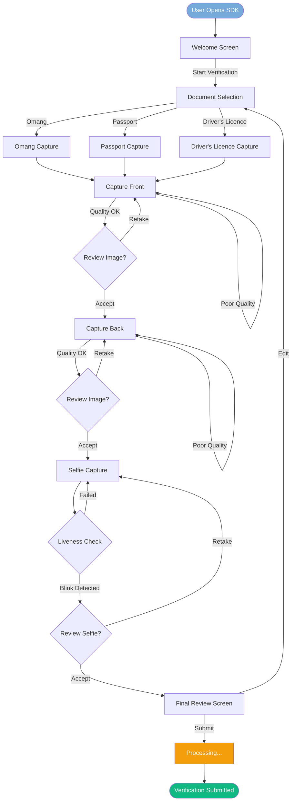
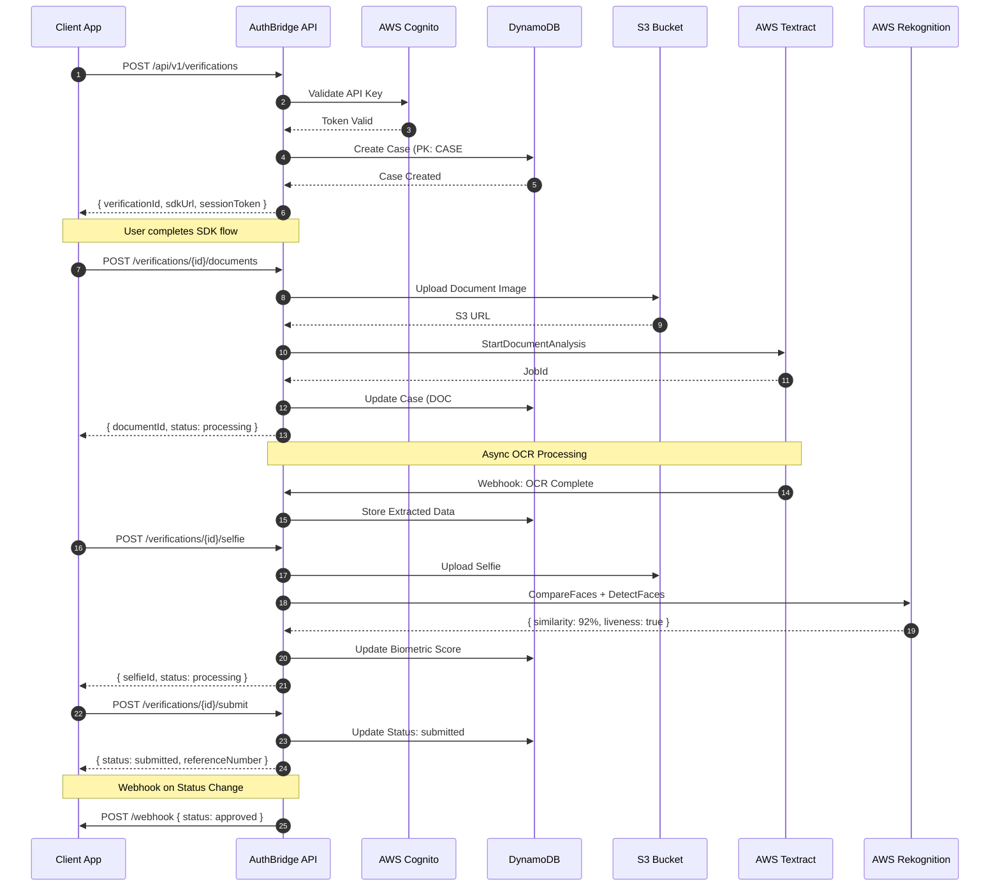
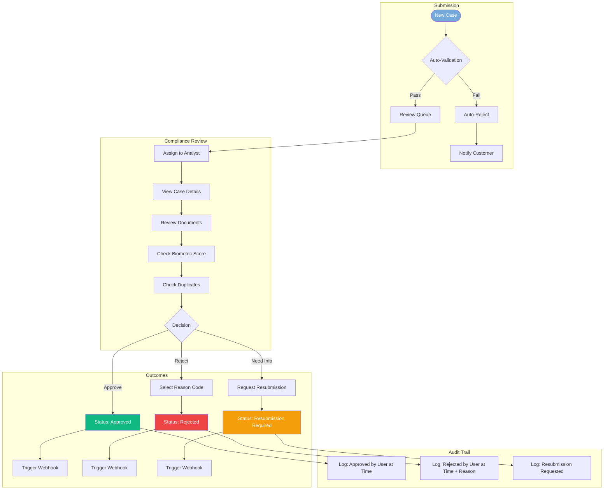
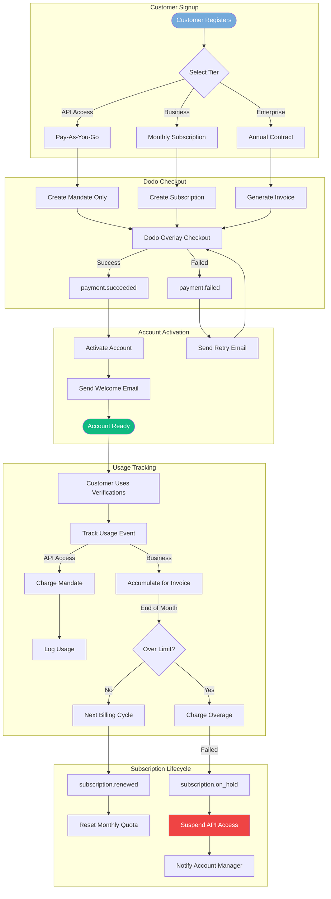
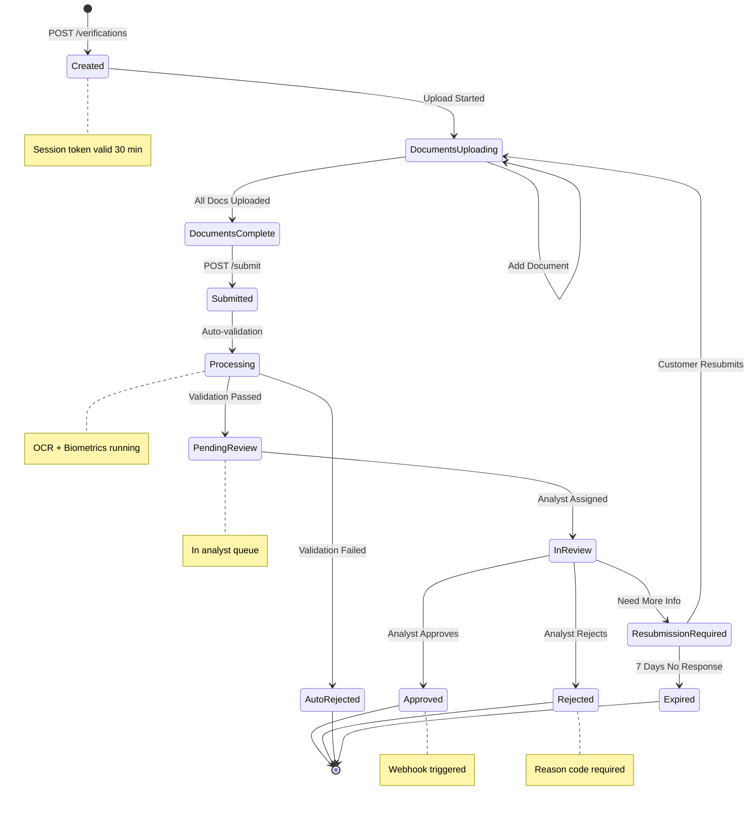
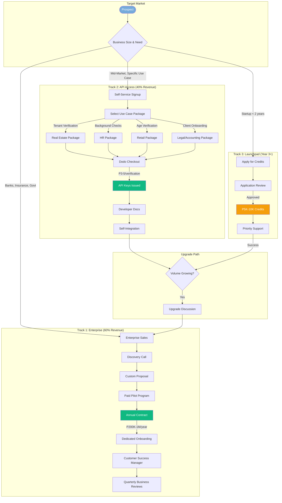

# AuthBridge Mermaid Diagrams

**Generated:** 2026-01-13
**Author:** Paige (Technical Writer Agent)

This document contains all architectural and flow diagrams for AuthBridge.

---

## 1. KYC Verification Flow (Web SDK)

End-to-end user journey through the embeddable Web SDK.



---

## 2. API Verification Sequence

Shows API calls between Client App, AuthBridge API, and AWS Services.



---

## 3. Case Management Workflow

Backoffice case review workflow with decision points and audit logging.



---

## 4. DynamoDB Entity Relationships

Single-table design showing entity relationships and access patterns.

```mermaid
erDiagram
    USER ||--o{ CASE : creates
    CASE ||--|{ DOCUMENT : contains
    CASE ||--o{ NOTE : has
    CASE ||--|{ AUDIT : generates
    USER ||--o{ AUDIT : performs
    CLIENT ||--o{ USER : employs
    CLIENT ||--o{ CASE : owns

    USER {
        string PK "USER#userId"
        string SK "PROFILE"
        string email
        string name
        string role "admin|analyst|reviewer"
        string clientId
        datetime createdAt
        datetime lastLogin
    }

    CASE {
        string PK "CASE#caseId"
        string SK "META"
        string GSI1PK "CLIENT#clientId"
        string GSI1SK "2026-01-13#caseId"
        string status "pending|approved|rejected"
        string customerName
        string omangNumber "encrypted"
        string documentType
        number biometricScore
        string assigneeId
        datetime createdAt
        datetime updatedAt
    }

    DOCUMENT {
        string PK "CASE#caseId"
        string SK "DOC#docId"
        string type "omang_front|omang_back|selfie"
        string s3Key
        json ocrData
        number confidence
        datetime uploadedAt
    }

    AUDIT {
        string PK "AUDIT#date"
        string SK "timestamp#eventId"
        string GSI1PK "USER#userId"
        string GSI1SK "timestamp"
        string action "CASE_CREATED|APPROVED|REJECTED"
        string resourceId
        string ipAddress
        json metadata
    }

    NOTE {
        string PK "CASE#caseId"
        string SK "NOTE#timestamp"
        string authorId
        string content
        datetime createdAt
    }

    CLIENT {
        string PK "CLIENT#clientId"
        string SK "PROFILE"
        string companyName
        string tier "api_access|business|enterprise"
        string webhookUrl
        string apiKeyHash
        datetime createdAt
    }
```

---

## 5. Dodo Payments Billing Flow

Customer signup, subscription management, and usage-based billing.



---

## 6. Verification Case Lifecycle

State machine showing all possible case states and transitions.



---

## 7. Omang Processing Pipeline

Document processing flow from upload through verification result.

```mermaid
flowchart LR
    subgraph Upload["1. Upload"]
        Image([Omang Image]) --> Compress[Compress < 1MB]
        Compress --> S3[Store in S3]
        S3 --> Encrypt[Encrypt at Rest]
    end

    subgraph OCR["2. OCR Extraction"]
        Encrypt --> Textract[AWS Textract]
        Textract --> Extract[Extract Fields]
        Extract --> Fields[Name, Omang#, DOB, Address, Expiry]
        Fields --> Confidence[Confidence Scores]
    end

    subgraph Validation["3. Validation"]
        Confidence --> Format{Format Valid?}
        Format --> |9 digits| Checksum{Checksum Valid?}
        Format --> |Invalid| FailFormat[Fail: Invalid Format]

        Checksum --> |Pass| Expiry{Not Expired?}
        Checksum --> |Fail| FailChecksum[Fail: Invalid Checksum]

        Expiry --> |Valid| Duplicate{Duplicate Check}
        Expiry --> |Expired| FailExpiry[Fail: Document Expired]

        Duplicate --> |New| PassValidation[Validation Passed]
        Duplicate --> |Found| FlagDupe[Flag: Duplicate Omang]
    end

    subgraph Biometrics["4. Biometric Matching"]
        PassValidation --> ExtractPhoto[Extract ID Photo]
        FlagDupe --> ExtractPhoto
        ExtractPhoto --> Rekognition[AWS Rekognition]

        Rekognition --> Compare[CompareFaces]
        Compare --> Score{Score >= 80%?}

        Score --> |Yes| LivenessCheck[Check Liveness]
        Score --> |No| ManualReview[Flag: Manual Review]

        LivenessCheck --> |Pass| Success([Verification Ready])
        LivenessCheck --> |Fail| FailLiveness[Fail: Liveness Failed]
    end

    style Image fill:#75AADB,color:#fff
    style Success fill:#10B981,color:#fff
    style FailFormat fill:#EF4444,color:#fff
    style FailChecksum fill:#EF4444,color:#fff
    style FailExpiry fill:#EF4444,color:#fff
    style FailLiveness fill:#EF4444,color:#fff
    style ManualReview fill:#F59E0B,color:#fff
    style FlagDupe fill:#F59E0B,color:#fff
```



---

## 8. Dual-Track Revenue Model

Visual showing Enterprise vs API Access customer journeys.



---

## Usage Notes

These diagrams can be rendered in:
- GitHub/GitLab markdown preview
- VS Code with Mermaid extension
- Notion, Confluence, or other documentation tools
- Export to PNG/SVG using Mermaid CLI or online editors

To update diagrams, edit the Mermaid code blocks above and re-render.
