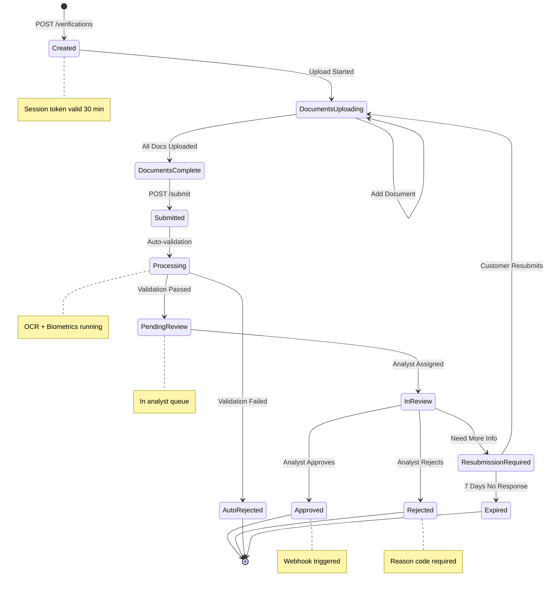

# AuthBridge - Epic Breakdown

## Overview

This document provides the complete epic and story breakdown for AuthBridge, decomposing the requirements from the PRD, Architecture, and UX Design Spec into implementable stories.

## Requirements Inventory

### Functional Requirements

**FR1:** Document type selection (Omang, Passport, Driver's License, ID Card)
**FR2:** Camera capture with real-time guidance for document photography
**FR3:** Fallback to file upload for desktop users
**FR4:** Image compression and optimization (< 1MB per image)
**FR5:** Selfie capture with liveness detection
**FR6:** Progress indicators at each verification step
**FR7:** Multi-language support (English, Setswana)
**FR8:** Mobile-responsive design for Web SDK
**FR9:** 9-digit Omang format validation
**FR10:** OCR extraction from Omang card (front and back)
**FR11:** Date of birth validation from Omang
**FR12:** Address parsing (plot number, locality, district)
**FR13:** Expiry date check (10-year validity from issue)
**FR14:** Photo extraction for biometric matching
**FR15:** Duplicate Omang detection
**FR16:** Case listing with filters (status, date, type, assignee)
**FR17:** Case detail view with document preview
**FR18:** Approve/reject workflow with reason codes
**FR19:** Case notes and comments
**FR20:** Audit trail (who did what when)
**FR21:** User management and permissions (Casbin RBAC)
**FR22:** Bulk actions (approve/reject multiple cases)
**FR23:** Search functionality (by name, Omang, email)
**FR24:** Authentication (JWT tokens, API keys)
**FR25:** Start verification endpoint (POST /api/v1/verifications)
**FR26:** Upload document endpoint (POST /api/v1/verifications/{id}/documents)
**FR27:** Submit verification endpoint (POST /api/v1/verifications/{id}/submit)
**FR28:** Get verification status endpoint (GET /api/v1/verifications/{id})
**FR29:** Webhook notifications for status changes
**FR30:** Rate limiting (50 requests/second)
**FR31:** Embeddable JavaScript library (UMD/ES modules)
**FR32:** Customizable UI themes (colors, fonts, logos)
**FR33:** Event callbacks (onComplete, onError, onCancel)
**FR34:** CDN distribution for Web SDK
**FR35:** Data encryption at rest (S3, DynamoDB)
**FR36:** Data encryption in transit (TLS 1.2+)
**FR37:** IAM least privilege (dedicated roles per Lambda)
**FR38:** 5-year data retention
**FR39:** GDPR-style data export and deletion
**FR40:** 72-hour breach notification system
**FR41:** Verification volume reporting by day/week/month
**FR42:** Approval/rejection rates reporting
**FR43:** Average processing time reporting
**FR44:** Document type distribution reporting
**FR45:** Cost tracking and export to CSV

**Phase 2 FRs:**
**FR46:** CIPA registration number validation (BW + 11 digits) for KYB
**FR47:** BURS TIN validation (format check)
**FR48:** Business document upload (registration certificate, tax clearance)
**FR49:** Ultimate Beneficial Owner (UBO) identification
**FR50:** Director verification
**FR51:** Business address validation
**FR52:** Omang checksum validation
**FR53:** Fraud pattern detection
**FR54:** Orange Money payment integration
**FR55:** Setswana language pack (complete UI translation)

**Phase 3 FRs:**
**FR56:** AML/PEP screening integration
**FR57:** Continuous KYC (periodic re-verification)
**FR58:** White-label solution (custom branding, domain, emails)
**FR59:** Advanced fraud detection (ML models, device fingerprinting)
**FR60:** Native Mobile SDKs (Android, iOS)
**FR61:** Visual workflow builder (no-code)

### Non-Functional Requirements

**NFR1:** API response time < 500ms (p95)
**NFR2:** SDK load time < 2 seconds
**NFR3:** Document upload success rate > 95%
**NFR4:** Verification completion time < 2 minutes
**NFR5:** Dashboard page load < 1 second
**NFR6:** Support 10,000 verifications/month initially
**NFR7:** Scale to 100,000 verifications/month by Year 2
**NFR8:** Auto-scaling for traffic spikes
**NFR9:** No single point of failure
**NFR10:** 99.5% uptime SLA
**NFR11:** Automated failover
**NFR12:** Data backup every 24 hours
**NFR13:** Disaster recovery (RTO < 4 hours, RPO < 1 hour)
**NFR14:** OWASP Top 10 compliance
**NFR15:** Penetration testing before launch
**NFR16:** Quarterly security audits
**NFR17:** Dependency vulnerability scanning
**NFR18:** Data Protection Act 2024 compliant
**NFR19:** FIA AML/KYC requirements met
**NFR20:** Bank of Botswana aligned
**NFR21:** NBFIRA compliant (if required)
**NFR22:** Mobile-first design
**NFR23:** Accessibility (WCAG 2.1 AA)
**NFR24:** Clear error messages
**NFR25:** Contextual help
**NFR26:** Infrastructure as Code (Serverless Framework)
**NFR27:** Automated testing (unit, integration, e2e)
**NFR28:** CI/CD pipeline
**NFR29:** Comprehensive documentation
**NFR30:** Monitoring and alerting

### Additional Requirements

**From Architecture:**
- **ARCH-1:** Brownfield project built on Ballerine open-source platform (existing codebase)
- **ARCH-2:** Node.js 22 LTS runtime required (Node.js 18 EOL March 2026)
- **ARCH-3:** AWS af-south-1 (Cape Town) region mandatory for data residency
- **ARCH-4:** DynamoDB single-table design pattern
- **ARCH-5:** AWS Cognito with passwordless authentication (passkeys, email OTP)
- **ARCH-6:** Casbin RBAC for authorization
- **ARCH-7:** AWS Rekognition Face Liveness for biometric verification (80% confidence threshold)
- **ARCH-8:** AWS Textract for OCR
- **ARCH-9:** React 19.2 + Mantine 8.3 for Backoffice
- **ARCH-10:** Svelte 5.46 for Web SDK
- **ARCH-11:** Vite 7.2 with Rolldown bundler
- **ARCH-12:** Dodo Payments as Merchant of Record for billing
- **ARCH-13:** Intercom for customer support (Fin AI Agent)
- **ARCH-14:** Make.com for workflow automation
- **ARCH-15:** Amplitude for product analytics
- **ARCH-16:** Netlify for frontend hosting
- **ARCH-17:** CloudFront CDN for SDK distribution
- **ARCH-18:** Phased email delivery (Cognito default → SES with custom domain)
- **ARCH-19:** Domain strategy: authbridge.io (MVP, ACTIVE) → authbridge.co.bw (post-funding, FUTURE)

**From UX Design Spec:**
- **UX-1:** Design System with Botswana Blue (#75AADB) as primary brand color
- **UX-2:** Inter font family for typography
- **UX-3:** 4px base spacing unit
- **UX-4:** Mobile-first responsive breakpoints (xs: 320px to 2xl: 1440px)
- **UX-5:** Omang-specific document capture overlay (credit card aspect ratio)
- **UX-6:** Real-time edge detection and quality feedback during capture
- **UX-7:** Face oval overlay with liveness prompts for selfie capture
- **UX-8:** Resubmission screen for rejected verifications
- **UX-9:** Session expired screen
- **UX-10:** Camera permission denied screen with instructions
- **UX-11:** Unsupported browser screen
- **UX-12:** Login page with passwordless/SSO options
- **UX-13:** Registration page with work email validation (block free email domains)
- **UX-14:** Email verification flow
- **UX-15:** Status indicators: Pending (Warning), In Review (Info), Approved (Success), Rejected (Error)
- **UX-16:** Toast notifications (top center, 5 second duration)
- **UX-17:** Modal sizes: Small (400px), Medium (560px), Large (720px), Full (90vw)
- **UX-18:** Sidebar navigation (240px expanded, 64px collapsed)
- **UX-19:** 64 total screens identified across Web SDK, Backoffice, Customer Portal, Public Website

### FR Coverage Map

| FR | Epic | Description |
|----|------|-------------|
| FR1-FR8 | Epic 1 | Web SDK verification flow |
| FR9-FR15 | Epic 2 | Omang verification & OCR |
| FR16-FR23 | Epic 3 | Case management dashboard |
| FR24-FR30 | Epic 4 | REST API & webhooks |
| FR31-FR34 | Epic 1 | Web SDK embeddable library |
| FR35-FR40 | Epic 5 | Security & compliance |
| FR41-FR45 | Epic 6 | Reporting & analytics |
| FR46-FR51 | Epic 7 | KYB verification (Phase 2) |
| FR52-FR55 | Epic 8 | Enhanced features (Phase 2) |
| FR56-FR61 | Epic 9 | Enterprise features (Phase 3) |

## Epic List

### Verification Case Lifecycle

The following state diagram shows all possible case states and transitions:

### Epic 1: Web SDK Verification Flow
Enable end-users to complete identity verification through an embeddable SDK with document capture, selfie, and liveness detection.
**FRs covered:** FR1-FR8, FR31-FR34
**Phase:** MVP

### Epic 1.5: Backend Foundation
Provide minimal backend infrastructure to make Epic 1 SDK functional and unblock Epic 2 development.
**FRs covered:** FR24 (partial), FR25, FR26, FR35 (partial)
**Phase:** MVP (Critical Path)
**Dependencies:** Required before Epic 2

### Epic 2: Omang Document Processing
Process Omang cards with OCR extraction, validation, and biometric matching to verify Botswana citizens.
**FRs covered:** FR9-FR15
**Phase:** MVP
**Dependencies:** Requires Epic 1.5 (Backend Foundation)

### Epic 3: Case Management Dashboard
Enable compliance officers to review, approve, and reject verification cases with full audit trail.
**FRs covered:** FR16-FR23
**Phase:** MVP

### Epic 4: REST API & Webhooks
Provide developers with a complete API to integrate AuthBridge into their applications.
**FRs covered:** FR24-FR30
**Phase:** MVP

### Epic 5: Security & Compliance Foundation
Implement data protection, encryption, audit logging, and compliance features for Data Protection Act 2024.
**FRs covered:** FR35-FR40
**Phase:** MVP

### Epic 6: Reporting & Analytics
Enable business owners to track verification metrics, costs, and generate compliance reports.
**FRs covered:** FR41-FR45
**Phase:** MVP

### Epic 7: KYB Business Verification
Enable verification of businesses through CIPA and BURS integration with UBO identification.
**FRs covered:** FR46-FR51
**Phase:** Phase 2

### Epic 8: Enhanced Verification & Payments
Add fraud detection, Orange Money payments, and Setswana language support.
**FRs covered:** FR52-FR55
**Phase:** Phase 2

### Epic 9: Enterprise & Scale Features
Deliver AML/PEP screening, continuous KYC, white-label, and mobile SDKs for enterprise customers.
**FRs covered:** FR56-FR61
**Phase:** Phase 3

---

## Epic 1: Web SDK Verification Flow

**Goal:** Enable end-users to complete identity verification through an embeddable SDK with document capture, selfie, and liveness detection.

### Story 1.1: SDK Initialization & Welcome Screen

As an end-user,
I want to see a welcome screen when verification starts,
So that I understand what's required and can prepare my documents.

**Acceptance Criteria:**

**Given** a client application embeds the AuthBridge SDK
**When** the SDK initializes with a valid session token
**Then** the welcome screen displays with client branding (if configured)
**And** estimated time ("~2 minutes") and required items are shown
**And** a "Start Verification" button is prominently displayed
**And** privacy policy link is accessible

### Story 1.2: Document Type Selection

As an end-user,
I want to select my document type (Omang, Passport, Driver's License),
So that the system knows what to expect for verification.

**Acceptance Criteria:**

**Given** the user is on the document selection screen
**When** they view the available options
**Then** Omang is displayed first as the primary option for Botswana
**And** each document type shows a description and icon
**When** the user selects a document type
**Then** the selection is highlighted and they can proceed to capture

### Story 1.3: Document Capture with Camera

As an end-user,
I want to photograph my document using my device camera,
So that I can submit it for verification.

**Acceptance Criteria:**

**Given** the user has selected a document type
**When** the camera view opens
**Then** a document-shaped overlay guides positioning (credit card ratio for Omang)
**And** real-time quality feedback shows (lighting, blur, glare detection)
**When** the user captures the image
**Then** the image is compressed to < 1MB
**And** the user can review and retake if needed

### Story 1.4: Document Upload Fallback

As a desktop user without camera access,
I want to upload document images from my device,
So that I can complete verification without a camera.

**Acceptance Criteria:**

**Given** camera access is denied or unavailable
**When** the user clicks "Upload from device"
**Then** a file picker opens accepting JPG, PNG, PDF
**And** uploaded images are validated for quality
**And** the user can proceed with the uploaded image

### Story 1.5: Selfie Capture with Liveness Detection

As an end-user,
I want to take a selfie with liveness verification,
So that the system can confirm I'm a real person matching my ID.

**Acceptance Criteria:**

**Given** document capture is complete
**When** the selfie screen opens
**Then** a face oval overlay guides positioning
**And** liveness prompts appear ("Blink", "Turn head slightly")
**When** liveness is confirmed and selfie captured
**Then** the image is stored for biometric comparison
**And** the user can review and retake if needed

### Story 1.6: Review & Submit Verification

As an end-user,
I want to review my captured images before submitting,
So that I can ensure everything looks correct.

**Acceptance Criteria:**

**Given** all captures are complete
**When** the review screen displays
**Then** document front, back (if applicable), and selfie are shown
**And** a "Submit" button is available
**When** the user submits
**Then** a loading indicator shows during processing
**And** the completion screen displays with reference number

---

## Epic 1.5: Backend Foundation

**Goal:** Provide minimal backend infrastructure to make Epic 1 SDK functional and unblock Epic 2 development.

**Context:** Epic 1 retrospective revealed that the Web SDK cannot function without backend infrastructure. Epic 1.5 provides the foundation Epic 2 needs to succeed.

**Critical Path:** Must complete before Epic 2 can start.

### Story 1.5.1: API Authentication & Session Management

As a developer,
I want to authenticate API requests and manage verification sessions,
So that the Web SDK can securely create and track verifications.

**Acceptance Criteria:**

**Given** a client application needs to start a verification
**When** they request a session token
**Then** a JWT token is generated with 30-minute expiration
**And** the token includes client ID and verification ID
**And** token validation middleware is available for all endpoints
**And** expired tokens return 401 Unauthorized with clear error message

### Story 1.5.2: Create Verification Endpoint

As the Web SDK,
I want to create a new verification case via API,
So that I can initiate the verification flow and store user data.

**Acceptance Criteria:**

**Given** an authenticated request to POST /api/v1/verifications
**When** valid parameters are provided (document type, customer metadata)
**Then** a verification case is created in DynamoDB
**And** a unique verification ID is returned
**And** case status is set to "created"
**And** response time is < 500ms (p95)
**And** the endpoint handles concurrent requests safely

### Story 1.5.3: Document Upload Endpoint with S3 Integration

As the Web SDK,
I want to upload captured images to secure storage,
So that documents are persisted for processing and review.

**Acceptance Criteria:**

**Given** an authenticated request to POST /api/v1/verifications/{id}/documents
**When** a document image is provided (base64 encoded)
**Then** the image is uploaded to S3 bucket in af-south-1 region
**And** S3 object key follows pattern: `{clientId}/{verificationId}/{documentType}-{timestamp}.jpg`
**And** presigned URL is generated for secure access (15-minute expiration)
**And** document metadata is stored in DynamoDB (S3 key, upload timestamp, file size)
**And** upload success rate is > 95%
**And** images > 10MB are rejected with clear error message

### Story 1.5.4: DynamoDB Schema & Basic Case Storage

As the system,
I want a DynamoDB table to store verification cases and documents,
So that all verification data is persisted and queryable.

**Acceptance Criteria:**

**Given** the DynamoDB table is created
**When** data is written
**Then** single-table design pattern is used with entity prefixes:
  - `CASE#{verificationId}` for case metadata
  - `DOC#{verificationId}#{documentId}` for document records
**And** GSI1 enables querying by client ID and status
**And** GSI2 enables querying by creation date
**And** on-demand billing mode is configured
**And** point-in-time recovery (PITR) is enabled
**And** encryption at rest is enabled with AWS managed keys
**And** TTL is configured for expired sessions (30 days)

---

## Epic 2: Omang Document Processing

**Goal:** Process Omang cards with OCR extraction, validation, and biometric matching to verify Botswana citizens.

### Story 2.1: Omang OCR Extraction

As the system,
I want to extract text from Omang card images using AWS Textract,
So that I can validate the document and populate case data.

**Acceptance Criteria:**

**Given** an Omang card image is uploaded
**When** the OCR service processes the image
**Then** the following fields are extracted: Full Name, Omang Number, Date of Birth, Address, Expiry Date
**And** extraction confidence scores are recorded
**And** the extracted data is stored with the verification case

### Story 2.2: Omang Format Validation

As the system,
I want to validate Omang number format and expiry,
So that I can reject invalid documents early.

**Acceptance Criteria:**

**Given** an Omang number is extracted
**When** validation runs
**Then** the 9-digit format is verified
**And** expiry date is checked (10-year validity)
**And** invalid formats return clear error messages
**And** validation results are logged for audit

### Story 2.3: Biometric Face Matching

As the system,
I want to compare the selfie to the ID photo using AWS Rekognition,
So that I can verify the person matches their document.

**Acceptance Criteria:**

**Given** a selfie and document photo are available
**When** biometric comparison runs
**Then** a similarity score (0-100) is calculated
**And** scores >= 80% are marked as matching
**And** scores < 80% are flagged for manual review
**And** liveness detection results are included

### Story 2.4: Duplicate Omang Detection

As the system,
I want to detect if an Omang has been used in previous verifications,
So that I can prevent fraud and flag suspicious activity.

**Acceptance Criteria:**

**Given** an Omang number is extracted
**When** duplicate check runs
**Then** the system queries for existing cases with the same Omang
**And** duplicates within the same client are flagged
**And** cross-client duplicates are logged for review
**And** the case is marked with duplicate status if found

---

## Epic 3: Case Management Dashboard

**Goal:** Enable compliance officers to review, approve, and reject verification cases with full audit trail.

### Story 3.1: Case List View with Filters

As a compliance officer,
I want to view all verification cases with filtering options,
So that I can efficiently manage my review queue.

**Acceptance Criteria:**

**Given** the user is logged into the Backoffice
**When** they navigate to the Cases page
**Then** cases are displayed in a table with: Customer Name, Omang, Status, Date, Assignee
**And** filters are available for: Status, Date Range, Document Type, Assignee
**And** search works by name, Omang number, or email
**And** results load in < 1 second

### Story 3.2: Case Detail View

As a compliance officer,
I want to view complete case details including documents,
So that I can make informed approval decisions.

**Acceptance Criteria:**

**Given** the user clicks on a case
**When** the detail view opens
**Then** customer information is displayed (name, Omang, DOB, address)
**And** document images are viewable with zoom/rotate controls
**And** OCR extracted data is shown alongside the images
**And** biometric match score is displayed
**And** case history and notes are visible

### Story 3.3: Approve/Reject Workflow

As a compliance officer,
I want to approve or reject cases with reason codes,
So that decisions are documented and customers are notified.

**Acceptance Criteria:**

**Given** the user is viewing a case detail
**When** they click "Approve"
**Then** the case status changes to "Approved"
**And** a webhook is triggered to notify the client
**When** they click "Reject"
**Then** a reason code dropdown appears (Blurry Image, Face Mismatch, Invalid Document, etc.)
**And** optional notes can be added
**And** the case status changes to "Rejected"
**And** the action is logged in the audit trail

### Story 3.4: Case Notes & Comments

As a compliance officer,
I want to add notes to cases,
So that I can document observations and communicate with colleagues.

**Acceptance Criteria:**

**Given** the user is viewing a case
**When** they add a note
**Then** the note is saved with timestamp and author
**And** notes are visible to all users with case access
**And** notes cannot be edited or deleted (audit compliance)

### Story 3.5: Bulk Case Actions

As a compliance officer,
I want to approve or reject multiple cases at once,
So that I can process high-volume queues efficiently.

**Acceptance Criteria:**

**Given** the user is on the case list
**When** they select multiple cases using checkboxes
**Then** bulk action buttons appear (Approve Selected, Reject Selected)
**When** bulk approve is clicked
**Then** all selected cases are approved
**And** individual audit entries are created for each case

---

## Epic 4: REST API & Webhooks

**Goal:** Provide developers with a complete API to integrate AuthBridge into their applications.

### Story 4.1: API Authentication

As a developer,
I want to authenticate API requests using API keys,
So that my application can securely access AuthBridge.

**Acceptance Criteria:**

**Given** a developer has an API key
**When** they include it in the Authorization header
**Then** the request is authenticated
**And** rate limiting is applied (50 req/sec)
**And** invalid keys return 401 Unauthorized
**And** all requests are logged with client ID

### Story 4.2: Create Verification Endpoint

As a developer,
I want to create a new verification session via API,
So that I can initiate the verification flow for my users.

**Acceptance Criteria:**

**Given** an authenticated API request to POST /api/v1/verifications
**When** valid parameters are provided (customer email, redirect URL)
**Then** a verification session is created
**And** a session token and SDK URL are returned
**And** the response includes verification ID for tracking
**And** response time is < 500ms (p95)

### Story 4.3: Document Upload Endpoint

As a developer,
I want to upload documents via API,
So that I can integrate verification into custom flows.

**Acceptance Criteria:**

**Given** an authenticated request to POST /api/v1/verifications/{id}/documents
**When** a document image is uploaded (base64 or multipart)
**Then** the document is stored in S3
**And** OCR processing is triggered
**And** the document ID is returned
**And** upload success rate is > 95%

### Story 4.4: Verification Status Endpoint

As a developer,
I want to check verification status via API,
So that I can update my application based on results.

**Acceptance Criteria:**

**Given** an authenticated request to GET /api/v1/verifications/{id}
**When** the verification exists
**Then** current status is returned (pending, approved, rejected, expired)
**And** extracted data is included (if approved)
**And** rejection reason is included (if rejected)

### Story 4.5: Webhook Notifications

As a developer,
I want to receive webhook notifications on status changes,
So that my application can react in real-time.

**Acceptance Criteria:**

**Given** a webhook URL is configured for a client
**When** a verification status changes
**Then** a POST request is sent to the webhook URL within 5 seconds
**And** the payload includes: verification ID, status, timestamp
**And** failed deliveries are retried (3 attempts with exponential backoff)
**And** webhook delivery is logged

---

## Epic 5: Security & Compliance Foundation

**Goal:** Implement data protection, encryption, audit logging, and compliance features for Data Protection Act 2024.

### Story 5.1: Data Encryption Implementation

As the system,
I want to encrypt all sensitive data at rest and in transit,
So that customer data is protected per Data Protection Act 2024.

**Acceptance Criteria:**

**Given** data is stored in DynamoDB or S3
**When** the data is written
**Then** it is encrypted using AES-256 (KMS managed keys)
**And** Omang numbers are additionally encrypted at attribute level
**Given** data is transmitted
**When** API requests are made
**Then** TLS 1.2+ is enforced
**And** HTTPS is required for all endpoints

### Story 5.2: Comprehensive Audit Logging

As a compliance officer,
I want complete audit trails for all actions,
So that I can demonstrate compliance to regulators.

**Acceptance Criteria:**

**Given** any action occurs in the system
**When** the action completes
**Then** an audit log entry is created with: timestamp, user ID, action type, resource ID, IP address
**And** audit logs are immutable (append-only)
**And** logs are retained for 5 years
**And** audit logs are queryable by date range and user

### Story 5.3: Data Export & Deletion

As a data subject,
I want to request export or deletion of my data,
So that I can exercise my rights under Data Protection Act 2024.

**Acceptance Criteria:**

**Given** a data export request is received
**When** the request is processed
**Then** all data for the subject is compiled into a downloadable format
**And** export completes within 5 minutes
**Given** a data deletion request is received
**When** the request is processed
**Then** all personal data is deleted or anonymized
**And** deletion completes within 24 hours
**And** audit log of deletion is retained

### Story 5.4: IAM & Access Control

As a system administrator,
I want role-based access control for all users,
So that users only access what they need.

**Acceptance Criteria:**

**Given** users are assigned roles (admin, analyst, reviewer, api_user)
**When** they attempt to access resources
**Then** Casbin RBAC policies are enforced
**And** unauthorized access returns 403 Forbidden
**And** role assignments are logged in audit trail

---

## Epic 6: Reporting & Analytics

**Goal:** Enable business owners to track verification metrics, costs, and generate compliance reports.

### Story 6.1: Dashboard Metrics Overview

As a business owner,
I want to see key metrics on the dashboard,
So that I can monitor verification performance at a glance.

**Acceptance Criteria:**

**Given** the user logs into the Backoffice
**When** the dashboard loads
**Then** the following metrics are displayed: Total Verifications (today/week/month), Approval Rate, Average Processing Time, Pending Cases
**And** metrics update in real-time
**And** trend indicators show change vs previous period

### Story 6.2: Verification Reports

As a business owner,
I want to generate detailed verification reports,
So that I can analyze trends and report to stakeholders.

**Acceptance Criteria:**

**Given** the user navigates to Reports
**When** they select date range and filters
**Then** a report is generated showing: Volume by day, Approval/Rejection rates, Document type distribution, Processing times
**And** reports can be exported to CSV
**And** export completes in < 30 seconds

### Story 6.3: Usage & Cost Tracking

As a business owner,
I want to track API usage and costs,
So that I can manage my budget and forecast expenses.

**Acceptance Criteria:**

**Given** the user views the Usage page
**When** the page loads
**Then** current period usage is displayed (verifications count)
**And** cost estimate is calculated based on pricing tier
**And** usage history is shown by month
**And** alerts can be configured for usage thresholds

---

## Epic 7: KYB Business Verification

**Goal:** Enable verification of businesses through CIPA and BURS integration with UBO identification.

### Story 7.1: Business Registration Lookup

As a compliance officer,
I want to verify business registration via CIPA,
So that I can confirm the business is legitimate.

**Acceptance Criteria:**

**Given** a CIPA registration number is provided (BW + 11 digits)
**When** the lookup is performed
**Then** business details are retrieved: Company Name, Registration Date, Status, Directors
**And** invalid registration numbers return clear errors
**And** results are cached for 24 hours

### Story 7.2: Tax Compliance Verification

As a compliance officer,
I want to verify BURS TIN and tax status,
So that I can confirm the business is tax compliant.

**Acceptance Criteria:**

**Given** a BURS TIN is provided
**When** the verification runs
**Then** TIN format is validated
**And** tax clearance status is checked (if API available)
**And** results are stored with the business verification case

### Story 7.3: UBO Identification

As a compliance officer,
I want to identify Ultimate Beneficial Owners,
So that I can comply with AML requirements.

**Acceptance Criteria:**

**Given** a business verification case
**When** UBO information is requested
**Then** shareholders with > 25% ownership are identified
**And** individual KYC can be triggered for each UBO
**And** UBO structure is documented in the case

---

## Epic 8: Enhanced Verification & Payments

**Goal:** Add fraud detection, Orange Money payments, and Setswana language support.

### Story 8.1: Fraud Pattern Detection

As the system,
I want to detect suspicious verification patterns,
So that I can prevent fraud and protect clients.

**Acceptance Criteria:**

**Given** a verification is submitted
**When** fraud checks run
**Then** velocity checks detect multiple attempts from same device/IP
**And** document reuse across clients is flagged
**And** suspicious patterns trigger manual review
**And** fraud scores are logged for analysis

### Story 8.2: Dodo Payments Integration

As a customer,
I want to pay for verifications using Dodo Payments,
So that I can easily manage billing in Botswana Pula.

**Acceptance Criteria:**

**Given** a customer signs up for API Access tier
**When** they complete checkout via Dodo
**Then** their account is activated automatically
**And** usage is tracked and billed per verification
**And** invoices are available in the customer portal
**And** webhook events update account status

### Story 8.3: Setswana Language Support

As a Setswana-speaking user,
I want to use the SDK in my language,
So that I can understand instructions clearly.

**Acceptance Criteria:**

**Given** the SDK is initialized
**When** language is set to "tn" (Setswana)
**Then** all UI text displays in Setswana
**And** error messages are translated
**And** language can be switched during the flow

---

## Epic 9: Enterprise & Scale Features

**Goal:** Deliver AML/PEP screening, continuous KYC, white-label, and mobile SDKs for enterprise customers.

### Story 9.1: AML/PEP Screening

As a compliance officer,
I want to screen customers against sanctions and PEP lists,
So that I can meet AML regulatory requirements.

**Acceptance Criteria:**

**Given** a verification is approved
**When** AML screening is enabled
**Then** the customer is checked against global sanctions lists
**And** PEP (Politically Exposed Persons) matches are flagged
**And** screening results are stored with the case
**And** ongoing monitoring can be configured

### Story 9.2: White-Label Configuration

As an enterprise customer,
I want to customize the SDK with my branding,
So that verification feels native to my application.

**Acceptance Criteria:**

**Given** white-label is enabled for a client
**When** the SDK loads
**Then** client logo, colors, and fonts are applied
**And** custom domain can be configured (sdk.clientdomain.com)
**And** email notifications use client branding

### Story 9.3: Continuous KYC Monitoring

As a compliance officer,
I want to schedule periodic re-verification,
So that I can maintain ongoing compliance.

**Acceptance Criteria:**

**Given** continuous KYC is enabled
**When** a customer's verification expires (configurable: 1-3 years)
**Then** a re-verification request is triggered
**And** the customer is notified via email
**And** expired verifications are flagged in the dashboard

### Story 9.4: Mobile SDK (iOS)

As a mobile developer,
I want a native iOS SDK,
So that I can integrate verification into my iOS app.

**Acceptance Criteria:**

**Given** the iOS SDK is integrated
**When** verification is initiated
**Then** native camera controls are used
**And** biometric authentication (Face ID) can be leveraged
**And** the SDK is distributed via CocoaPods/SPM
**And** bundle size is < 5MB

### Story 9.5: Mobile SDK (Android)

As a mobile developer,
I want a native Android SDK,
So that I can integrate verification into my Android app.

**Acceptance Criteria:**

**Given** the Android SDK is integrated
**When** verification is initiated
**Then** native camera controls are used
**And** biometric authentication (fingerprint) can be leveraged
**And** the SDK is distributed via Maven Central
**And** bundle size is < 5MB

---

## Summary

| Epic | Stories | Phase |
|------|---------|-------|
| Epic 1: Web SDK Verification Flow | 6 | MVP |
| Epic 1.5: Backend Foundation | 4 | MVP (Critical Path) |
| Epic 2: Omang Document Processing | 4 | MVP |
| Epic 3: Case Management Dashboard | 5 | MVP |
| Epic 4: REST API & Webhooks | 5 | MVP |
| Epic 5: Security & Compliance | 4 | MVP |
| Epic 6: Reporting & Analytics | 3 | MVP |
| Epic 7: KYB Business Verification | 3 | Phase 2 |
| Epic 8: Enhanced Verification & Payments | 3 | Phase 2 |
| Epic 9: Enterprise & Scale Features | 5 | Phase 3 |
| **Total** | **42** | |

**MVP Stories:** 31 (including Epic 1.5)
**Phase 2 Stories:** 6
**Phase 3 Stories:** 5

**Note:** Epic 1.5 (Backend Foundation) was added after Epic 1 retrospective to provide infrastructure required by Epic 2.
