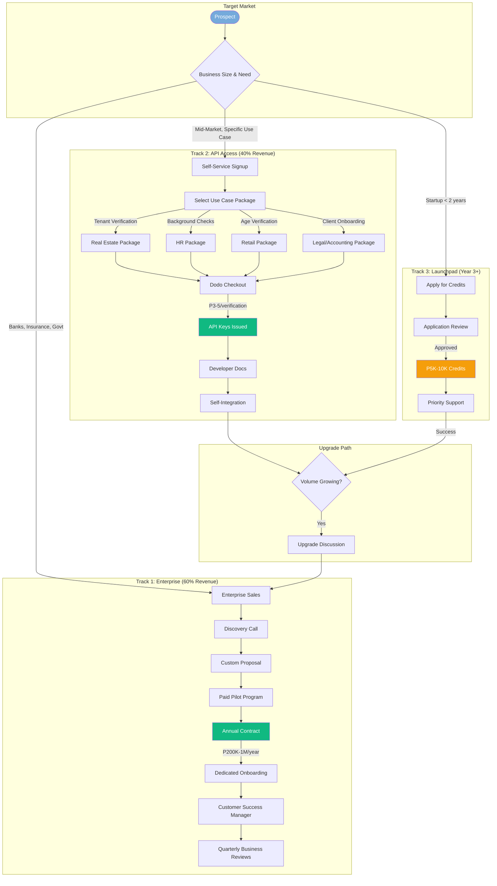

# Product Brief: AuthBridge

**Botswana's Trusted Identity Verification Partner**

---

## Executive Summary

**AuthBridge** is Botswana's first locally-focused identity verification platform, purpose-built to serve both enterprises and mid-market businesses with compliant KYC/KYB verification. As a proprietary platform with deep local expertise, AuthBridge delivers regulatory-compliant identity verification through a balanced dual-track approach: high-touch enterprise partnerships and accessible API-based verification for specific use cases.

The platform serves two distinct tracks:
- **Enterprise Track (60% of revenue):** Banks, insurance companies, government ministries, pension funds with annual contracts and dedicated support
- **Mid-Market API Access Track (40% of revenue):** Medium businesses with specific verification needs (tenant screening, employee background checks, age verification) via self-service, pay-as-you-go pricing

AuthBridge positions itself as Botswana's trusted identity verification partner—not just a technology vendor—offering local expertise with enterprise standards, accessible to all.

**Strategic Vision:** Build a profitable, sustainable business aligned with Botswana's Vision 2036 and NDP 12 priorities, funding long-term community contribution through startup support programs, educational fellowships, and partnerships with government and academic institutions.

**Core Value Proposition:** "Local expertise, enterprise standards, accessible to all."

**Market Opportunity:**
- Global KYC market: $6.73B (2025) → $14.39B (2030) at 16.42% CAGR
- Botswana digital payments: $1.53B (2024) → $2.20B (2028) at 9.59% CAGR
- Target market: 100+ enterprises + 500+ mid-market businesses across banking, insurance, government, real estate, legal, recruitment, retail
- Zero local competitors with Botswana-specific focus
- Strategic alignment with P966.37M government digital transformation budget

**Year 1 Revenue Target:** P1.5M-3M from dual-track revenue (enterprise contracts + API access)

---

## Strategic Vision & Long-Term Goals

### Business Philosophy

AuthBridge is built on a foundation of sustainable profitability. Rather than chasing developer adoption in a market with limited willingness to pay for tools, we focus on enterprises and institutions with compliance budgets and genuine verification needs. This approach ensures:

1. **Financial Sustainability:** No dependency on credit finance or external funding
2. **Quality Focus:** Resources to deliver premium service and support
3. **Long-term Investment:** Profits fund community contribution initiatives
4. **Market Leadership:** Build defensible position before competitors enter

### Long-Term Vision: AuthBridge Impact

When AuthBridge achieves sustainable profitability, we commit to giving back to Botswana's technology ecosystem through:

**1. AuthBridge Launchpad (Startup Credits Program)**
- Eligible startups apply for subsidized/free AuthBridge credits
- Credits issued via Dodo Payments integration
- Support emerging Botswana tech companies
- Pipeline for future enterprise customers

**2. AuthBridge Fellowship Program**
- Annual fellowships for top high school graduates
- Scholarships, mentorship, and career guidance
- Summer internships at AuthBridge
- University application support

**3. Talent Development Programs**
- Paid internships for university students
- Graduate rotation programs
- Partnerships with UB, BIUST, BA ISAGO
- Guest lectures and curriculum input

**4. Government & Institutional Partnerships**
- Support national digital transformation initiatives
- Contribute to fintech policy development
- Partner with BURS, CIPA for API integration
- Collaborate on identity verification standards

**Timeline:**
- Year 1-2: Focus on profitability, informal mentorship
- Year 3: Launch AuthBridge Launchpad
- Year 4: Formalize Fellowship and Internship programs
- Year 5+: Consider AuthBridge Foundation structure

---

## Core Vision

### Problem Statement

**The Enterprise Compliance Challenge**

Botswana's enterprises face mounting pressure to digitize identity verification while maintaining regulatory compliance. Banks, insurance companies, government agencies, and other regulated industries struggle with:

**Manual KYC is Expensive and Slow:**
- Banks spend P50-100 per customer on manual verification
- Account opening takes 3-5 days
- High operational costs from labor-intensive processes
- Error-prone manual data entry

**Global Solutions Don't Fit:**
- Onfido, Jumio, Sumsub charge $1-3 per verification
- No understanding of Omang, CIPA, BURS, Data Protection Act 2024
- English-only interfaces (70% of Botswana prefers Setswana)
- Global support hours, no local context
- Data residency concerns with foreign cloud providers

**Regulatory Pressure is Increasing:**
- Data Protection Act 2024 requires 72-hour breach notification, DPO appointment
- Bank of Botswana pushing digital transformation
- FIA requiring enhanced AML/KYC compliance
- NBFIRA oversight of non-bank financial institutions

**No Local Alternative Exists:**
- Zero Botswana-specific KYC providers
- No compliance consulting tailored to local regulations
- Enterprises left to figure out compliance alone

### Problem Impact by Segment

**Banks & Financial Institutions:**
- P50-100 per customer for manual KYC (vs. P2-5 with AuthBridge)
- 3-5 day account opening (vs. <1 day with AuthBridge)
- Regulatory audit failures due to incomplete records
- Customer drop-off from slow onboarding

**Insurance Companies:**
- Fraud losses from inadequate policyholder verification
- Claims fraud from identity theft
- Compliance gaps in beneficiary verification
- Manual processes don't scale with growth

**Government & Parastatals:**
- Citizen services delayed by manual verification
- Duplicate registrations and identity fraud
- No audit trail for compliance reporting
- Siloed systems across departments

**Real Estate & Legal:**
- AML compliance requirements for property transactions
- Client verification for Law Society compliance
- Manual processes create bottlenecks
- Risk of facilitating money laundering

### Why Existing Solutions Fall Short

**Global Enterprise Players (Onfido, Jumio, Sumsub):**
- ❌ Pricing: $1-3 per verification (unsustainable for local market)
- ❌ Local Expertise: Don't understand Omang, CIPA, BURS, Data Protection Act 2024
- ❌ Language: English-only (70% of Botswana prefers Setswana)
- ❌ Support: Global support hours, no local context
- ❌ Data Residency: May not comply with cross-border data restrictions
- ✅ Strengths: Advanced features, global coverage, brand recognition

**Budget Players (Identomat, Didit):**
- ✅ Pricing: $0.28-0.30 per verification
- ❌ Local Expertise: Generic solutions, no Botswana customization
- ❌ Compliance: Don't address Data Protection Act 2024 specifics
- ❌ Support: Limited support, no local presence
- ❌ Enterprise Features: Lack white-label, SLA, dedicated support

**The Gap:** No solution combines enterprise-grade capabilities, local expertise, regulatory compliance, and dedicated support specifically for the Botswana market.

### Proposed Solution

**AuthBridge: Botswana's Trusted Identity Verification Partner**

AuthBridge delivers enterprise-grade KYC/KYB verification as a compliance partner, not just a technology vendor. The platform combines:

**1. Enterprise-Grade Capabilities**
- White-label solution for brand consistency
- Dedicated support with SLA guarantees
- Custom integrations with existing systems
- On-premise deployment option for banks
- Compliance consulting included

**2. Botswana-Specific Features**
- **Omang Verification:** OCR extraction + format validation + biometric matching
- **CIPA Integration:** Business registration validation (BW + 11 digits)
- **BURS Compliance:** Tax Identification Number validation
- **Setswana Language:** Native language support for 70% of population
- **Local Document Types:** Omang, BW driver's license, utility bills, bank statements

**3. Regulatory Compliance**
- **Data Protection Act 2024:** 72-hour breach notification, DPO support, DPIA assistance
- **Data Residency:** AWS Cape Town (af-south-1) keeps data in Africa
- **AML/KYC Framework:** 5-year retention, audit trails, suspicious transaction reporting
- **Bank of Botswana Aligned:** Fintech Sandbox participant, regulatory guidance

**4. Technical Excellence**
- **AWS Serverless:** Lambda + API Gateway + DynamoDB + S3
- **Proprietary Platform:** Purpose-built for Botswana with full roadmap control
- **Modern Stack:** React 19, Svelte 5, Node.js 22, TypeScript 5.9
- **Enterprise Security:** SOC 2 ready, ISO 27001 roadmap

**5. Professional Services**
- Compliance consulting (P500-1,500/hour)
- DPO-as-a-Service (P7,500-15,000/month)
- Integration services (P15,000-50,000)
- Training & certification programs
- Managed KYC operations

**6. Ecosystem Integration**
- Core banking system integration
- Orange Money payment acceptance (Phase 2)
- **Dodo Payments billing infrastructure:**
  - Subscription management (Business/Enterprise tiers)
  - Usage-based billing (API Access tier)
  - Adaptive Currency (BWP display)
  - Customer Credits (Launchpad program)
  - Automated invoicing and tax compliance
  - Customer self-service portal
  - Discount codes and promotions
  - Affiliate/partner tracking
- Make.com workflow automation
- Custom API integrations


### Key Differentiators

**1. Local Market Expertise (STRONG - Hard to Replicate)**
- Deep understanding of Botswana regulations (Data Protection Act 2024, Bank of Botswana, NBFIRA, FIA)
- Omang-specific verification capabilities
- Setswana language support
- Local business practices and cultural context
- Relationships with regulators and enterprise ecosystem
- **Defensibility:** HIGH - Global players would need years to build this knowledge

**2. Compliance Partner Positioning (UNIQUE)**
- Not just technology—compliance consulting included
- DPO-as-a-Service offering
- DPIA templates and assistance
- Regulatory update notifications
- Help clients navigate Data Protection Act 2024
- **Defensibility:** HIGH - Requires deep regulatory knowledge + trust

**3. Enterprise-First Approach (STRONG)**
- White-label solutions for brand consistency
- Dedicated support with SLA guarantees
- Custom integrations with legacy systems
- On-premise deployment option
- Quarterly business reviews
- **Defensibility:** HIGH - Relationships and switching costs

**4. Data Residency & Trust (MEDIUM)**
- AWS Cape Town (af-south-1) keeps data in Africa
- Compliance with cross-border data restrictions
- Local company, local accountability
- Trust signal for government and banks
- **Defensibility:** MEDIUM - Others can do this, but trust takes time

**5. Regulatory Relationships (STRONG - Building)**
- Bank of Botswana Fintech Sandbox participant
- Data Protection Commissioner engagement
- FIA compliance alignment
- Industry working group participation
- **Defensibility:** HIGH - First-mover in regulatory relationships

---

## Target Users & Market Segments

### Segment Prioritization (Balanced Dual-Track)

**TRACK 1: ENTERPRISE (High-Touch) - 60% of Revenue**

**Tier 1 - High Budget, Immediate Need (Primary Focus)**

| Segment | Size | Deal Value | Sales Cycle | Priority |
|---------|------|------------|-------------|----------|
| Banks | 8 commercial + microfinance | P200K-1M/year | 6-12 months | HIGHEST |
| Insurance Companies | 15+ insurers | P100K-500K/year | 4-8 months | HIGH |
| Pension Funds | BPOPF, Debswana, etc. | P150K-400K/year | 6-12 months | HIGH |
| Government Ministries | 10+ ministries | P200K-800K/year | 6-18 months | HIGH |
| Parastatals | BPC, WUC, BTC, etc. | P100K-300K/year | 4-8 months | HIGH |

**Tier 2 - Growing Need, Good Budgets (Secondary Focus)**

| Segment | Size | Deal Value | Sales Cycle | Priority |
|---------|------|------------|-------------|----------|
| Telecommunications | Mascom, Orange, BTC | P300K-1M/year | 6-12 months | HIGH |
| Mining Companies | Debswana, etc. | P100K-300K/year | 6-12 months | MEDIUM |

---

**TRACK 2: MID-MARKET API ACCESS (Low-Touch) - 40% of Revenue**

Self-service signup, pay-as-you-go pricing (P3-5 per verification), days-to-weeks sales cycle.

**Use Case Packages:**

| Use Case | Target Segment | Volume Est. | Priority |
|----------|----------------|-------------|----------|
| **Tenant Verification** | Real estate agencies, landlords, property managers | 50+ agencies | HIGH |
| **Employee Background Checks** | Recruitment agencies, HR departments | 30+ agencies | HIGH |
| **Age Verification** | Alcohol retailers, gaming, tobacco sellers | 100+ retailers | HIGH |
| **Client Onboarding** | Legal firms, accounting firms (Law Society/BICA compliance) | 100+ firms | HIGH |
| **Seller/Vendor Verification** | Marketplaces, e-commerce platforms | 20+ platforms | MEDIUM |
| **Patient Verification** | Private hospitals, clinics, medical aids | 50+ facilities | MEDIUM |
| **Member Verification** | Associations, clubs, cooperatives | 100+ orgs | MEDIUM |
| **Contractor Verification** | Construction, mining companies | 50+ companies | MEDIUM |

---

**TRACK 3: COMMUNITY CONTRIBUTION (AuthBridge Launchpad) - Year 3+**

| Segment | Size | Deal Value | Sales Cycle | Priority |
|---------|------|------------|-------------|----------|
| Fintechs/Startups | 10-50 companies | Subsidized credits | Application-based | YEAR 3+ |

### Primary Segment: Banks & Financial Institutions

**Profile:**
- **Size:** 8 commercial banks + microfinance institutions
- **Employees:** 100-5,000
- **Monthly Verifications:** 5,000-50,000
- **Current Solution:** Manual KYC processes, legacy systems
- **Budget:** P200K-1M/year for KYC solutions

**Pain Points:**
- Manual KYC costs P50-100 per customer
- Account opening takes 3-5 days
- Regulatory pressure to digitize (Bank of Botswana mandate)
- Risk-averse culture needs proven, local solutions
- Vendor lock-in concerns with global providers
- Data residency requirements

**Value Proposition:**
- 70% cost reduction vs. manual processes
- Account opening in <1 day
- Enterprise-grade security and compliance
- White-label option for brand consistency
- Dedicated support with SLA
- Local team understands Bank of Botswana requirements
- Compliance consulting included

**Key Personas:**

**Gorata - Head of Digital Banking (Decision Maker)**
- Age: 45, 20+ years in banking
- Goals: Modernize KYC (board mandate), reduce costs 30%, launch digital account opening
- Pain Points: Legacy systems, board approval process, vendor risk
- Needs: Proven solution, local support, clear ROI, security assurance
- Influence: Final decision maker, budget holder

**Lesego - Compliance Manager (Influencer)**
- Age: 40, 15+ years in compliance
- Goals: 100% regulatory compliance, pass audits, implement Data Protection Act
- Pain Points: Incomplete audit trails, manual reporting, regulatory changes
- Needs: Complete audit trail, compliance reports, DPO support
- Influence: Technical approval, risk assessment

**Tebogo - IT Director (Technical Gatekeeper)**
- Age: 50, 25+ years in IT
- Goals: Secure integration, minimal disruption, vendor stability
- Pain Points: Integration complexity, security concerns, vendor lock-in
- Needs: API documentation, security whitepaper, SLA guarantees
- Influence: Technical veto power, integration requirements

**Acquisition Strategy:**
- Direct enterprise sales (6-12 month cycle)
- Paid proof-of-concept pilots (not free)
- RFP responses
- Bank of Botswana Fintech Sandbox connections
- Compliance consultant referrals
- Bankers Association of Botswana events
- Case studies from early adopters

**Success Metrics:**
- 3 bank meetings in Month 1-3
- 1 paid pilot program by Month 6
- 1 signed contract by Month 12
- P500K-1M revenue per bank contract

### Secondary Segment: Insurance Companies

**Profile:**
- **Size:** 15+ insurance companies (life, general, medical aid)
- **Employees:** 50-500
- **Monthly Verifications:** 1,000-10,000
- **Current Solution:** Manual processes, basic checks
- **Budget:** P100K-500K/year

**Pain Points:**
- Policyholder fraud and identity theft
- Claims fraud from fake identities
- Beneficiary verification gaps
- Regulatory compliance (NBFIRA)
- Manual processes don't scale

**Value Proposition:**
- Reduce fraud losses through proper verification
- Streamline policyholder onboarding
- Beneficiary verification for claims
- NBFIRA compliance support
- Integration with policy management systems

**Key Personas:**
- **Kelebogile (Head of Operations, 42):** Streamline onboarding, reduce fraud
- **Mothusi (Risk Manager, 38):** Fraud prevention, compliance reporting
- **Oratile (IT Manager, 35):** System integration, data security

**Acquisition Strategy:**
- Direct sales (4-8 month cycle)
- Insurance Institute of Botswana events
- NBFIRA compliance workshops
- Referrals from accounting firms

### Tertiary Segment: Government & Parastatals

**Profile:**
- **Size:** 10+ ministries, 20+ parastatals
- **Employees:** 100-10,000
- **Monthly Verifications:** 2,000-20,000
- **Current Solution:** Manual processes, paper-based
- **Budget:** P200K-800K/year (tender-based)

**Pain Points:**
- Citizen services delayed by manual verification
- Duplicate registrations and identity fraud
- No audit trail for compliance
- Siloed systems across departments
- Budget cycle constraints

**Value Proposition:**
- Accelerate citizen service delivery
- Eliminate duplicate registrations
- Complete audit trail for accountability
- Integration with e-Government initiatives
- Support national digital transformation

**Key Personas:**
- **Kagiso (Director of ICT, 48):** Digital transformation, system modernization
- **Boipelo (Permanent Secretary, 55):** Service delivery, budget efficiency
- **Thato (Procurement Officer, 40):** Tender compliance, vendor management

**Acquisition Strategy:**
- PPADB vendor registration
- Tender responses
- Ministry of Communications relationships
- e-Government Botswana partnerships
- Pilot programs with progressive ministries

**Success Metrics:**
- PPADB registration by Month 3
- 2 government meetings by Month 6
- 1 pilot program by Month 12
- P300K-800K per government contract

### Future Segment: AuthBridge Launchpad (Startups)

**Profile:**
- **Size:** 10-50 Botswana startups
- **Stage:** Seed to Series A
- **Monthly Verifications:** 100-2,000
- **Current Solution:** Manual or none
- **Budget:** Limited (subsidized program)

**Eligibility Criteria:**
- Registered Botswana company (<2 years old)
- Less than P1M in funding raised
- Technology/digital business model
- Genuine KYC/verification need
- Commitment to provide case study/testimonial

**Program Benefits:**
- P5,000-10,000 in AuthBridge credits (12-month validity)
- Priority support during integration
- Invitation to AuthBridge community events
- Featured in "Powered by AuthBridge" showcase

**Strategic Value:**
- Pipeline for future paying customers
- Case studies and testimonials
- Ecosystem goodwill and PR
- Talent pipeline (founders may join or refer)
- Government relations ("supporting local startups")

**Timeline:** Launch in Year 3 when profitable

---

## Pricing Strategy

### Dual-Track Pricing Philosophy

AuthBridge serves two distinct markets with appropriate pricing models:
- **Enterprise Track:** Premium pricing reflecting value of local expertise, compliance support, and dedicated service
- **API Access Track:** Accessible per-verification pricing for mid-market businesses with specific use cases

**Dual-Track Revenue Model:**



**Pricing Principles:**
1. Value-based pricing for enterprise, accessibility for mid-market
2. Dual-track approach serves both high-touch and low-touch customers
3. Professional services as additional revenue stream
4. Clear upgrade path from API Access to Business to Enterprise

### Pricing Tiers

| Tier | Model | Target | Pricing |
|------|-------|--------|---------|
| **API Access** | Per-verification | Mid-market, specific use cases | P3-5/verification |
| **Business** | Monthly subscription + usage | Growing companies | P5K-15K/month + P2-3/verification |
| **Enterprise** | Annual contract | Banks, insurance, government | P200K-1M/year |
| **AuthBridge Launchpad** | Credits program | Eligible startups | Subsidized (Year 3+) |

### Track 1: Enterprise Pricing (High-Touch)

**Model 1: Platform Subscription + Usage**
Best for: Banks, large enterprises

| Component | Pricing |
|-----------|---------|
| Platform Fee | P10,000-25,000/month |
| Per Verification | P1.50-2.50 |
| Included Verifications | 2,000-5,000/month |
| Overage Rate | P2.00-3.00 |

**Model 2: Annual Contract**
Best for: Insurance, government

| Tier | Annual Fee | Included Verifications | Overage |
|------|------------|------------------------|---------|
| Business | P60K-180K/year | 2,500-7,500/month | P2.50 |
| Enterprise | P200K-1M/year | Custom | Custom |

### Track 2: API Access Pricing (Low-Touch)

**Self-Service, Pay-As-You-Go**
Best for: Mid-market businesses with specific verification needs

| Volume/Month | Per Verification | Features |
|--------------|------------------|----------|
| 1-500 | P5.00 | API access, basic dashboard |
| 501-2,000 | P4.00 | + Priority support |
| 2,001-5,000 | P3.50 | + Custom branding |
| 5,000+ | P3.00 | + Dedicated account manager |

**Use Case Packages:**
- Tenant Verification Package
- Employee Background Check Package
- Age Verification Package
- Client Onboarding Package
- Seller/Vendor Verification Package

### Seat-Based Add-On (Dashboard Access)

| Tier | Per Seat/Month | Features |
|------|----------------|----------|
| Reviewer | P500 | View cases, add notes |
| Analyst | P1,000 | Review + approve/reject |
| Admin | P2,000 | Full access + user management |

### Professional Services Pricing

| Service | Pricing | Description |
|---------|---------|-------------|
| Compliance Consulting | P500-1,500/hour | Data Protection Act, AML/KYC guidance |
| DPO-as-a-Service | P7,500-15,000/month | Outsourced Data Protection Officer |
| DPIA Preparation | P25,000-50,000 | Data Protection Impact Assessment |
| Integration Services | P15,000-50,000 | Custom API integration |
| Training Workshop | P5,000/session | Compliance officer training |
| Certification Program | P2,500/person | "Certified KYC Professional - Botswana" |

### White-Label Premium

| Feature | Additional Cost |
|---------|-----------------|
| Custom Branding | +50% of base |
| Custom Domain | +P2,000/month |
| Branded SDK | +P5,000/month |
| On-Premise Deployment | Custom quote |

### Enterprise Deal Targets

| Segment | Target Deal Size | Target Customers (Y1) | Track |
|---------|------------------|----------------------|-------|
| Banks | P500K-1M/year | 1-2 | Enterprise |
| Insurance | P150K-400K/year | 2-3 | Enterprise |
| Government | P300K-600K/year | 1-2 | Enterprise |
| Mid-Market API | P36K-120K/year | 20-50 | API Access |
| **Total Year 1** | **P1.5M-3M** | **25-60** |

---

## National Development Alignment

### Vision 2036 & NDP 12 Alignment

AuthBridge is strategically aligned with Botswana's national development priorities:

| National Priority | AuthBridge Alignment |
|-------------------|---------------------|
| **Digital transformation** | Core enabler of digital services across sectors |
| **Knowledge-based economy** | Tech company creating local intellectual property |
| **Financial inclusion** | Enables digital financial services for all Batswana |
| **Economic diversification** | Non-diamond technology sector development |
| **Job creation** | Tech jobs, internships, fellowships for Batswana |
| **Cybersecurity** | Identity verification prevents fraud and protects citizens |

### Government Budget Context

- **P966.37 million ($66.8M)** allocated to Ministry of Communications and Innovation (FY 2025/2026)
- **Botswana Economic Transformation Program:** 186 projects worth $38.4 billion, targeting 512,000 jobs
- AuthBridge positioned as enabler of government digital transformation initiatives

---

## Strategic Opportunities

### A. Qatar-BDC $12 Billion Investment (August 2025)

Qatar's Al Mansour Holdings signed $12B deal with Botswana Development Corporation. **Cybersecurity is explicitly listed as a priority sector.**

- **Sectors covered:** Infrastructure, energy, mining, agriculture, tourism, **cybersecurity**, defence
- **AuthBridge alignment:** Identity verification is foundational to cybersecurity infrastructure
- **Action:** Approach BDC about accessing cybersecurity funding allocation
- **Positioning:** Frame AuthBridge as critical cybersecurity infrastructure for digital Botswana

### B. BURS E-Invoicing Initiative (March 2026)

Mandatory e-invoicing for all VAT-registered businesses by March 2026.

- **Context:** Three-year pilot (2022-2025) completed successfully
- **Goal:** Recover 30-50% of VAT revenue lost to fraud
- **AuthBridge opportunity:** Business verification (KYB) critical for e-invoicing compliance
- **Use case:** Companies need to verify trading partners before issuing invoices
- **Potential partnership:** AuthBridge as verification layer for e-invoicing ecosystem
- **Timeline:** Engage BURS Q1 2026

### C. Citizen Wallet & Cryptographic Card (2025)

Government unveiled digital identity infrastructure (with PEMANDU):

- **Citizen Wallet:** E-wallet for government services, subsidies, financial inclusion
- **Cryptographic Card:** Smart card with secure chip for citizen verification
- **AuthBridge opportunity:**
  - Verification provider for Citizen Wallet onboarding
  - Private sector integration layer for Citizen Wallet
  - Bridge between government identity and private sector KYC
- **Action:** Engage Ministry of Communications about partnership opportunities

---

## Funding Strategy

### Funding Sources

| Source | Type | Relevance | Website |
|--------|------|-----------|---------|
| **BDC** | Development finance + Qatar funds | Cybersecurity funding from $12B Qatar investment | bdc.bw |
| **CEDA** | Loans & grants | Citizen-owned business support | ceda.co.bw |
| **BIF** | Innovation grants | Tech development (TRL 4-8) | bif.co.bw |
| **LEA** | Grants & support | SMME development | lea.co.bw |
| **BDIH** | Incubation & access to BIF | Tech park, programs | bih.co.bw |
| **AfDB** | Development finance | Economic diversification projects | - |
| **BPOPF/LAPF** | Pension fund investment | Local tech venture investment | - |

### Funding Strategy

**Immediate Actions (Q1 2026):**
1. Register with BDIH (required for BIF eligibility)
2. Contact BDC about cybersecurity funding from Qatar investment
3. Apply to CEDA for loan/grant
4. Engage LEA for business development support
5. Monitor BIF for application reopening

**Positioning for Different Funders:**
- **BDC/Qatar:** Frame as **cybersecurity infrastructure** protecting Botswana's digital economy
- **Government:** Frame as **digital transformation enabler** supporting Vision 2036
- **Development Finance:** Frame as **financial inclusion tool** enabling digital services for all
- **BIF/BDIH:** Frame as **local innovation & job creator** building Botswana tech capacity

---

## Revenue Model & Financial Projections

### Revenue Streams (Dual-Track)

**Track 1 - Enterprise Revenue (60%):**
- Enterprise platform subscriptions
- Annual contracts with SLA
- Per-verification usage fees (enterprise rates)

**Track 2 - API Access Revenue (40%):**
- Self-service API subscriptions
- Pay-as-you-go verification fees
- Use case package subscriptions

**Professional Services (Additional):**
- Compliance consulting, DPO-as-a-Service
- Integration services, training

### Year 1 Financial Projections

**Conservative Scenario:**

| Quarter | Enterprise | API Access | Services | Total |
|---------|------------|------------|----------|-------|
| Q1 | P0 | P30K | P30K | P60K |
| Q2 | P150K | P80K | P50K | P280K |
| Q3 | P300K | P150K | P75K | P525K |
| Q4 | P500K | P250K | P100K | P850K |
| **Year 1** | **P950K** | **P510K** | **P255K** | **P1.7M** |

**Optimistic Scenario:**

| Quarter | Enterprise | API Access | Services | Total |
|---------|------------|------------|----------|-------|
| Q1 | P100K | P50K | P50K | P200K |
| Q2 | P400K | P150K | P100K | P650K |
| Q3 | P600K | P300K | P150K | P1.05M |
| Q4 | P800K | P450K | P200K | P1.45M |
| **Year 1** | **P1.9M** | **P950K** | **P500K** | **P3.35M** |

**Target Range:** P1.5M-3M Year 1 Revenue (60% Enterprise / 40% API Access)

### Cost Structure

**Pre-Launch Investment:**
| Item | Cost |
|------|------|
| NBFIRA License (if required) | P25,000 |
| Legal consultation | P20,000 |
| DPO setup | P15,000 |
| Professional indemnity insurance | P30,000 |
| Branding and collateral | P25,000 |
| **Total** | **P115,000** |

**Monthly Operating Costs:**
| Category | Cost/Month |
|----------|------------|
| DPO (outsourced) | P10,000 |
| AWS Infrastructure | P0-2,000 |
| Netlify Hosting | P0 |
| Domain & Email (authbridge.io) | P500 |
| Dodo Payments (4% + 40¢ per txn) | Variable (included in COGS) |
| Marketing | P10,000 |
| Sales (part-time) | P15,000 |
| Professional services | P5,000 |
| Insurance | P2,500 |
| Misc | P2,000 |
| **Total Monthly** | **P45,000-47,000** |
| **Total Annual** | **P540K-564K** |

**Note:** Dodo Payments fees (4% + 40¢ per transaction + 0.5% subscription fee) are deducted from revenue before payout, not a separate operating cost. This includes tax compliance, invoicing, and chargeback handling.

### Profitability Analysis

**Year 1 (Conservative):**
- Revenue: P1.7M
- Costs: P655K (P115K setup + P540K operating)
- **Profit: P1.05M**
- **Margin: 62%**

**Year 1 (Optimistic):**
- Revenue: P3.2M
- Costs: P679K
- **Profit: P2.52M**
- **Margin: 79%**

### Unit Economics

**Enterprise Customer:**
- Average Contract Value (ACV): P400,000
- Customer Acquisition Cost (CAC): P40,000
- Gross Margin: 85%
- Customer Lifetime Value (LTV): P1.2M (3 years)
- **LTV:CAC Ratio: 30:1**

**Mid-Market Customer:**
- Average Contract Value (ACV): P100,000
- Customer Acquisition Cost (CAC): P15,000
- Gross Margin: 80%
- Customer Lifetime Value (LTV): P250K (3 years)
- **LTV:CAC Ratio: 17:1**


---

## Competitive Moat Strategy

### Building Defensible Advantages

**1. Regulatory Relationships (HIGH Priority)**

*Strategy:* Become the trusted KYC advisor for regulators

*Actions:*
- Apply to Bank of Botswana Fintech Sandbox immediately
- Participate in regulatory working groups
- Help draft industry KYC standards
- Provide input on Data Protection Act implementation
- Build relationships with FIA, NBFIRA, Data Protection Commissioner

*Outcome:* Competitors can't replicate years of regulatory trust

**2. Data Network Effects (MEDIUM Priority)**

*Strategy:* Build fraud detection that improves with scale

*Actions:*
- Aggregate anonymized fraud patterns across clients
- Build ML models that improve with more data
- Cross-client duplicate detection (anonymized)
- Industry benchmarking reports

*Outcome:* More clients = better fraud detection = more value

**3. Integration Lock-In (HIGH Priority)**

*Strategy:* Deep integrations create switching costs

*Actions:*
- Integrate with core banking systems
- Custom workflows embedded in client operations
- API integrations with client systems
- Training client staff on AuthBridge

*Outcome:* Switching costs increase over time

**4. Certification & Accreditation (MEDIUM Priority)**

*Strategy:* Raise the bar for competitors

*Actions:*
- Seek Bank of Botswana "approved vendor" status
- ISO 27001 certification (Year 2)
- SOC 2 Type II audit (Year 2)
- Professional indemnity insurance

*Outcome:* Competitors must match certifications to compete

**5. Exclusive Partnerships (HIGH Priority)**

*Strategy:* Block competitor access to key channels

*Actions:*
- Exclusive KYC provider for Fintech Sandbox participants
- Preferred vendor with Bankers Association
- Partnership with Big 4 accounting firms
- Integration partner for core banking vendors

*Outcome:* Control key distribution channels

**6. Government API Access (LONG-TERM)**

*Strategy:* Position for official Omang/CIPA/BURS API access

*Actions:*
- Build relationships with relevant ministries
- Demonstrate security and compliance
- Offer to pilot government API integration
- Lobby through industry associations

*Outcome:* If AuthBridge gets exclusive API access, game over for competitors

### Competitive Response Playbook

**If Global Player Enters Market:**
- Emphasize local expertise and regulatory relationships
- Lock in long-term contracts with key accounts
- Highlight data residency and local accountability
- Offer migration support from global providers

**If Local Competitor Emerges:**
- Leverage first-mover advantage and relationships
- Accelerate certification (ISO 27001, SOC 2)
- Deepen integrations with existing clients
- Compete on service, not price

**If Price War:**
- Focus on value, not price (compliance partner positioning)
- Target enterprise customers (less price-sensitive)
- Emphasize total cost of ownership (support, compliance)
- Build switching costs through integration

---

## Go-to-Market Strategy

### Enterprise Sales Approach

**Sales Philosophy:** Consultative selling, not transactional

**Sales Process:**
1. **Lead Generation** (Ongoing)
   - Industry events and conferences
   - Regulatory workshops
   - Referrals from partners
   - Content marketing (compliance guides)

2. **Discovery** (Week 1-2)
   - Understand pain points and compliance gaps
   - Map decision-making process
   - Identify budget and timeline
   - Assess technical requirements

3. **Proof of Concept** (Week 3-8)
   - Paid pilot program (P25,000-50,000)
   - Limited scope, clear success criteria
   - Dedicated support during pilot
   - Executive sponsor engagement

4. **Proposal** (Week 9-10)
   - Custom pricing based on volume and features
   - ROI analysis and business case
   - Implementation timeline
   - SLA and support terms

5. **Procurement** (Week 11-20)
   - Navigate tender/procurement process
   - Legal and security review
   - Contract negotiation
   - Board/committee approval

6. **Implementation** (Week 21-28)
   - Dedicated onboarding team
   - Integration support
   - Training for client staff
   - Go-live support

7. **Success** (Ongoing)
   - Quarterly business reviews
   - Usage optimization
   - Expansion opportunities
   - Reference and case study

### Channel Strategy

**Direct Enterprise Sales (Primary - 60% of revenue)**
- Target: Banks, insurance, government, large enterprises
- Approach: Relationship-based, consultative
- Team: Founder initially, sales hire in Year 2

**Self-Service API Access (Secondary - 40% of revenue)**
- Target: Mid-market businesses with specific use cases
- Approach: Online signup, self-service onboarding
- Channels: Website, content marketing, use case landing pages
- Sales cycle: Days to weeks

**Partner Channel (Supplementary)**
- System integrators (core banking implementations)
- Big 4 accounting firms (compliance audits)
- Legal firms (client recommendations)
- Compliance consultants (referrals)

### Marketing Strategy

**Positioning:** "Local expertise, enterprise standards, accessible to all"

**Key Messages:**
- "Built for Botswana, trusted by Botswana's leading institutions"
- "Local expertise, enterprise standards, accessible to all"
- "Your compliance partner, not just a vendor"
- "The only KYC platform that truly understands Botswana"
- "Enterprise-grade verification, now accessible to every business"

**Content Marketing:**
- "Data Protection Act 2024 Compliance Guide" (lead magnet)
- "KYC Best Practices for Botswana Financial Institutions"
- "Omang Verification: Technical Deep Dive"
- Use case guides: Tenant Verification, Employee Background Checks, Age Verification
- Monthly compliance newsletter
- Case studies from early adopters

**Use Case Landing Pages (API Access Track):**
_Note: These URLs use the future .co.bw domain. Current MVP uses authbridge.io._
- authbridge.io/tenant-verification (MVP)
- authbridge.io/employee-background-checks (MVP)
- authbridge.io/age-verification (MVP)
- authbridge.io/client-onboarding (MVP)
- authbridge.io/seller-verification (MVP)

**Events & Speaking:**
- Bank of Botswana Fintech events
- Bankers Association conferences
- Insurance Institute workshops
- NBFIRA compliance seminars
- Government ICT forums

**Digital Presence:**
- Professional website with enterprise focus
- LinkedIn thought leadership
- Industry publication articles
- Webinars on compliance topics

### Sales Collateral

**Executive Materials:**
- 2-page executive summary
- ROI calculator
- Customer case studies
- Reference customer list

**Technical Materials:**
- Security whitepaper
- API documentation
- Integration guides
- Architecture overview

**Compliance Materials:**
- Data Protection Act compliance checklist
- DPIA template
- Audit trail documentation
- Regulatory alignment matrix

### Partnership Development

**Strategic Partners:**

| Partner Type | Target Partners | Value Exchange |
|--------------|-----------------|----------------|
| System Integrators | Core banking vendors | Referrals, joint implementations |
| Consulting Firms | Big 4, local firms | Compliance audit referrals |
| Legal Firms | Top commercial firms | Client recommendations |
| Industry Associations | Bankers Association, Insurance Institute | Event access, credibility |
| Government | Bank of Botswana, BURS, CIPA | Regulatory alignment, API access |

**Partner Program (Year 2):**
- Referral fees (10-15% of first year)
- Co-marketing opportunities
- Joint solution development
- Partner certification program

---

## Core Features & Capabilities

### MVP Features (Launch - Month 3)

**1. KYC Verification Flow**
- Document type selection (Omang, Passport, Driver's License)
- Camera capture with fallback to file upload
- Image compression and optimization
- Selfie capture with liveness detection
- Document OCR and data extraction
- Biometric face matching
- Manual review dashboard for edge cases

**2. Omang-Specific Verification**
- 9-digit format validation
- OCR extraction from Omang card
- Date of birth validation
- Address parsing (plot number, locality, district)
- Expiry date check (10-year validity)
- Photo extraction for biometric matching

**2a. Country-Based Document Extractor Architecture**

AuthBridge uses a country-based extractor architecture to support regional expansion. Each country has specific document formats and validation rules.

*Currently Supported (Botswana - BW):*
- Omang (National Identity Card) - with OCR and MRZ support
- Passport (ICAO TD3 format with MRZ parsing)
- Driver's Licence (Department of Road Transport and Safety)

*Regional Expansion Roadmap:*
| Phase | Country | Code | Priority |
|-------|---------|------|----------|
| Phase 1 (MVP) | Botswana | BW | ✅ Done |
| Phase 2 (Year 2) | South Africa | ZA | HIGH |
| Phase 2 (Year 2) | Namibia | NA | HIGH |
| Phase 3 (Year 3) | Zimbabwe | ZW | MEDIUM |
| Phase 3 (Year 3) | Zambia | ZM | MEDIUM |

*Country Selection Criteria:*
1. Target market alignment (SADC region)
2. Population size and economic activity
3. Country reputation and regulatory stability
4. Clear KYC/AML laws and documentation
5. Risk profile (fraud rates, sanctions status)

**2b. Proof of Address Documents (Roadmap)**

Planned for Phase 2 implementation to support address verification:

| Document Type | Issuing Institution |
|---------------|---------------------|
| WUC Statement | Water Utilities Corporation |
| BPC Electricity Bill | Botswana Power Corporation |
| Rent Bill/Invoice | Registered Landlords |
| Bank Statement | Licensed Botswana Banks |
| Internet Bill | BTCL, Mascom, Orange |
| Medical Aid Statement | BPOMAS, Bomaid, Pula Medical Aid |
| Pension Fund Statement | BPOPF, Debswana Pension Fund |

*Validation Rules:*
- Document must be dated within the last 3 months
- Must show full name matching identity document
- Must show physical address (not P.O. Box)
- Must be from a recognized Botswana institution

**3. Case Management Dashboard (Backoffice)**
- Case listing with filters (status, date, type)
- Case detail view with document preview
- Approve/reject workflow
- Case notes and comments
- Audit trail (who did what when)
- User management and permissions (RBAC)

**4. REST API**
- Authentication (JWT tokens, API keys)
- Start verification endpoint
- Upload document endpoint
- Submit verification endpoint
- Get verification status endpoint
- Webhook notifications for status changes

**5. Web SDK**
- Embeddable JavaScript library
- Customizable UI themes
- Multi-language support (English, Setswana)
- Responsive design (mobile-first)
- Progress indicators
- Error handling and retry logic

**6. Compliance & Security**
- Data encryption at rest and in transit
- IAM least privilege
- Audit logging (all API actions)
- 5-year data retention
- Data export and deletion capabilities
- 72-hour breach notification system

**7. Enterprise Reporting**
- Verification volume by day/week/month
- Approval/rejection rates
- Average processing time
- Compliance reports for regulators
- Export to PDF/CSV

### Phase 2 Features (Month 4-6)

**8. KYB (Know Your Business) Verification**
- CIPA registration number validation
- BURS TIN validation
- Business document upload
- Ultimate Beneficial Owner (UBO) identification
- Director verification

**9. White-Label Solution**
- Custom branding (logo, colors, fonts)
- Custom domain
- Branded email notifications
- Branded SDK

**10. Dodo Payments Integration (Billing Infrastructure)**
- **Cost:** Pay-as-you-go (4% + 40¢ per transaction) - no upfront costs
- **Adaptive Currency:** Prices displayed in BWP (Botswana Pula) for local customers
- **Subscription Management:** Automated recurring billing for Business/Enterprise tiers
- **Usage-Based Billing:** On-demand subscriptions for API Access tier (pay-per-verification)
- **Customer Credits:** Built-in credit system for AuthBridge Launchpad startup program
- **Self-Service Portal:** Customer billing management, invoice downloads, payment method updates
- **Automated Invoicing:** Tax-compliant invoices generated automatically
- **Discount Codes:** Promotional campaigns, enterprise negotiations, referral programs
- **Webhook Integration:** Real-time payment events for account provisioning
- **Analytics Dashboard:** MRR, ARR, churn, CLTV tracking built-in
- **Merchant of Record:** Dodo handles tax compliance, chargebacks, legal seller responsibility

**11. Intercom Integration (Customer Support)**
- **Current Plan:** Advanced (Startup Partner Program)
- **Expires:** 30 August 2026 (Year 1: FREE, Year 2: 50% off, Year 3: 25% off)
- **Included:** 6 seats, 300 Fin AI resolutions/mo, 99 bulk emails/mo, Proactive Support Plus
- **Fin AI Agent:** Resolves 70%+ of support queries automatically
- **Help Center:** Self-service knowledge base for API docs, SDK guides, FAQs
- **Messenger Widget:** Embedded chat in Backoffice dashboard
- **Product Tours:** Guided onboarding walkthroughs for new customers
- **Onboarding Checklist:** 8-step checklist to production readiness
- **Outbound Messaging:** Proactive support, re-engagement campaigns
- **User Segmentation:** Route enterprise customers to priority queue
- **Webhook Events:** Sync support interactions with AuthBridge backend

**12. Make.com Integration (Workflow Automation)**
- **Current Plan:** Teams
- **Expires:** 12 August 2026 (FREE until then)
- **Included:** Unlimited scenarios, 10,000 operations/mo, team collaboration
- **Verification Event Routing:** Trigger Slack alerts, CRM updates on verification events
- **CRM Sync:** Automatically update HubSpot/Salesforce with verification results
- **Daily Reports:** Scheduled reports to Google Sheets, email, Slack
- **Error Alerting:** PagerDuty + Slack alerts on API errors
- **Customer Onboarding:** Automated account setup, welcome emails, call scheduling
- **Churn Prevention:** Identify at-risk customers, trigger retention workflows
- **AWS Integration:** Native modules for Lambda, S3, DynamoDB, SES

**13. Amplitude Integration (Product Analytics)**
- **Current Plan:** Scholarship
- **Expires:** 8 November 2026 (FREE until then)
- **Included:** Full analytics platform, cohorts, funnels, session replay, experiments
- **Event Tracking:** Track verifications, API calls, user actions
- **Funnel Analysis:** Optimize onboarding (40% to production target) and verification (65% completion target) flows
- **Retention Analysis:** Understand customer stickiness, identify churn signals
- **Cohort Analysis:** Segment by behavior (Power Users, At Risk, Upgrade Candidates)
- **Session Replay:** Debug UX issues with real user session recordings
- **Experimentation:** A/B test features, pricing, onboarding flows
- **Data Governance:** Clean taxonomy, PII masking, GDPR compliance

**⚠️ Integration Cost Milestones**

| Date | Event | New Monthly Cost | Revenue Target |
|------|-------|------------------|----------------|
| Aug 2026 | Make.com + Intercom expire | P6,810/mo | 2 Business customers |
| Nov 2026 | Amplitude expires | P7,545/mo | 2-3 Business customers |
| Aug 2027 | Intercom Year 2 ends | P10,725/mo | 1 Enterprise customer |

**Year 1 Savings from Startup Programs:** ~P85,000

**14. Additional Integrations**
- Orange Money payment acceptance (Phase 2)
- Core banking system connectors

**15. Setswana Language Pack**
- Complete UI translation
- Setswana error messages
- Setswana help documentation

### Phase 3 Features (Month 7-12)

**16. AML/PEP Screening**
- Sanctions list integration
- PEP screening
- Adverse media screening
- Risk scoring

**17. Advanced Fraud Detection**
- ML models for fraud patterns
- Device fingerprinting
- Velocity checks
- Duplicate document detection

**18. Enterprise Features**
- On-premise deployment option
- Custom SLA dashboards
- Advanced analytics
- API rate limiting controls

**19. Mobile SDKs**
- Native Android SDK
- Native iOS SDK

---

## Technical Architecture

### System Architecture Overview

```
┌─────────────────────────────────────────────────────────────────────────────┐
│                           AUTHBRIDGE ARCHITECTURE                            │
├─────────────────────────────────────────────────────────────────────────────┤
│                                                                              │
│  ┌──────────────┐     ┌──────────────┐     ┌──────────────┐                │
│  │   Netlify    │     │   Netlify    │     │  CloudFront  │                │
│  │  (Backoffice)│     │  (Web SDK)   │     │    (CDN)     │                │
│  └──────┬───────┘     └──────┬───────┘     └──────┬───────┘                │
│         │                    │                    │                         │
│         └────────────────────┼────────────────────┘                         │
│                              │                                              │
│                              ▼                                              │
│  ┌───────────────────────────────────────────────────────────────────────┐ │
│  │                        API GATEWAY (REST)                              │ │
│  │  /auth/* │ /verify/* │ /cases/* │ /documents/* │ /webhooks/*          │ │
│  └───────────────────────────────────────────────────────────────────────┘ │
│                              │                                              │
│         ┌────────────────────┼────────────────────┐                         │
│         ▼                    ▼                    ▼                         │
│  ┌──────────────┐     ┌──────────────┐     ┌──────────────┐                │
│  │   Lambda     │     │   Lambda     │     │   Lambda     │                │
│  │ (Auth/User)  │     │ (Verify)     │     │ (Cases)      │                │
│  │ Node.js 22   │     │ Node.js 22   │     │ Node.js 22   │                │
│  └──────┬───────┘     └──────┬───────┘     └──────┬───────┘                │
│         │                    │                    │                         │
│         └────────────────────┼────────────────────┘                         │
│                              │                                              │
│         ┌────────────────────┼────────────────────┐                         │
│         ▼                    ▼                    ▼                         │
│  ┌──────────────┐     ┌──────────────┐     ┌──────────────┐                │
│  │   Cognito    │     │  DynamoDB    │     │     S3       │                │
│  │   (Auth)     │     │   (Data)     │     │  (Documents) │                │
│  └──────────────┘     └──────────────┘     └──────────────┘                │
│                              │                                              │
│                              ▼                                              │
│  ┌───────────────────────────────────────────────────────────────────────┐ │
│  │                      INTEGRATIONS                                      │ │
│  │  Make.com │ Amplitude │ Intercom │ Orange Money │ Dodo Payments       │ │
│  └───────────────────────────────────────────────────────────────────────┘ │
│                                                                              │
└─────────────────────────────────────────────────────────────────────────────┘
```

### Technology Stack

**Frontend:**
- Backoffice: React 19, TypeScript 5.9, Mantine 8, Refine 5
- Web SDK: Svelte 5, TypeScript 5.9, Vite 7
- Build Tools: Nx workspace, pnpm 10
- Hosting: Netlify

**Backend:**
- Runtime: Node.js 22 LTS (AWS Lambda)
- API: API Gateway REST API
- Authentication: AWS Cognito
- Database: DynamoDB (single-table design)
- Storage: S3 (document storage)
- Framework: Serverless Framework
- Region: af-south-1 (Cape Town)

**Security & Compliance:**
- Encryption at rest: S3 (AES-256), DynamoDB (KMS)
- Encryption in transit: TLS 1.2+
- IAM least privilege
- CloudTrail audit logging
- 5-year data retention

### Enterprise Technical Requirements

**SLA Commitments:**
- 99.9% uptime guarantee
- <500ms API response time (p95)
- <4 hour incident response
- 24/7 monitoring

**Security & Compliance:**
- Penetration testing (annual)
- SOC 2 Type II (Year 2 roadmap)
- ISO 27001 (Year 2 roadmap)
- Security questionnaire support
- Vendor risk assessment documentation

**Integration Options:**
- REST API with comprehensive documentation
- Webhook notifications
- Custom API endpoints for enterprise
- On-premise deployment (banks)
- Legacy system connectors

**Data & Reporting:**
- Custom reporting dashboards
- Data export (CSV, JSON, PDF)
- Audit log access
- Compliance report generation
- Real-time analytics


---

## Risk Assessment

### Critical Risks

**1. Regulatory/Licensing Risk**

- **Risk:** NBFIRA may require licensing before launch
- **Likelihood:** MEDIUM | **Impact:** CRITICAL
- **Mitigation:**
  - Contact NBFIRA immediately to clarify requirements
  - Apply to Bank of Botswana Fintech Sandbox
  - Engage legal counsel specializing in fintech
  - Prepare licensing application proactively
- **Contingency:** If license required, budget 3-6 months for approval

**2. Long Enterprise Sales Cycles**

- **Risk:** 6-12 month sales cycles delay revenue
- **Likelihood:** HIGH | **Impact:** HIGH
- **Mitigation:**
  - Paid pilots generate early revenue
  - Professional services (consulting) for cash flow
  - Diversified pipeline across segments
  - Multiple deals in parallel
- **Contingency:** Extend runway through consulting revenue

**3. Data Breach / Security Incident**

- **Risk:** Security breach exposing customer PII
- **Likelihood:** LOW | **Impact:** CRITICAL
- **Mitigation:**
  - Comprehensive security architecture
  - Penetration testing before launch
  - 72-hour breach notification system
  - Professional indemnity insurance
  - Incident response plan
- **Contingency:** Crisis communication plan, legal counsel on retainer

**4. Reference Customer Requirement**

- **Risk:** Enterprises want to see similar clients before buying
- **Likelihood:** HIGH | **Impact:** HIGH
- **Mitigation:**
  - Land 1-2 lighthouse customers (even at discount)
  - Build compelling case studies
  - Offer extended pilots with success guarantees
  - Leverage Fintech Sandbox credibility
- **Contingency:** Partner with established firm for credibility

**5. Key Person Dependency**

- **Risk:** Solo founder = single point of failure
- **Likelihood:** MEDIUM | **Impact:** HIGH
- **Mitigation:**
  - Comprehensive documentation
  - Code in version control
  - Consider advisory board
  - Plan for early sales hire
- **Contingency:** Identify potential co-founder or key hire

### Medium Risks

**6. Government Procurement Complexity**

- **Risk:** Tender processes are slow and bureaucratic
- **Likelihood:** HIGH | **Impact:** MEDIUM
- **Mitigation:**
  - PPADB registration early
  - Understand budget cycles
  - Build relationships before tenders
  - Start with progressive ministries
- **Contingency:** Focus on private sector if government too slow

**7. Compliance Liability**

- **Risk:** If verification fails and client faces regulatory action
- **Likelihood:** LOW | **Impact:** HIGH
- **Mitigation:**
  - Clear SLAs with liability caps
  - Professional indemnity insurance
  - Comprehensive audit trails
  - Client training on proper use
- **Contingency:** Legal defense fund, insurance claims

**8. Global Competitor Entry**

- **Risk:** Onfido/Jumio targets Botswana market
- **Likelihood:** LOW | **Impact:** MEDIUM
- **Mitigation:**
  - Build regulatory relationships (hard to replicate)
  - Lock in long-term contracts
  - Deep integrations create switching costs
  - Local accountability advantage
- **Contingency:** Compete on service and relationships, not price

**9. Technical Complexity / Delays**

- **Risk:** Development takes longer than planned
- **Likelihood:** MEDIUM | **Impact:** MEDIUM
- **Mitigation:**
  - Phased approach with clear MVP
  - Buffer time in estimates
  - Prioritize ruthlessly
  - Consider contractors for specific tasks
- **Contingency:** Delay non-essential features, extend timeline

### Low Risks

**10. AWS Cost Overruns**

- **Risk:** Usage exceeds free tier
- **Likelihood:** LOW | **Impact:** LOW
- **Mitigation:**
  - Billing alerts at 50%, 75%, 90%
  - Cost optimization practices
  - Budget buffer for overages
- **Contingency:** Pass costs to customers in pricing

**11. No Government API Access**

- **Risk:** Omang/CIPA/BURS APIs not available
- **Likelihood:** HIGH (Certain) | **Impact:** LOW
- **Mitigation:**
  - Multi-layered verification (OCR + biometric + manual)
  - Build relationships for future API access
  - Position as integration partner
- **Contingency:** Manual verification as premium service

---

## Implementation Roadmap

### Phase 1: Foundation (Weeks 1-4)

**Week 1-2: Regulatory & Business Setup**
- [ ] Contact NBFIRA to clarify licensing requirements
- [ ] Apply to Bank of Botswana Fintech Sandbox
- [ ] Register with Data Protection Commissioner
- [ ] Appoint Data Protection Officer
- [ ] Get professional indemnity insurance quote
- [ ] PPADB vendor registration

**Week 3-4: Technical Foundation**
- [ ] Complete dependency upgrades (Node 22, TypeScript 5.9)
- [ ] AWS account setup (af-south-1)
- [ ] Configure billing alerts
- [ ] Initialize Serverless Framework
- [ ] Set up CI/CD pipeline

### Phase 2: Core Development (Weeks 5-10)

**Week 5-6: Backend Infrastructure**
- [ ] Create DynamoDB tables and indexes
- [ ] Create S3 buckets for document storage
- [ ] Configure Cognito user pool
- [ ] Implement auth handlers
- [ ] Set up IAM roles (least privilege)

**Week 7-8: Core API Development**
- [ ] Implement verification handlers
- [ ] Implement case handlers
- [ ] Implement document handlers
- [ ] Configure API Gateway
- [ ] Webhook notification system

**Week 9-10: Frontend & SDK**
- [ ] Complete React/Mantine upgrades
- [ ] Case management dashboard
- [ ] Web SDK development
- [ ] Omang verification flow
- [ ] End-to-end testing

### Phase 3: Enterprise Features (Weeks 11-14)

**Week 11-12: Compliance & Security**
- [ ] Comprehensive audit logging
- [ ] Compliance reporting
- [ ] Security hardening
- [ ] Penetration testing
- [ ] DPIA completion

**Week 13-14: Enterprise Readiness**
- [ ] White-label configuration
- [ ] SLA monitoring dashboard
- [ ] Advanced reporting
- [ ] Documentation completion
- [ ] Demo environment

### Phase 4: Go-to-Market (Weeks 15-20)

**Week 15-16: Sales Preparation**
- [ ] Sales collateral creation
- [ ] Pricing finalization
- [ ] Contract templates
- [ ] Target account list (50 enterprises)
- [ ] Partner outreach

**Week 17-20: Market Entry**
- [ ] Launch website
- [ ] Begin enterprise outreach
- [ ] First pilot customer
- [ ] Fintech Sandbox participation
- [ ] Industry event attendance

### Milestone Targets

**Month 3 (MVP Launch):**
- Platform ready for enterprise pilots
- 1-2 pilot customers signed
- Fintech Sandbox participation
- Security audit complete

**Month 6 (Traction):**
- 3-5 paying customers
- P300K+ revenue
- 1 bank in pilot
- Case studies published

**Month 12 (Scale):**
- 10-15 paying customers
- P1.5M+ revenue
- 1-2 bank contracts
- Government pilot initiated
- Profitable operations

**Year 2 Targets:**
- 25+ customers
- P4M+ revenue
- 3+ bank contracts
- ISO 27001 certification
- AuthBridge Launchpad planning

---

## Success Metrics & KPIs

### Business Metrics

**Revenue Metrics:**
- **ARR Target:** P1.5M-3M Year 1
- **Enterprise ACV:** P150K-400K
- **API Access ARPU:** P3K-10K/month
- **Revenue Mix:** 60% Enterprise / 40% API Access
- **Gross Margin:** 80%+

**Customer Metrics:**
- **Enterprise Customers:** 5-10 by Month 12
- **API Access Customers:** 20-50 by Month 12
- **Net Revenue Retention:** >110%
- **Customer Churn:** <10% annually
- **NPS:** >50

**Sales Metrics:**
- **Enterprise Pipeline Coverage:** 3x target
- **Enterprise Win Rate:** 25-35%
- **Enterprise Sales Cycle:** 4-8 months average
- **API Access Conversion:** 5-10% of signups
- **CAC Payback:** <12 months

### Operational Metrics

**Platform Performance:**
- **Uptime:** 99.9%
- **API Response Time:** <500ms (p95)
- **Verification Success Rate:** >95%
- **Manual Review Rate:** <15%

**Customer Success:**
- **Time to Value:** <30 days
- **Support Response:** <2 hours
- **Support Resolution:** <24 hours
- **Training Completion:** >90%

### Strategic Metrics

**Market Position:**
- **Market Share:** #1 in Botswana KYC
- **Brand Awareness:** Top-of-mind for enterprise KYC
- **Regulatory Standing:** Approved/recommended vendor

**Competitive Moat:**
- **Regulatory Relationships:** Active engagement with 3+ regulators
- **Enterprise Integrations:** 5+ deep integrations
- **Certifications:** ISO 27001, SOC 2 (Year 2)

---

## Appendix

### A. Competitive Analysis Summary

| Provider | Pricing | Botswana Focus | Enterprise Features | Local Support | Verdict |
|----------|---------|----------------|---------------------|---------------|---------|
| Onfido | $1-3 | ❌ | ✅ | ❌ | Too expensive, no local expertise |
| Jumio | $1.50-3 | ❌ | ✅ | ❌ | Too expensive, no local expertise |
| Sumsub | $0.80-2.50 | ❌ | ✅ | ❌ | No local expertise |
| Identomat | $0.28 | ❌ | ❌ | ❌ | No enterprise features |
| Didit | FREE-$0.30 | ❌ | ❌ | ❌ | No enterprise features |
| **AuthBridge** | Custom | ✅ | ✅ | ✅ | **UNIQUE POSITION** |

### B. Target Account List (Sample)

**Banks:**
1. First National Bank Botswana
2. Barclays Bank Botswana
3. Standard Chartered Botswana
4. Stanbic Bank Botswana
5. Bank of Baroda Botswana
6. Bank Gaborone
7. African Banking Corporation
8. Letshego Holdings

**Insurance:**
1. Botswana Insurance Holdings (BIHL)
2. Hollard Insurance
3. Metropolitan Botswana
4. Regent Insurance
5. BPOPF (pension)

**Government:**
1. Ministry of Finance
2. Ministry of Communications
3. BURS
4. CIPA
5. Bank of Botswana

### C. AuthBridge Launchpad Program Design

**Program Overview:**
- Annual application cycles (Q1 each year)
- 10-20 startups selected per cohort
- P5,000-10,000 in AuthBridge credits
- 12-month validity
- Priority support included

**Eligibility:**
- Botswana-registered company
- Less than 2 years old
- Less than P1M raised
- Technology/digital business
- Genuine KYC need

**Application Process:**
1. Online application (company info, use case, projections)
2. Review by AuthBridge team
3. Selection committee decision
4. Onboarding and credit issuance
5. Quarterly check-ins

**Success Metrics:**
- Startups supported per year
- Conversion to paid customers
- Case studies generated
- Ecosystem impact

**Launch Timeline:** Year 3 (when profitable)

### D. Key Assumptions

**Market Assumptions:**
- 100+ enterprises need KYC solutions in Botswana
- Enterprise budgets: P100K-1M/year for compliance
- 6-12 month enterprise sales cycles
- No local competitor emerges in Year 1

**Financial Assumptions:**
- Bootstrap with personal investment
- Profitable by Month 9-12
- No external funding needed Year 1
- Professional services generate early cash flow

**Technical Assumptions:**
- AWS free tier sufficient initially
- No government API access (Omang, BURS, CIPA)
- OCR + biometric achieves >95% accuracy
- Manual review rate <15%

### E. Document Control

**Version:** 2.0
**Status:** Complete
**Date:** January 13, 2026
**Author:** Edmond Moepswa
**Reviewed By:** Mary (Business Analyst Agent)

**Change Log:**
- v1.0 (2026-01-13): Initial product brief
- v2.0 (2026-01-13): Strategic pivot to enterprise-first, proprietary platform with community contribution vision

**Key Changes in v2.0:**
- Repositioned from "affordable alternative" to "trusted enterprise partner"
- Prioritized enterprise segments (banks, insurance, government) over startups
- Added professional services revenue stream
- Introduced AuthBridge Launchpad for future startup support
- Added AuthBridge Impact vision (fellowship, internships, partnerships)
- Updated pricing to enterprise models
- Enhanced competitive moat strategy
- Revised financial projections for enterprise focus

---

**END OF PRODUCT BRIEF**
