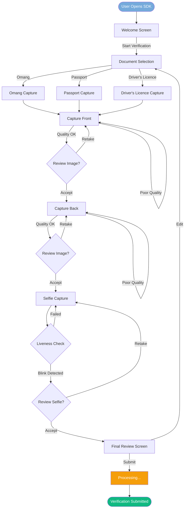

# AuthBridge UX Design Specification

**Botswana's Trusted Identity Verification Partner**

---

## Document Overview

This document provides comprehensive UX/UI specifications for all screens, flows, and components required for AuthBridge. It covers:

1. **Design System** — Colours, typography, spacing, components
2. **Web SDK** — End-user verification flow (existing + enhancements)
3. **Backoffice Application** — Internal case management dashboard
4. **Customer Portal** — Self-service for API Access customers
5. **Public Website** — Marketing and documentation pages

### Scope

- **In Scope:** All screens identified in the UX audit (64 screens)
- **On Hold:** Setswana localisation, Orange Money integration
- **Language:** English (UK) as default

### Design Principles

1. **Mobile-First** — Design for mobile devices first, scale up to desktop
2. **Simplicity** — Minimise cognitive load, clear calls-to-action
3. **Accessibility** — WCAG 2.1 AA compliance
4. **Trust** — Professional design, clear privacy messaging, security indicators
5. **Speed** — Fast load times, instant feedback, progress indicators
6. **Botswana Context** — Culturally appropriate, local document support

---

## Table of Contents

1. [Design System](#1-design-system)
2. [Web SDK — End-User Verification](#2-web-sdk--end-user-verification)
3. [Authentication & Onboarding](#3-authentication--onboarding)
4. [Backoffice — Dashboard & Home](#4-backoffice--dashboard--home)
5. [Backoffice — Case Management (KYC)](#5-backoffice--case-management-kyc)
6. [Backoffice — Business Verification (KYB)](#6-backoffice--business-verification-kyb)
7. [Backoffice — User Management](#7-backoffice--user-management)
8. [Backoffice — Reporting & Analytics](#8-backoffice--reporting--analytics)
9. [Customer Portal — Billing & Subscription](#9-customer-portal--billing--subscription)
10. [Customer Portal — Settings & Configuration](#10-customer-portal--settings--configuration)
11. [Customer Portal — Developer Tools](#11-customer-portal--developer-tools)
12. [Support & Help](#12-support--help)
13. [Public Website](#13-public-website)
14. [Screen Inventory](#14-screen-inventory)

---

## 1. Design System

### 1.1 Colour Palette

#### Primary Colours (AuthBridge Brand)

| Name | Hex | Usage |
|------|-----|-------|
| **Botswana Blue** | `#75AADB` | Primary brand colour, buttons, links |
| **Botswana Blue Dark** | `#2596BE` | Hover states, active states |
| **Botswana Blue Light** | `#E9F5F9` | Backgrounds, highlights |
| **Black** | `#000000` | Text, headers (from Botswana flag) |
| **White** | `#FFFFFF` | Backgrounds, cards |

#### Semantic Colours

| Name | Hex | Usage |
|------|-----|-------|
| **Success** | `#10B981` | Approved states, success messages |
| **Success Light** | `#D1FAE5` | Success backgrounds |
| **Error** | `#EF4444` | Rejected states, error messages |
| **Error Light** | `#FEE2E2` | Error backgrounds |
| **Warning** | `#F59E0B` | Pending states, warnings |
| **Warning Light** | `#FEF3C7` | Warning backgrounds |
| **Info** | `#3B82F6` | Information, tips |
| **Info Light** | `#DBEAFE` | Info backgrounds |

#### Neutral Colours

| Name | Hex | Usage |
|------|-----|-------|
| **Gray 50** | `#F9FAFB` | Page backgrounds |
| **Gray 100** | `#F3F4F6` | Card backgrounds, dividers |
| **Gray 200** | `#E5E7EB` | Borders, disabled backgrounds |
| **Gray 300** | `#D1D5DB` | Disabled text, placeholders |
| **Gray 400** | `#9CA3AF` | Secondary text |
| **Gray 500** | `#6B7280` | Body text |
| **Gray 600** | `#4B5563` | Labels |
| **Gray 700** | `#374151` | Headings |
| **Gray 800** | `#1F2937` | Primary text |
| **Gray 900** | `#111827` | Darkest text |

### 1.2 Typography

#### Font Family

- **Primary:** Inter (sans-serif)
- **Monospace:** JetBrains Mono (for code, API keys)
- **Fallback:** system-ui, -apple-system, sans-serif

#### Type Scale

| Name | Size | Weight | Line Height | Usage |
|------|------|--------|-------------|-------|
| **Display** | 36px (2.25rem) | 700 | 1.2 | Hero headings |
| **H1** | 30px (1.875rem) | 700 | 1.3 | Page titles |
| **H2** | 24px (1.5rem) | 600 | 1.3 | Section headings |
| **H3** | 20px (1.25rem) | 600 | 1.4 | Card titles |
| **H4** | 18px (1.125rem) | 600 | 1.4 | Subsection headings |
| **Body Large** | 18px (1.125rem) | 400 | 1.6 | Lead paragraphs |
| **Body** | 16px (1rem) | 400 | 1.5 | Default body text |
| **Body Small** | 14px (0.875rem) | 400 | 1.5 | Secondary text, captions |
| **Caption** | 12px (0.75rem) | 400 | 1.4 | Labels, hints |
| **Overline** | 12px (0.75rem) | 600 | 1.4 | Category labels (uppercase) |

### 1.3 Spacing Scale

Base unit: 4px

| Token | Value | Usage |
|-------|-------|-------|
| `space-1` | 4px | Tight spacing |
| `space-2` | 8px | Icon gaps, inline spacing |
| `space-3` | 12px | Small padding |
| `space-4` | 16px | Default padding, gaps |
| `space-5` | 20px | Medium padding |
| `space-6` | 24px | Card padding |
| `space-8` | 32px | Section spacing |
| `space-10` | 40px | Large spacing |
| `space-12` | 48px | Section margins |
| `space-16` | 64px | Page sections |

### 1.4 Breakpoints

| Name | Width | Target |
|------|-------|--------|
| **xs** | 320px | Small phones |
| **sm** | 576px | Large phones |
| **md** | 768px | Tablets |
| **lg** | 992px | Laptops |
| **xl** | 1200px | Desktops |
| **2xl** | 1440px | Large desktops |

### 1.5 Border Radius

| Token | Value | Usage |
|-------|-------|-------|
| `radius-sm` | 4px | Small elements, tags |
| `radius-md` | 8px | Buttons, inputs |
| `radius-lg` | 12px | Cards, modals |
| `radius-xl` | 16px | Large cards |
| `radius-full` | 9999px | Pills, avatars |

### 1.6 Shadows

| Token | Value | Usage |
|-------|-------|-------|
| `shadow-sm` | `0 1px 2px rgba(0,0,0,0.05)` | Subtle elevation |
| `shadow-md` | `0 4px 6px rgba(0,0,0,0.1)` | Cards, dropdowns |
| `shadow-lg` | `0 10px 15px rgba(0,0,0,0.1)` | Modals, popovers |
| `shadow-xl` | `0 20px 25px rgba(0,0,0,0.15)` | Dialogs |


### 1.7 Core Components

#### Buttons

| Variant | Background | Text | Border | Usage |
|---------|------------|------|--------|-------|
| **Primary** | Botswana Blue | White | None | Primary actions |
| **Secondary** | White | Botswana Blue | Botswana Blue | Secondary actions |
| **Outline** | Transparent | Gray 700 | Gray 300 | Tertiary actions |
| **Ghost** | Transparent | Gray 600 | None | Subtle actions |
| **Danger** | Error | White | None | Destructive actions |
| **Success** | Success | White | None | Positive actions |

**Button Sizes:**
- **Small:** 32px height, 12px padding, 14px font
- **Medium:** 40px height, 16px padding, 16px font
- **Large:** 48px height, 20px padding, 18px font

**Button States:**
- Default, Hover (+10% darker), Active (+20% darker), Disabled (50% opacity), Loading (spinner)

#### Form Inputs

| Element | Height | Padding | Border | Border Radius |
|---------|--------|---------|--------|---------------|
| **Text Input** | 40px | 12px | 1px Gray 300 | 8px |
| **Textarea** | Auto (min 80px) | 12px | 1px Gray 300 | 8px |
| **Select** | 40px | 12px | 1px Gray 300 | 8px |
| **Checkbox** | 20px | — | 1px Gray 300 | 4px |
| **Radio** | 20px | — | 1px Gray 300 | Full |
| **Toggle** | 24px | — | None | Full |

**Input States:**
- Default, Focus (Botswana Blue border, light blue shadow), Error (Error border), Disabled (Gray 100 bg)

#### Cards

```
┌─────────────────────────────────────┐
│  Card Header (optional)             │  ← 16px padding
├─────────────────────────────────────┤
│                                     │
│  Card Content                       │  ← 24px padding
│                                     │
├─────────────────────────────────────┤
│  Card Footer (optional)             │  ← 16px padding
└─────────────────────────────────────┘
```

- Background: White
- Border: 1px Gray 200
- Border Radius: 12px
- Shadow: shadow-md

#### Tables

| Element | Style |
|---------|-------|
| **Header Row** | Gray 50 background, Gray 700 text, 600 weight |
| **Body Row** | White background, Gray 800 text |
| **Row Hover** | Gray 50 background |
| **Row Selected** | Botswana Blue Light background |
| **Cell Padding** | 12px vertical, 16px horizontal |
| **Border** | 1px Gray 200 between rows |

#### Badges/Tags

| Variant | Background | Text |
|---------|------------|------|
| **Default** | Gray 100 | Gray 700 |
| **Primary** | Botswana Blue Light | Botswana Blue Dark |
| **Success** | Success Light | Success |
| **Warning** | Warning Light | Warning |
| **Error** | Error Light | Error |

#### Status Indicators

| Status | Colour | Icon |
|--------|--------|------|
| **Pending** | Warning | Clock |
| **In Review** | Info | Eye |
| **Approved** | Success | Check Circle |
| **Rejected** | Error | X Circle |
| **Expired** | Gray 400 | Clock |
| **Resubmission Required** | Warning | Refresh |

#### Navigation

**Sidebar (Backoffice):**
- Width: 240px (expanded), 64px (collapsed)
- Background: White
- Border Right: 1px Gray 200
- Logo at top, navigation items, user menu at bottom

**Top Bar:**
- Height: 64px
- Background: White
- Border Bottom: 1px Gray 200
- Contains: Breadcrumbs, Search, Notifications, User Avatar

#### Modals/Dialogs

| Size | Width | Usage |
|------|-------|-------|
| **Small** | 400px | Confirmations, simple forms |
| **Medium** | 560px | Standard forms, details |
| **Large** | 720px | Complex forms, previews |
| **Full** | 90vw (max 1200px) | Document viewers, wizards |

- Overlay: Black at 50% opacity
- Border Radius: 16px
- Padding: 24px

#### Toast Notifications

- Position: Top centre
- Width: Auto (max 400px)
- Duration: 5 seconds (dismissible)
- Variants: Success, Error, Warning, Info


---

## 2. Web SDK — End-User Verification

The Web SDK is the embeddable verification flow that end-users interact with. It's embedded in client applications (banks, insurance, etc.) to capture identity documents and selfies.

### 2.0 Verification Flow Overview

The following diagram shows the complete end-to-end user journey through the Web SDK:



### 2.1 Existing Screens (Enhancement Required)

These screens exist but need Omang-specific enhancements:

#### 2.1.1 Welcome Screen

**Current:** Generic welcome message
**Enhancement Required:**
- Add AuthBridge branding option (or client white-label)
- Add estimated time ("This takes about 2 minutes")
- Add privacy notice link
- Add language selector (English UK default)

**Wireframe:**
```
┌─────────────────────────────────────┐
│           [Client Logo]             │
│                                     │
│     Verify Your Identity            │
│                                     │
│  We need to verify your identity    │
│  to complete your application.      │
│                                     │
│  ⏱ This takes about 2 minutes       │
│                                     │
│  You'll need:                       │
│  ✓ Your Omang or Passport           │
│  ✓ Good lighting                    │
│  ✓ A steady hand for photos         │
│                                     │
│  ┌─────────────────────────────┐    │
│  │      Start Verification     │    │
│  └─────────────────────────────┘    │
│                                     │
│  🔒 Your data is encrypted and      │
│     protected. Privacy Policy       │
└─────────────────────────────────────┘
```

#### 2.1.2 Document Selection Screen

**Current:** Generic document types (Passport, ID Card, Driver's License)
**Enhancement Required:**
- Add **"Omang"** as primary option for Botswana
- Add Omang icon (Botswana coat of arms or ID card icon)
- Reorder: Omang first, then Passport, then Driver's License
- Add document descriptions

**Wireframe:**
```
┌─────────────────────────────────────┐
│  ← Back                    Step 1/5 │
│                                     │
│     Select Your Document            │
│                                     │
│  Choose the document you'll use     │
│  to verify your identity.           │
│                                     │
│  ┌─────────────────────────────┐    │
│  │ 🪪  Omang                    │    │
│  │     Botswana National ID    │ ✓  │
│  └─────────────────────────────┘    │
│                                     │
│  ┌─────────────────────────────┐    │
│  │ 🛂  Passport                 │    │
│  │     International travel    │    │
│  └─────────────────────────────┘    │
│                                     │
│  ┌─────────────────────────────┐    │
│  │ 🚗  Driver's Licence         │    │
│  │     Botswana or foreign     │    │
│  └─────────────────────────────┘    │
│                                     │
│  ┌─────────────────────────────┐    │
│  │         Continue            │    │
│  └─────────────────────────────┘    │
└─────────────────────────────────────┘
```

#### 2.1.3 Document Capture — Front

**Current:** Generic capture overlay
**Enhancement Required:**
- **Omang-specific overlay** with correct aspect ratio (85.6mm × 53.98mm, credit card size)
- Omang-specific instructions ("Position your Omang card")
- Real-time edge detection feedback
- Quality indicators (blur, glare, lighting)

**Wireframe:**
```
┌─────────────────────────────────────┐
│  ← Back                    Step 2/5 │
│                                     │
│     Photograph Your Omang           │
│           (Front Side)              │
│                                     │
│  ┌─────────────────────────────┐    │
│  │                             │    │
│  │   ┌───────────────────┐     │    │
│  │   │                   │     │    │
│  │   │   [Camera View]   │     │    │
│  │   │                   │     │    │
│  │   │  ┌─────────────┐  │     │    │
│  │   │  │ Omang Frame │  │     │    │
│  │   │  └─────────────┘  │     │    │
│  │   │                   │     │    │
│  │   └───────────────────┘     │    │
│  │                             │    │
│  └─────────────────────────────┘    │
│                                     │
│  ✓ Good lighting detected           │
│  ⚠ Hold steady                      │
│                                     │
│       ┌───────────────┐             │
│       │   📷 Capture   │             │
│       └───────────────┘             │
│                                     │
│  📁 Upload from device instead      │
└─────────────────────────────────────┘
```

#### 2.1.4 Document Review — Front

**Current:** Generic review
**Enhancement Required:**
- Show extracted Omang fields (Name, Omang Number, DOB)
- Highlight any OCR confidence issues
- Allow field correction before submission

**Wireframe:**
```
┌─────────────────────────────────────┐
│  ← Back                    Step 2/5 │
│                                     │
│     Check Your Photo                │
│                                     │
│  ┌─────────────────────────────┐    │
│  │                             │    │
│  │     [Captured Image]        │    │
│  │                             │    │
│  └─────────────────────────────┘    │
│                                     │
│  ✓ Image is clear                   │
│  ✓ All corners visible              │
│  ✓ No glare detected                │
│                                     │
│  Extracted Information:             │
│  ┌─────────────────────────────┐    │
│  │ Name: MOEPSWA EDMOND        │    │
│  │ Omang: 123456789            │    │
│  │ DOB: 15/03/1985             │    │
│  └─────────────────────────────┘    │
│                                     │
│  ┌─────────────────────────────┐    │
│  │      Looks Good ✓           │    │
│  └─────────────────────────────┘    │
│                                     │
│  ↻ Retake Photo                     │
└─────────────────────────────────────┘
```

#### 2.1.5 Document Capture — Back

**Current:** Generic back capture
**Enhancement Required:**
- Omang back side overlay (barcode area highlighted)
- Instructions specific to Omang back

#### 2.1.6 Selfie Capture

**Current:** Basic selfie capture
**Enhancement Required:**
- Face oval overlay
- Liveness detection prompts ("Blink", "Turn head slightly")
- Lighting quality indicator
- Glasses/hat warning

**Wireframe:**
```
┌─────────────────────────────────────┐
│  ← Back                    Step 4/5 │
│                                     │
│     Take a Selfie                   │
│                                     │
│  Position your face in the oval     │
│                                     │
│  ┌─────────────────────────────┐    │
│  │                             │    │
│  │        ┌───────┐            │    │
│  │       (         )           │    │
│  │       │  Face   │           │    │
│  │       │  Here   │           │    │
│  │       (         )           │    │
│  │        └───────┘            │    │
│  │                             │    │
│  └─────────────────────────────┘    │
│                                     │
│  ✓ Face detected                    │
│  ✓ Good lighting                    │
│  ⚠ Please blink now                 │
│                                     │
│       ┌───────────────┐             │
│       │   📷 Capture   │             │
│       └───────────────┘             │
│                                     │
│  Tips:                              │
│  • Remove glasses if possible       │
│  • Look directly at the camera      │
│  • Keep a neutral expression        │
└─────────────────────────────────────┘
```

#### 2.1.7 Final/Success Screen

**Current:** Generic success
**Enhancement Required:**
- Show verification reference number
- Estimated review time
- Next steps instructions
- Option to download receipt

**Wireframe:**
```
┌─────────────────────────────────────┐
│                                     │
│            ✓                        │
│     Verification Submitted          │
│                                     │
│  Thank you! Your documents have     │
│  been submitted for review.         │
│                                     │
│  ┌─────────────────────────────┐    │
│  │ Reference: VRF-2026-ABC123  │    │
│  │ Submitted: 13 Jan 2026      │    │
│  │ Est. Review: Within 24 hrs  │    │
│  └─────────────────────────────┘    │
│                                     │
│  What happens next?                 │
│  1. Our team reviews your docs      │
│  2. You'll receive an email         │
│  3. Your account will be activated  │
│                                     │
│  ┌─────────────────────────────┐    │
│  │      Return to [Client]     │    │
│  └─────────────────────────────┘    │
│                                     │
│  📥 Download Receipt                │
└─────────────────────────────────────┘
```


### 2.2 New Screens Required

#### 2.2.1 Resubmission Screen (Enhancement)

**Purpose:** When a verification is rejected and user needs to resubmit

**Wireframe:**
```
┌─────────────────────────────────────┐
│                                     │
│            ⚠                        │
│     Resubmission Required           │
│                                     │
│  We couldn't verify your identity   │
│  with the documents provided.       │
│                                     │
│  Issues found:                      │
│  ┌─────────────────────────────┐    │
│  │ ✗ Document image was blurry │    │
│  │ ✗ Face didn't match ID      │    │
│  └─────────────────────────────┘    │
│                                     │
│  Please try again with:             │
│  • Better lighting                  │
│  • A clearer photo of your ID       │
│  • Make sure your face is visible   │
│                                     │
│  ┌─────────────────────────────┐    │
│  │      Try Again              │    │
│  └─────────────────────────────┘    │
│                                     │
│  Need help? Contact Support         │
└─────────────────────────────────────┘
```

#### 2.2.2 Decline Screen (Enhancement)

**Purpose:** When verification is permanently declined

**Wireframe:**
```
┌─────────────────────────────────────┐
│                                     │
│            ✗                        │
│     Verification Declined           │
│                                     │
│  Unfortunately, we were unable to   │
│  verify your identity.              │
│                                     │
│  This may be because:               │
│  • The document couldn't be         │
│    authenticated                    │
│  • Information didn't match our     │
│    records                          │
│                                     │
│  If you believe this is an error,   │
│  please contact support.            │
│                                     │
│  ┌─────────────────────────────┐    │
│  │      Contact Support        │    │
│  └─────────────────────────────┘    │
│                                     │
│  Reference: VRF-2026-ABC123         │
└─────────────────────────────────────┘
```

#### 2.2.3 Session Expired Screen

**Purpose:** When verification session times out

**Wireframe:**
```
┌─────────────────────────────────────┐
│                                     │
│            ⏱                        │
│     Session Expired                 │
│                                     │
│  Your verification session has      │
│  expired for security reasons.      │
│                                     │
│  Don't worry — your progress        │
│  may have been saved.               │
│                                     │
│  ┌─────────────────────────────┐    │
│  │      Start Again            │    │
│  └─────────────────────────────┘    │
│                                     │
│  ┌─────────────────────────────┐    │
│  │      Return to [Client]     │    │
│  └─────────────────────────────┘    │
└─────────────────────────────────────┘
```

#### 2.2.4 Camera Permission Denied Screen

**Purpose:** When user denies camera access

**Wireframe:**
```
┌─────────────────────────────────────┐
│                                     │
│            📷                       │
│     Camera Access Required          │
│                                     │
│  To verify your identity, we need   │
│  access to your camera.             │
│                                     │
│  How to enable:                     │
│  1. Click the camera icon in your   │
│     browser's address bar           │
│  2. Select "Allow"                  │
│  3. Refresh this page               │
│                                     │
│  ┌─────────────────────────────┐    │
│  │      Try Again              │    │
│  └─────────────────────────────┘    │
│                                     │
│  📁 Or upload photos instead        │
└─────────────────────────────────────┘
```

#### 2.2.5 Unsupported Browser Screen

**Purpose:** When browser doesn't support required features

**Wireframe:**
```
┌─────────────────────────────────────┐
│                                     │
│            🌐                       │
│     Browser Not Supported           │
│                                     │
│  Your browser doesn't support the   │
│  features needed for verification.  │
│                                     │
│  Please use one of these browsers:  │
│  • Google Chrome (recommended)      │
│  • Mozilla Firefox                  │
│  • Safari (iOS/macOS)               │
│  • Microsoft Edge                   │
│                                     │
│  ┌─────────────────────────────┐    │
│  │   Open in Chrome            │    │
│  └─────────────────────────────┘    │
└─────────────────────────────────────┘
```

---

## 3. Authentication & Onboarding

These screens are for the Customer Portal (API Access customers) and Backoffice users.

### 3.1 Login Page

**URL:** `/login`

**Purpose:** Authenticate existing users

**Wireframe:**
```
┌─────────────────────────────────────────────────────────────┐
│                                                             │
│                    [AuthBridge Logo]                        │
│                                                             │
│                    Welcome Back                             │
│              Sign in to your account                        │
│                                                             │
│         ┌─────────────────────────────────┐                 │
│         │ Email address                   │                 │
│         │ ┌─────────────────────────────┐ │                 │
│         │ │ you@company.com             │ │                 │
│         │ └─────────────────────────────┘ │                 │
│         │                                 │                 │
│         │ Password                        │                 │
│         │ ┌─────────────────────────────┐ │                 │
│         │ │ ••••••••••                  │ │                 │
│         │ └─────────────────────────────┘ │                 │
│         │                                 │                 │
│         │ ☐ Remember me    Forgot password?                 │
│         │                                 │                 │
│         │ ┌─────────────────────────────┐ │                 │
│         │ │        Sign In              │ │                 │
│         │ └─────────────────────────────┘ │                 │
│         │                                 │                 │
│         │ ─────────── or ───────────      │                 │
│         │                                 │                 │
│         │ ┌─────────────────────────────┐ │                 │
│         │ │  🔐 Sign in with SSO        │ │                 │
│         │ └─────────────────────────────┘ │                 │
│         └─────────────────────────────────┘                 │
│                                                             │
│              Don't have an account? Sign up                 │
│                                                             │
└─────────────────────────────────────────────────────────────┘
```

**Fields:**
- Email (required, email validation)
- Password (required, min 8 characters)
- Remember me (checkbox)

**Actions:**
- Sign In → Authenticate and redirect to dashboard
- Forgot password → Navigate to password reset
- Sign up → Navigate to registration
- SSO → Enterprise SSO flow (future)

**Error States:**
- Invalid credentials: "Invalid email or password. Please try again."
- Account locked: "Your account has been locked. Please contact support."
- Email not verified: "Please verify your email before signing in."


### 3.2 Registration Page

**URL:** `/register`

**Purpose:** Create new account (API Access self-service)

**Wireframe:**
```
┌─────────────────────────────────────────────────────────────┐
│                                                             │
│                    [AuthBridge Logo]                        │
│                                                             │
│                   Create Your Account                       │
│           Start verifying identities in minutes             │
│                                                             │
│         ┌─────────────────────────────────┐                 │
│         │ Full name                       │                 │
│         │ ┌─────────────────────────────┐ │                 │
│         │ │ Edmond Moepswa              │ │                 │
│         │ └─────────────────────────────┘ │                 │
│         │                                 │                 │
│         │ Work email                      │                 │
│         │ ┌─────────────────────────────┐ │                 │
│         │ │ edmond@company.co.bw        │ │                 │
│         │ └─────────────────────────────┘ │                 │
│         │                                 │                 │
│         │ Company name                    │                 │
│         │ ┌─────────────────────────────┐ │                 │
│         │ │ BridgeArc (Pty) Ltd         │ │                 │
│         │ └─────────────────────────────┘ │                 │
│         │                                 │                 │
│         │ Password                        │                 │
│         │ ┌─────────────────────────────┐ │                 │
│         │ │ ••••••••••                  │ │                 │
│         │ └─────────────────────────────┘ │                 │
│         │ ✓ 8+ characters  ✓ 1 number     │                 │
│         │                                 │                 │
│         │ ☑ I agree to the Terms of       │                 │
│         │   Service and Privacy Policy    │                 │
│         │                                 │                 │
│         │ ┌─────────────────────────────┐ │                 │
│         │ │     Create Account          │ │                 │
│         │ └─────────────────────────────┘ │                 │
│         └─────────────────────────────────┘                 │
│                                                             │
│              Already have an account? Sign in               │
│                                                             │
└─────────────────────────────────────────────────────────────┘
```

**Fields:**
- Full name (required)
- Work email (required, email validation, no free email domains)
- Company name (required)
- Password (required, min 8 chars, 1 number, 1 uppercase)
- Terms acceptance (required checkbox)

**Validation:**
- Email: Block free email domains (gmail, yahoo, hotmail) for business accounts
- Password strength indicator
- Real-time validation feedback

### 3.3 Email Verification Page

**URL:** `/verify-email`

**Purpose:** Confirm email address after registration

**Wireframe:**
```
┌─────────────────────────────────────────────────────────────┐
│                                                             │
│                    [AuthBridge Logo]                        │
│                                                             │
│                        ✉️                                   │
│                   Check Your Email                          │
│                                                             │
│         We've sent a verification link to:                  │
│         edmond@company.co.bw                                │
│                                                             │
│         Click the link in the email to verify               │
│         your account and get started.                       │
│                                                             │
│         ┌─────────────────────────────────┐                 │
│         │     Resend Verification Email   │                 │
│         └─────────────────────────────────┘                 │
│                                                             │
│         Didn't receive it?                                  │
│         • Check your spam folder                            │
│         • Make sure edmond@company.co.bw is correct         │
│         • Contact support if you need help                  │
│                                                             │
└─────────────────────────────────────────────────────────────┘
```

### 3.4 Email Verified Success Page

**URL:** `/email-verified`

**Purpose:** Confirm email verification success

**Wireframe:**
```
┌─────────────────────────────────────────────────────────────┐
│                                                             │
│                    [AuthBridge Logo]                        │
│                                                             │
│                        ✓                                    │
│                   Email Verified!                           │
│                                                             │
│         Your email has been verified successfully.          │
│         You can now sign in to your account.                │
│                                                             │
│         ┌─────────────────────────────────┐                 │
│         │        Go to Sign In            │                 │
│         └─────────────────────────────────┘                 │
│                                                             │
└─────────────────────────────────────────────────────────────┘
```

### 3.5 Forgot Password Page

**URL:** `/forgot-password`

**Purpose:** Request password reset

**Wireframe:**
```
┌─────────────────────────────────────────────────────────────┐
│                                                             │
│                    [AuthBridge Logo]                        │
│                                                             │
│                   Forgot Password?                          │
│         Enter your email to reset your password             │
│                                                             │
│         ┌─────────────────────────────────┐                 │
│         │ Email address                   │                 │
│         │ ┌─────────────────────────────┐ │                 │
│         │ │ you@company.com             │ │                 │
│         │ └─────────────────────────────┘ │                 │
│         │                                 │                 │
│         │ ┌─────────────────────────────┐ │                 │
│         │ │     Send Reset Link         │ │                 │
│         │ └─────────────────────────────┘ │                 │
│         └─────────────────────────────────┘                 │
│                                                             │
│              ← Back to Sign In                              │
│                                                             │
└─────────────────────────────────────────────────────────────┘
```

### 3.6 Reset Password Page

**URL:** `/reset-password?token=xxx`

**Purpose:** Set new password

**Wireframe:**
```
┌─────────────────────────────────────────────────────────────┐
│                                                             │
│                    [AuthBridge Logo]                        │
│                                                             │
│                   Reset Your Password                       │
│              Enter your new password below                  │
│                                                             │
│         ┌─────────────────────────────────┐                 │
│         │ New password                    │                 │
│         │ ┌─────────────────────────────┐ │                 │
│         │ │ ••••••••••                  │ │                 │
│         │ └─────────────────────────────┘ │                 │
│         │ ✓ 8+ characters  ✗ 1 number     │                 │
│         │                                 │                 │
│         │ Confirm password                │                 │
│         │ ┌─────────────────────────────┐ │                 │
│         │ │ ••••••••••                  │ │                 │
│         │ └─────────────────────────────┘ │                 │
│         │                                 │                 │
│         │ ┌─────────────────────────────┐ │                 │
│         │ │     Reset Password          │ │                 │
│         │ └─────────────────────────────┘ │                 │
│         └─────────────────────────────────┘                 │
│                                                             │
└─────────────────────────────────────────────────────────────┘
```

### 3.7 Onboarding Wizard

**URL:** `/onboarding`

**Purpose:** Guide new users through initial setup (after first login)

**Step 1: Company Details**
```
┌─────────────────────────────────────────────────────────────┐
│  Step 1 of 4                                    [Skip →]    │
│  ━━━━━━━━━━━━━━━━━━━━━━━━━━━━━━━━━━━━━━━━━━━━━━━━━━━━━━━━━  │
│                                                             │
│                   Tell Us About Your Company                │
│                                                             │
│         ┌─────────────────────────────────┐                 │
│         │ Company registration number     │                 │
│         │ ┌─────────────────────────────┐ │                 │
│         │ │ BW00001234567               │ │                 │
│         │ └─────────────────────────────┘ │                 │
│         │ (CIPA registration number)      │                 │
│         │                                 │                 │
│         │ Industry                        │                 │
│         │ ┌─────────────────────────────┐ │                 │
│         │ │ Financial Services        ▼ │ │                 │
│         │ └─────────────────────────────┘ │                 │
│         │                                 │                 │
│         │ Company size                    │                 │
│         │ ○ 1-10  ○ 11-50  ○ 51-200  ○ 200+ │               │
│         │                                 │                 │
│         │ ┌─────────────────────────────┐ │                 │
│         │ │         Continue            │ │                 │
│         │ └─────────────────────────────┘ │                 │
│         └─────────────────────────────────┘                 │
│                                                             │
└─────────────────────────────────────────────────────────────┘
```

**Step 2: Use Case Selection**
```
┌─────────────────────────────────────────────────────────────┐
│  Step 2 of 4                                    [Skip →]    │
│  ━━━━━━━━━━━━━━━━━━━━━━━━━━━━━━━━━━━━━━━━━━━━━━━━━━━━━━━━━  │
│                                                             │
│                   What Will You Verify?                     │
│              Select all that apply                          │
│                                                             │
│         ┌─────────────────────────────────┐                 │
│         │ ☑ Customer onboarding (KYC)     │                 │
│         │ ☐ Business verification (KYB)   │                 │
│         │ ☐ Tenant verification           │                 │
│         │ ☐ Employee background checks    │                 │
│         │ ☐ Age verification              │                 │
│         │ ☐ Other                         │                 │
│         └─────────────────────────────────┘                 │
│                                                             │
│         Estimated monthly verifications:                    │
│         ○ <100  ○ 100-500  ○ 500-2000  ○ 2000+             │
│                                                             │
│         ┌─────────────────────────────────┐                 │
│         │         Continue                │                 │
│         └─────────────────────────────────┘                 │
│                                                             │
└─────────────────────────────────────────────────────────────┘
```

**Step 3: API Key Generation**
```
┌─────────────────────────────────────────────────────────────┐
│  Step 3 of 4                                                │
│  ━━━━━━━━━━━━━━━━━━━━━━━━━━━━━━━━━━━━━━━━━━━━━━━━━━━━━━━━━  │
│                                                             │
│                   Your API Keys                             │
│         Use these to integrate AuthBridge                   │
│                                                             │
│         ┌─────────────────────────────────┐                 │
│         │ Test API Key (Sandbox)          │                 │
│         │ ┌─────────────────────────────┐ │                 │
│         │ │ sk_test_abc123...    [Copy] │ │                 │
│         │ └─────────────────────────────┘ │                 │
│         │                                 │                 │
│         │ Live API Key (Production)       │                 │
│         │ ┌─────────────────────────────┐ │                 │
│         │ │ sk_live_xyz789...    [Copy] │ │                 │
│         │ └─────────────────────────────┘ │                 │
│         │ ⚠ Keep this secret! Never      │                 │
│         │   expose in client-side code.   │                 │
│         └─────────────────────────────────┘                 │
│                                                             │
│         ┌─────────────────────────────────┐                 │
│         │         Continue                │                 │
│         └─────────────────────────────────┘                 │
│                                                             │
└─────────────────────────────────────────────────────────────┘
```

**Step 4: First Verification**
```
┌─────────────────────────────────────────────────────────────┐
│  Step 4 of 4                                                │
│  ━━━━━━━━━━━━━━━━━━━━━━━━━━━━━━━━━━━━━━━━━━━━━━━━━━━━━━━━━  │
│                                                             │
│                   Try Your First Verification               │
│                                                             │
│         ┌─────────────────────────────────┐                 │
│         │                                 │                 │
│         │  Test the verification flow     │                 │
│         │  using our sandbox environment. │                 │
│         │                                 │                 │
│         │  ┌─────────────────────────┐    │                 │
│         │  │  🧪 Run Test Verification │    │                 │
│         │  └─────────────────────────┘    │                 │
│         │                                 │                 │
│         │  Or explore the documentation:  │                 │
│         │  📚 API Reference               │                 │
│         │  🔧 Integration Guide           │                 │
│         │  💻 Code Examples               │                 │
│         │                                 │                 │
│         └─────────────────────────────────┘                 │
│                                                             │
│         ┌─────────────────────────────────┐                 │
│         │      Go to Dashboard            │                 │
│         └─────────────────────────────────┘                 │
│                                                             │
└─────────────────────────────────────────────────────────────┘
```

### 3.8 Two-Factor Authentication Setup

**URL:** `/settings/security/2fa`

**Purpose:** Enable 2FA for account security

**Wireframe:**
```
┌─────────────────────────────────────────────────────────────┐
│                                                             │
│              Set Up Two-Factor Authentication               │
│                                                             │
│  Step 1: Scan QR Code                                       │
│  ┌─────────────────────────────────────────────────────┐    │
│  │                                                     │    │
│  │     ┌─────────────┐                                 │    │
│  │     │ [QR Code]   │   Scan this QR code with your  │    │
│  │     │             │   authenticator app:            │    │
│  │     │             │   • Google Authenticator        │    │
│  │     └─────────────┘   • Authy                       │    │
│  │                       • 1Password                   │    │
│  │                                                     │    │
│  │  Can't scan? Enter this code manually:              │    │
│  │  JBSWY3DPEHPK3PXP                                   │    │
│  │                                                     │    │
│  └─────────────────────────────────────────────────────┘    │
│                                                             │
│  Step 2: Enter Verification Code                            │
│  ┌─────────────────────────────────────────────────────┐    │
│  │  ┌───┐ ┌───┐ ┌───┐ ┌───┐ ┌───┐ ┌───┐               │    │
│  │  │   │ │   │ │   │ │   │ │   │ │   │               │    │
│  │  └───┘ └───┘ └───┘ └───┘ └───┘ └───┘               │    │
│  └─────────────────────────────────────────────────────┘    │
│                                                             │
│  ┌─────────────────────────────────────────────────────┐    │
│  │                  Enable 2FA                         │    │
│  └─────────────────────────────────────────────────────┘    │
│                                                             │
└─────────────────────────────────────────────────────────────┘
```


---

## 4. Backoffice — Dashboard & Home

The Backoffice is the internal application used by AuthBridge staff and client compliance teams to review and manage verification cases.

### 4.1 Dashboard Home

**URL:** `/dashboard`

**Purpose:** Overview of key metrics and recent activity

**Wireframe:**
```
┌─────────────────────────────────────────────────────────────────────────────┐
│ ┌─────────┐                                                                 │
│ │ 🏠 Home │  Dashboard                              🔔 │ 👤 Edmond ▼       │
│ │ 📋 Cases│  ─────────────────────────────────────────────────────────────  │
│ │ 🏢 KYB  │                                                                 │
│ │ 📊 Reports                                                                │
│ │ 👥 Team │  Welcome back, Edmond                                           │
│ │ ⚙️ Settings                                                               │
│ └─────────┘                                                                 │
│             ┌─────────────┐ ┌─────────────┐ ┌─────────────┐ ┌─────────────┐ │
│             │ 📥 Pending  │ │ 👁 In Review│ │ ✓ Approved  │ │ ✗ Rejected  │ │
│             │             │ │             │ │             │ │             │ │
│             │     47      │ │     12      │ │    1,234    │ │     89      │ │
│             │   +5 today  │ │   -3 today  │ │  +23 today  │ │   +2 today  │ │
│             └─────────────┘ └─────────────┘ └─────────────┘ └─────────────┘ │
│                                                                             │
│  ┌─────────────────────────────────────────┐ ┌─────────────────────────────┐│
│  │ Verification Volume (Last 30 Days)      │ │ Approval Rate               ││
│  │                                         │ │                             ││
│  │     📈 [Line Chart]                     │ │    🍩 [Donut Chart]         ││
│  │                                         │ │                             ││
│  │     ▲ 1,456 verifications               │ │    92% Approved             ││
│  │       +12% vs last month                │ │    5% Rejected              ││
│  │                                         │ │    3% Pending               ││
│  └─────────────────────────────────────────┘ └─────────────────────────────┘│
│                                                                             │
│  ┌─────────────────────────────────────────────────────────────────────────┐│
│  │ Recent Cases                                              View All →    ││
│  │ ───────────────────────────────────────────────────────────────────────││
│  │ │ 👤 Thabo Molefe      │ Omang    │ ⏳ Pending   │ 2 mins ago  │ Review ││
│  │ │ 👤 Kefilwe Motswana  │ Passport │ ⏳ Pending   │ 5 mins ago  │ Review ││
│  │ │ 👤 Kagiso Tau        │ Omang    │ ✓ Approved  │ 12 mins ago │ View   ││
│  │ │ 👤 Boitumelo Kgosi   │ Omang    │ ✗ Rejected  │ 15 mins ago │ View   ││
│  │ │ 👤 Lesego Phiri      │ Licence  │ ⏳ Pending   │ 18 mins ago │ Review ││
│  └─────────────────────────────────────────────────────────────────────────┘│
│                                                                             │
│  ┌─────────────────────────────────┐ ┌─────────────────────────────────────┐│
│  │ Processing Time                 │ │ Document Types                      ││
│  │                                 │ │                                     ││
│  │ Average: 4.2 minutes            │ │ Omang: 78%                          ││
│  │ Target: <5 minutes ✓            │ │ Passport: 15%                       ││
│  │                                 │ │ Driver's Licence: 7%                ││
│  │ [Progress Bar]                  │ │ [Horizontal Bar Chart]              ││
│  └─────────────────────────────────┘ └─────────────────────────────────────┘│
│                                                                             │
└─────────────────────────────────────────────────────────────────────────────┘
```

**Metrics Cards:**
- Pending Cases (count, change today)
- In Review (count, change today)
- Approved Today (count)
- Rejected Today (count)

**Charts:**
- Verification Volume: Line chart, last 30 days
- Approval Rate: Donut chart (Approved/Rejected/Pending)
- Processing Time: Average time, target indicator
- Document Types: Horizontal bar chart

**Recent Cases Table:**
- Name, Document Type, Status, Time, Action

### 4.2 Notifications Panel

**Trigger:** Click bell icon in header

**Purpose:** Show recent notifications and alerts

**Wireframe:**
```
┌─────────────────────────────────────┐
│ Notifications                  Mark │
│                               all   │
│ ───────────────────────────────────│
│ 🔴 New case requires review         │
│    Thabo Molefe - 2 mins ago        │
│ ───────────────────────────────────│
│ 🟡 Case escalated                   │
│    Kefilwe Motswana - 15 mins ago   │
│ ───────────────────────────────────│
│ ✓ Case approved automatically       │
│    Kagiso Tau - 1 hour ago          │
│ ───────────────────────────────────│
│ ⚠ Document expired                  │
│    Batch of 5 cases - 2 hours ago   │
│ ───────────────────────────────────│
│           View All Notifications    │
└─────────────────────────────────────┘
```

### 4.3 Global Search

**Trigger:** Click search icon or press `/`

**Purpose:** Search across all cases, users, companies

**Wireframe:**
```
┌─────────────────────────────────────────────────────────────┐
│  🔍 Search cases, users, companies...                       │
│  ───────────────────────────────────────────────────────────│
│                                                             │
│  Recent Searches                                            │
│  • 123456789 (Omang)                                        │
│  • Thabo Molefe                                             │
│  • VRF-2026-ABC123                                          │
│                                                             │
│  Quick Filters                                              │
│  [Pending Cases] [Today's Cases] [My Assigned]              │
│                                                             │
└─────────────────────────────────────────────────────────────┘
```

**Search Results:**
```
┌─────────────────────────────────────────────────────────────┐
│  🔍 thabo                                              [×]  │
│  ───────────────────────────────────────────────────────────│
│                                                             │
│  Cases (3)                                                  │
│  ┌─────────────────────────────────────────────────────┐    │
│  │ 👤 Thabo Molefe      │ VRF-2026-001 │ ⏳ Pending    │    │
│  │ 👤 Thabo Kgositsile  │ VRF-2026-045 │ ✓ Approved   │    │
│  │ 👤 Thabiso Moagi     │ VRF-2026-089 │ ✗ Rejected   │    │
│  └─────────────────────────────────────────────────────┘    │
│                                                             │
│  Companies (1)                                              │
│  ┌─────────────────────────────────────────────────────┐    │
│  │ 🏢 Thabo Holdings (Pty) Ltd │ BW00001234567         │    │
│  └─────────────────────────────────────────────────────┘    │
│                                                             │
└─────────────────────────────────────────────────────────────┘
```

---

## 5. Backoffice — Case Management (KYC)

### 5.1 Cases List

**URL:** `/cases`

**Purpose:** View and manage all verification cases

**Wireframe:**
```
┌─────────────────────────────────────────────────────────────────────────────┐
│ Cases                                                                       │
│ ─────────────────────────────────────────────────────────────────────────── │
│                                                                             │
│ ┌─────────────────────────────────────────────────────────────────────────┐ │
│ │ 🔍 Search by name, Omang, email...                                      │ │
│ └─────────────────────────────────────────────────────────────────────────┘ │
│                                                                             │
│ Filters:                                                                    │
│ [Status ▼] [Document Type ▼] [Date Range ▼] [Assignee ▼] [Clear Filters]   │
│                                                                             │
│ ☐ Select All                                    Showing 1-20 of 1,382       │
│ ┌─────────────────────────────────────────────────────────────────────────┐ │
│ │ ☐ │ Name           │ Omang/ID      │ Type    │ Status   │ Date    │ → │ │
│ │───│────────────────│───────────────│─────────│──────────│─────────│───│ │
│ │ ☐ │ Thabo Molefe   │ 123456789     │ Omang   │ ⏳ Pending│ 13 Jan  │ → │ │
│ │ ☐ │ Kefilwe M.     │ 987654321     │ Passport│ ⏳ Pending│ 13 Jan  │ → │ │
│ │ ☐ │ Kagiso Tau     │ 456789123     │ Omang   │ ✓ Approved│ 12 Jan  │ → │ │
│ │ ☐ │ Boitumelo K.   │ 789123456     │ Omang   │ ✗ Rejected│ 12 Jan  │ → │ │
│ │ ☐ │ Lesego Phiri   │ 321654987     │ Licence │ 👁 Review │ 12 Jan  │ → │ │
│ └─────────────────────────────────────────────────────────────────────────┘ │
│                                                                             │
│ Bulk Actions: [Assign To ▼] [Export Selected] [Approve All] [Reject All]   │
│                                                                             │
│ ◀ Previous  │ 1 │ 2 │ 3 │ ... │ 69 │  Next ▶                               │
│                                                                             │
└─────────────────────────────────────────────────────────────────────────────┘
```

**Filters:**
- Status: All, Pending, In Review, Approved, Rejected, Resubmission Required
- Document Type: All, Omang, Passport, Driver's Licence
- Date Range: Today, Yesterday, Last 7 days, Last 30 days, Custom
- Assignee: All, Unassigned, Me, [Team members]

**Bulk Actions:**
- Assign To: Assign selected cases to team member
- Export Selected: Download as CSV
- Approve All: Bulk approve (with confirmation)
- Reject All: Bulk reject (requires reason)

**Table Columns:**
- Checkbox (for bulk selection)
- Name (with avatar)
- Omang/ID Number
- Document Type
- Status (with colour badge)
- Submitted Date
- Assignee (avatar)
- Actions (→ to view)


### 5.2 Case Detail View

**URL:** `/cases/:id`

**Purpose:** Review individual verification case

**Wireframe:**
```
┌─────────────────────────────────────────────────────────────────────────────┐
│ ← Back to Cases                                    Case: VRF-2026-ABC123    │
│ ─────────────────────────────────────────────────────────────────────────── │
│                                                                             │
│ ┌───────────────────────────────────┐ ┌───────────────────────────────────┐ │
│ │                                   │ │ Customer Information              │ │
│ │     [Document Image - Front]      │ │ ─────────────────────────────────│ │
│ │                                   │ │ Name: Thabo Molefe               │ │
│ │     🔍 Zoom  ↻ Rotate  ☀ Enhance  │ │ Omang: 123456789                 │ │
│ │                                   │ │ DOB: 15 March 1985               │ │
│ │ ─────────────────────────────────│ │ Gender: Male                      │ │
│ │                                   │ │ Address: Plot 123, Gaborone      │ │
│ │     [Document Image - Back]       │ │                                   │ │
│ │                                   │ │ Submitted: 13 Jan 2026, 14:32    │ │
│ │     🔍 Zoom  ↻ Rotate  ☀ Enhance  │ │ Client: First National Bank      │ │
│ │                                   │ │ Reference: FNB-CUST-789          │ │
│ └───────────────────────────────────┘ └───────────────────────────────────┘ │
│                                                                             │
│ ┌───────────────────────────────────┐ ┌───────────────────────────────────┐ │
│ │                                   │ │ Verification Checks               │ │
│ │     [Selfie Image]                │ │ ─────────────────────────────────│ │
│ │                                   │ │ ✓ Document Authenticity    95%   │ │
│ │     🔍 Zoom                       │ │ ✓ Face Match               89%   │ │
│ │                                   │ │ ✓ Liveness Detection       Pass  │ │
│ │ ─────────────────────────────────│ │ ✓ Omang Format Valid       Pass  │ │
│ │ Face Match: 89%                   │ │ ⚠ Expiry Check             Warn  │ │
│ │ ┌─────────┐  ┌─────────┐          │ │   Document expires in 30 days    │ │
│ │ │ ID Face │  │ Selfie  │          │ │ ✓ Duplicate Check          Pass  │ │
│ │ └─────────┘  └─────────┘          │ │                                   │ │
│ └───────────────────────────────────┘ └───────────────────────────────────┘ │
│                                                                             │
│ ┌─────────────────────────────────────────────────────────────────────────┐ │
│ │ OCR Extracted Data                                                      │ │
│ │ ─────────────────────────────────────────────────────────────────────── │ │
│ │ Full Name: MOLEFE THABO KGOMOTSO                                        │ │
│ │ ID Number: 123456789                                                    │ │
│ │ Date of Birth: 15/03/1985                                               │ │
│ │ Place of Birth: GABORONE                                                │ │
│ │ Issue Date: 20/06/2020                                                  │ │
│ │ Expiry Date: 20/06/2030                                                 │ │
│ │                                                      [Edit Extracted] │ │
│ └─────────────────────────────────────────────────────────────────────────┘ │
│                                                                             │
│ ┌─────────────────────────────────────────────────────────────────────────┐ │
│ │ Decision                                                                │ │
│ │ ─────────────────────────────────────────────────────────────────────── │ │
│ │                                                                         │ │
│ │ Notes (optional):                                                       │ │
│ │ ┌─────────────────────────────────────────────────────────────────────┐ │ │
│ │ │ Add any notes about this verification...                            │ │ │
│ │ └─────────────────────────────────────────────────────────────────────┘ │ │
│ │                                                                         │ │
│ │ ┌─────────────────┐  ┌─────────────────┐  ┌─────────────────┐          │ │
│ │ │  ✓ Approve      │  │  ✗ Reject       │  │  ↻ Resubmit     │          │ │
│ │ └─────────────────┘  └─────────────────┘  └─────────────────┘          │ │
│ │                                                                         │ │
│ └─────────────────────────────────────────────────────────────────────────┘ │
│                                                                             │
└─────────────────────────────────────────────────────────────────────────────┘
```

**Sections:**
1. **Document Images:** Front, Back with zoom/rotate/enhance controls
2. **Customer Information:** Extracted and submitted data
3. **Selfie & Face Match:** Selfie image, face comparison, match score
4. **Verification Checks:** Automated check results with scores
5. **OCR Extracted Data:** Editable extracted fields
6. **Decision Panel:** Notes field, Approve/Reject/Resubmit buttons

### 5.3 Reject Case Modal

**Trigger:** Click "Reject" button on case detail

**Purpose:** Capture rejection reason

**Wireframe:**
```
┌─────────────────────────────────────────────────────────────┐
│                                                         [×] │
│                    Reject Verification                      │
│                                                             │
│  You are about to reject the verification for:              │
│  Thabo Molefe (123456789)                                   │
│                                                             │
│  Rejection Reason (required):                               │
│  ┌─────────────────────────────────────────────────────┐    │
│  │ Select reason...                                  ▼ │    │
│  └─────────────────────────────────────────────────────┘    │
│                                                             │
│  Options:                                                   │
│  • Document image unclear/blurry                            │
│  • Document appears tampered                                │
│  • Face does not match document                             │
│  • Document expired                                         │
│  • Suspected fraud                                          │
│  • Information mismatch                                     │
│  • Other (specify below)                                    │
│                                                             │
│  Additional Notes:                                          │
│  ┌─────────────────────────────────────────────────────┐    │
│  │                                                     │    │
│  │                                                     │    │
│  └─────────────────────────────────────────────────────┘    │
│                                                             │
│  ☐ Allow resubmission                                       │
│                                                             │
│  ┌─────────────────┐  ┌─────────────────────────────────┐   │
│  │     Cancel      │  │     Confirm Rejection           │   │
│  └─────────────────┘  └─────────────────────────────────┘   │
│                                                             │
└─────────────────────────────────────────────────────────────┘
```

### 5.4 Request Resubmission Modal

**Trigger:** Click "Resubmit" button on case detail

**Purpose:** Request user to resubmit documents

**Wireframe:**
```
┌─────────────────────────────────────────────────────────────┐
│                                                         [×] │
│                  Request Resubmission                       │
│                                                             │
│  Request the customer to resubmit their verification.       │
│                                                             │
│  What needs to be resubmitted?                              │
│  ☑ Document front                                           │
│  ☐ Document back                                            │
│  ☑ Selfie                                                   │
│                                                             │
│  Reason for resubmission:                                   │
│  ┌─────────────────────────────────────────────────────┐    │
│  │ Select reason...                                  ▼ │    │
│  └─────────────────────────────────────────────────────┘    │
│                                                             │
│  Options:                                                   │
│  • Image too blurry                                         │
│  • Glare on document                                        │
│  • Document partially cut off                               │
│  • Face not clearly visible                                 │
│  • Lighting too dark                                        │
│                                                             │
│  Message to customer (optional):                            │
│  ┌─────────────────────────────────────────────────────┐    │
│  │ Please retake your document photo in better         │    │
│  │ lighting conditions...                              │    │
│  └─────────────────────────────────────────────────────┘    │
│                                                             │
│  ┌─────────────────┐  ┌─────────────────────────────────┐   │
│  │     Cancel      │  │     Send Resubmission Request   │   │
│  └─────────────────┘  └─────────────────────────────────┘   │
│                                                             │
└─────────────────────────────────────────────────────────────┘
```

### 5.5 Case Notes & Comments

**Location:** Tab or section within Case Detail

**Purpose:** Internal notes and communication about a case

**Wireframe:**
```
┌─────────────────────────────────────────────────────────────┐
│ Notes & Activity                                            │
│ ─────────────────────────────────────────────────────────── │
│                                                             │
│ ┌─────────────────────────────────────────────────────────┐ │
│ │ Add a note...                                           │ │
│ │                                                         │ │
│ │                                          [Post Note]    │ │
│ └─────────────────────────────────────────────────────────┘ │
│                                                             │
│ ┌─────────────────────────────────────────────────────────┐ │
│ │ 👤 Lesego Phiri                          13 Jan, 14:45  │ │
│ │ Contacted customer to clarify address. They confirmed   │ │
│ │ Plot 123 is correct.                                    │ │
│ └─────────────────────────────────────────────────────────┘ │
│                                                             │
│ ┌─────────────────────────────────────────────────────────┐ │
│ │ 🤖 System                                13 Jan, 14:32  │ │
│ │ Case created. Automated checks completed.               │ │
│ │ Face match: 89% | Document: Valid | Liveness: Pass      │ │
│ └─────────────────────────────────────────────────────────┘ │
│                                                             │
│ ┌─────────────────────────────────────────────────────────┐ │
│ │ 👤 Thabo Kgosi                           13 Jan, 14:30  │ │
│ │ Assigned to Lesego for review.                          │ │
│ └─────────────────────────────────────────────────────────┘ │
│                                                             │
└─────────────────────────────────────────────────────────────┘
```

### 5.6 Audit Trail

**URL:** `/cases/:id/audit` or tab within Case Detail

**Purpose:** Complete history of all actions on a case

**Wireframe:**
```
┌─────────────────────────────────────────────────────────────┐
│ Audit Trail                                    Export CSV   │
│ ─────────────────────────────────────────────────────────── │
│                                                             │
│ │ Timestamp           │ User          │ Action    │ Details │
│ │─────────────────────│───────────────│───────────│─────────│
│ │ 13 Jan 2026, 15:02  │ Lesego Phiri  │ Approved  │ —       │
│ │ 13 Jan 2026, 14:58  │ Lesego Phiri  │ Viewed    │ —       │
│ │ 13 Jan 2026, 14:45  │ Lesego Phiri  │ Note Added│ "Conta..│
│ │ 13 Jan 2026, 14:35  │ Thabo Kgosi   │ Assigned  │ To Lese.│
│ │ 13 Jan 2026, 14:32  │ System        │ Created   │ Auto ch.│
│ │ 13 Jan 2026, 14:32  │ System        │ Face Match│ 89%     │
│ │ 13 Jan 2026, 14:32  │ System        │ OCR       │ Complete│
│ │ 13 Jan 2026, 14:31  │ System        │ Uploaded  │ Selfie  │
│ │ 13 Jan 2026, 14:30  │ System        │ Uploaded  │ Doc Back│
│ │ 13 Jan 2026, 14:29  │ System        │ Uploaded  │ Doc Fro.│
│ │ 13 Jan 2026, 14:28  │ End User      │ Started   │ Via SDK │
│                                                             │
└─────────────────────────────────────────────────────────────┘
```

**Columns:**
- Timestamp (date and time)
- User (who performed action, or "System")
- Action (Created, Viewed, Assigned, Approved, Rejected, etc.)
- Details (additional context)
- IP Address (for security, shown on hover/expand)

### 5.7 Case Assignment Modal

**Trigger:** Click "Assign" on case or bulk assign

**Purpose:** Assign case(s) to team member

**Wireframe:**
```
┌─────────────────────────────────────────────────────────────┐
│                                                         [×] │
│                    Assign Case                              │
│                                                             │
│  Assign to:                                                 │
│  ┌─────────────────────────────────────────────────────┐    │
│  │ 🔍 Search team members...                           │    │
│  └─────────────────────────────────────────────────────┘    │
│                                                             │
│  ┌─────────────────────────────────────────────────────┐    │
│  │ ○ 👤 Lesego Phiri (5 cases assigned)                │    │
│  │ ○ 👤 Thabo Kgosi (3 cases assigned)                 │    │
│  │ ○ 👤 Kefilwe Tau (8 cases assigned)                 │    │
│  │ ○ 👤 Unassigned                                     │    │
│  └─────────────────────────────────────────────────────┘    │
│                                                             │
│  ☐ Notify assignee via email                                │
│                                                             │
│  ┌─────────────────┐  ┌─────────────────────────────────┐   │
│  │     Cancel      │  │         Assign                  │   │
│  └─────────────────┘  └─────────────────────────────────┘   │
│                                                             │
└─────────────────────────────────────────────────────────────┘
```


---

## 6. Backoffice — Business Verification (KYB)

### 6.1 Companies List

**URL:** `/companies`

**Purpose:** View and manage business verification cases

**Wireframe:**
```
┌─────────────────────────────────────────────────────────────────────────────┐
│ Companies                                              [+ New Company]      │
│ ─────────────────────────────────────────────────────────────────────────── │
│                                                                             │
│ ┌─────────────────────────────────────────────────────────────────────────┐ │
│ │ 🔍 Search by company name, registration number...                       │ │
│ └─────────────────────────────────────────────────────────────────────────┘ │
│                                                                             │
│ Filters:                                                                    │
│ [Status ▼] [Industry ▼] [Date Range ▼] [Clear Filters]                     │
│                                                                             │
│ ┌─────────────────────────────────────────────────────────────────────────┐ │
│ │ Company Name        │ Reg. Number    │ Industry   │ Status   │ Date    │ │
│ │─────────────────────│────────────────│────────────│──────────│─────────│ │
│ │ 🏢 Acme Holdings    │ BW00001234567  │ Finance    │ ⏳ Pending│ 13 Jan  │ │
│ │ 🏢 Botswana Motors  │ BW00009876543  │ Automotive │ ✓ Verified│ 12 Jan  │ │
│ │ 🏢 Gaborone Tech    │ BW00005555555  │ Technology │ ⏳ Pending│ 11 Jan  │ │
│ │ 🏢 Kalahari Farms   │ BW00003333333  │ Agriculture│ ✗ Rejected│ 10 Jan  │ │
│ └─────────────────────────────────────────────────────────────────────────┘ │
│                                                                             │
│ ◀ Previous  │ 1 │ 2 │ 3 │  Next ▶                                          │
│                                                                             │
└─────────────────────────────────────────────────────────────────────────────┘
```

### 6.2 Company Detail View

**URL:** `/companies/:id`

**Purpose:** Review business verification details

**Wireframe:**
```
┌─────────────────────────────────────────────────────────────────────────────┐
│ ← Back to Companies                                 Company: BW00001234567  │
│ ─────────────────────────────────────────────────────────────────────────── │
│                                                                             │
│ ┌─────────────────────────────────────────────────────────────────────────┐ │
│ │ 🏢 Acme Holdings (Pty) Ltd                              ⏳ Pending       │ │
│ │ ─────────────────────────────────────────────────────────────────────── │ │
│ │ Registration: BW00001234567 (CIPA)                                      │ │
│ │ TIN: 123456789 (BURS)                                                   │ │
│ │ Industry: Financial Services                                            │ │
│ │ Incorporated: 15 March 2015                                             │ │
│ │ Address: Plot 123, CBD, Gaborone                                        │ │
│ └─────────────────────────────────────────────────────────────────────────┘ │
│                                                                             │
│ ┌─────────────────────────────────────────────────────────────────────────┐ │
│ │ Verification Checks                                                     │ │
│ │ ─────────────────────────────────────────────────────────────────────── │ │
│ │ ✓ CIPA Registration Valid                                               │ │
│ │ ✓ BURS TIN Valid                                                        │ │
│ │ ✓ Company Status: Active                                                │ │
│ │ ⏳ Directors Verification: 2/3 verified                                  │ │
│ │ ⏳ UBO Verification: Pending                                             │ │
│ └─────────────────────────────────────────────────────────────────────────┘ │
│                                                                             │
│ [Company Documents] [Directors] [UBOs] [Audit Trail]                        │
│                                                                             │
└─────────────────────────────────────────────────────────────────────────────┘
```

### 6.3 Company Documents Tab

**Purpose:** View uploaded business documents

**Wireframe:**
```
┌─────────────────────────────────────────────────────────────────────────────┐
│ Company Documents                                        [+ Upload Document]│
│ ─────────────────────────────────────────────────────────────────────────── │
│                                                                             │
│ ┌─────────────────────────────────────────────────────────────────────────┐ │
│ │ 📄 CIPA Registration Certificate                                        │ │
│ │    Uploaded: 13 Jan 2026 │ Status: ✓ Verified                           │ │
│ │    [View] [Download]                                                    │ │
│ └─────────────────────────────────────────────────────────────────────────┘ │
│                                                                             │
│ ┌─────────────────────────────────────────────────────────────────────────┐ │
│ │ 📄 BURS Tax Clearance Certificate                                       │ │
│ │    Uploaded: 13 Jan 2026 │ Status: ✓ Verified                           │ │
│ │    [View] [Download]                                                    │ │
│ └─────────────────────────────────────────────────────────────────────────┘ │
│                                                                             │
│ ┌─────────────────────────────────────────────────────────────────────────┐ │
│ │ 📄 Proof of Address (Utility Bill)                                      │ │
│ │    Uploaded: 13 Jan 2026 │ Status: ⏳ Pending Review                     │ │
│ │    [View] [Download]                                                    │ │
│ └─────────────────────────────────────────────────────────────────────────┘ │
│                                                                             │
│ Required Documents:                                                         │
│ ☑ CIPA Registration  ☑ Tax Clearance  ☑ Proof of Address  ☐ Operating Lic. │
│                                                                             │
└─────────────────────────────────────────────────────────────────────────────┘
```

### 6.4 Directors Tab

**URL:** `/companies/:id/directors`

**Purpose:** View and verify company directors

**Wireframe:**
```
┌─────────────────────────────────────────────────────────────────────────────┐
│ Directors                                                  [+ Add Director] │
│ ─────────────────────────────────────────────────────────────────────────── │
│                                                                             │
│ ┌─────────────────────────────────────────────────────────────────────────┐ │
│ │ 👤 Thabo Molefe (Managing Director)                                     │ │
│ │    Omang: 123456789 │ Appointed: 15 Mar 2015                            │ │
│ │    KYC Status: ✓ Verified (VRF-2026-ABC123)                             │ │
│ │    [View KYC] [Remove]                                                  │ │
│ └─────────────────────────────────────────────────────────────────────────┘ │
│                                                                             │
│ ┌─────────────────────────────────────────────────────────────────────────┐ │
│ │ 👤 Kefilwe Motswana (Director)                                          │ │
│ │    Omang: 987654321 │ Appointed: 20 Jun 2018                            │ │
│ │    KYC Status: ✓ Verified (VRF-2026-DEF456)                             │ │
│ │    [View KYC] [Remove]                                                  │ │
│ └─────────────────────────────────────────────────────────────────────────┘ │
│                                                                             │
│ ┌─────────────────────────────────────────────────────────────────────────┐ │
│ │ 👤 Kagiso Tau (Director)                                                │ │
│ │    Omang: 456789123 │ Appointed: 01 Jan 2020                            │ │
│ │    KYC Status: ⏳ Pending Verification                                   │ │
│ │    [Send Verification Link] [Remove]                                    │ │
│ └─────────────────────────────────────────────────────────────────────────┘ │
│                                                                             │
│ All directors must complete KYC verification before company can be approved.│
│                                                                             │
└─────────────────────────────────────────────────────────────────────────────┘
```

### 6.5 Ultimate Beneficial Owners (UBOs) Tab

**URL:** `/companies/:id/ubos`

**Purpose:** View and verify beneficial owners (25%+ ownership)

**Wireframe:**
```
┌─────────────────────────────────────────────────────────────────────────────┐
│ Ultimate Beneficial Owners                                      [+ Add UBO] │
│ ─────────────────────────────────────────────────────────────────────────── │
│                                                                             │
│ ℹ️ UBOs are individuals who own 25% or more of the company, or exercise     │
│    significant control over the company.                                    │
│                                                                             │
│ ┌─────────────────────────────────────────────────────────────────────────┐ │
│ │ 👤 Thabo Molefe                                                         │ │
│ │    Ownership: 60% │ Control Type: Direct                                │ │
│ │    Omang: 123456789                                                     │ │
│ │    KYC Status: ✓ Verified                                               │ │
│ │    [View Details] [Edit] [Remove]                                       │ │
│ └─────────────────────────────────────────────────────────────────────────┘ │
│                                                                             │
│ ┌─────────────────────────────────────────────────────────────────────────┐ │
│ │ 👤 Kefilwe Motswana                                                     │ │
│ │    Ownership: 40% │ Control Type: Direct                                │ │
│ │    Omang: 987654321                                                     │ │
│ │    KYC Status: ✓ Verified                                               │ │
│ │    [View Details] [Edit] [Remove]                                       │ │
│ └─────────────────────────────────────────────────────────────────────────┘ │
│                                                                             │
│ Total Ownership Declared: 100%                                              │
│                                                                             │
└─────────────────────────────────────────────────────────────────────────────┘
```

### 6.6 Add UBO Modal

**Trigger:** Click "+ Add UBO"

**Purpose:** Add a new beneficial owner

**Wireframe:**
```
┌─────────────────────────────────────────────────────────────┐
│                                                         [×] │
│              Add Ultimate Beneficial Owner                  │
│                                                             │
│  Full Name:                                                 │
│  ┌─────────────────────────────────────────────────────┐    │
│  │                                                     │    │
│  └─────────────────────────────────────────────────────┘    │
│                                                             │
│  Omang Number:                                              │
│  ┌─────────────────────────────────────────────────────┐    │
│  │                                                     │    │
│  └─────────────────────────────────────────────────────┘    │
│                                                             │
│  Ownership Percentage:                                      │
│  ┌─────────────────────────────────────────────────────┐    │
│  │                                                  %  │    │
│  └─────────────────────────────────────────────────────┘    │
│                                                             │
│  Control Type:                                              │
│  ○ Direct ownership                                         │
│  ○ Indirect ownership (through another entity)              │
│  ○ Significant control (voting rights, board control)       │
│                                                             │
│  ☐ This person has an existing KYC verification             │
│    Link to case: [Select case...]                           │
│                                                             │
│  ┌─────────────────┐  ┌─────────────────────────────────┐   │
│  │     Cancel      │  │         Add UBO                 │   │
│  └─────────────────┘  └─────────────────────────────────┘   │
│                                                             │
└─────────────────────────────────────────────────────────────┘
```

### 6.7 Company Verification Decision

**Location:** Bottom of Company Detail page

**Purpose:** Approve or reject company verification

**Wireframe:**
```
┌─────────────────────────────────────────────────────────────────────────────┐
│ Verification Decision                                                       │
│ ─────────────────────────────────────────────────────────────────────────── │
│                                                                             │
│ Checklist:                                                                  │
│ ✓ CIPA registration verified                                                │
│ ✓ BURS TIN verified                                                         │
│ ✓ All directors KYC complete (3/3)                                          │
│ ✓ All UBOs KYC complete (2/2)                                               │
│ ✓ Required documents uploaded                                               │
│                                                                             │
│ Notes:                                                                      │
│ ┌─────────────────────────────────────────────────────────────────────────┐ │
│ │                                                                         │ │
│ └─────────────────────────────────────────────────────────────────────────┘ │
│                                                                             │
│ ┌─────────────────────────┐  ┌─────────────────────────────────────────┐    │
│ │  ✓ Approve Company      │  │  ✗ Reject Company                       │    │
│ └─────────────────────────┘  └─────────────────────────────────────────┘    │
│                                                                             │
└─────────────────────────────────────────────────────────────────────────────┘
```


---

## 7. Backoffice — User Management

### 7.1 Team Members List

**URL:** `/settings/team`

**Purpose:** View and manage team members

**Wireframe:**
```
┌─────────────────────────────────────────────────────────────────────────────┐
│ Team Members                                              [+ Invite Member] │
│ ─────────────────────────────────────────────────────────────────────────── │
│                                                                             │
│ ┌─────────────────────────────────────────────────────────────────────────┐ │
│ │ 🔍 Search team members...                                               │ │
│ └─────────────────────────────────────────────────────────────────────────┘ │
│                                                                             │
│ ┌─────────────────────────────────────────────────────────────────────────┐ │
│ │ Name              │ Email                │ Role      │ Status  │ Actions│ │
│ │───────────────────│──────────────────────│───────────│─────────│────────│ │
│ │ 👤 Edmond Moepswa │ edmond@authbridge.bw │ Admin     │ ● Active│ ⚙️     │ │
│ │ 👤 Lesego Phiri   │ lesego@authbridge.bw │ Reviewer  │ ● Active│ ⚙️     │ │
│ │ 👤 Thabo Kgosi    │ thabo@authbridge.bw  │ Reviewer  │ ● Active│ ⚙️     │ │
│ │ 👤 Kefilwe Tau    │ kefilwe@authbridge.bw│ Analyst   │ ○ Invited│ ⚙️    │ │
│ └─────────────────────────────────────────────────────────────────────────┘ │
│                                                                             │
│ Roles:                                                                      │
│ • Admin: Full access to all features                                        │
│ • Analyst: Can review and approve/reject cases                              │
│ • Reviewer: Can view cases and add notes (no approve/reject)                │
│                                                                             │
└─────────────────────────────────────────────────────────────────────────────┘
```

### 7.2 Invite Team Member Modal

**Trigger:** Click "+ Invite Member"

**Purpose:** Invite new team member

**Wireframe:**
```
┌─────────────────────────────────────────────────────────────┐
│                                                         [×] │
│                  Invite Team Member                         │
│                                                             │
│  Email Address:                                             │
│  ┌─────────────────────────────────────────────────────┐    │
│  │ colleague@company.co.bw                             │    │
│  └─────────────────────────────────────────────────────┘    │
│                                                             │
│  Role:                                                      │
│  ┌─────────────────────────────────────────────────────┐    │
│  │ Select role...                                    ▼ │    │
│  └─────────────────────────────────────────────────────┘    │
│                                                             │
│  ○ Admin                                                    │
│    Full access to all features including billing and        │
│    team management.                                         │
│                                                             │
│  ○ Analyst                                                  │
│    Can review cases, approve/reject, manage KYB.            │
│    Cannot access billing or team settings.                  │
│                                                             │
│  ○ Reviewer                                                 │
│    Can view cases and add notes. Cannot approve or          │
│    reject cases.                                            │
│                                                             │
│  Personal Message (optional):                               │
│  ┌─────────────────────────────────────────────────────┐    │
│  │ Welcome to the team! Looking forward to working     │    │
│  │ with you.                                           │    │
│  └─────────────────────────────────────────────────────┘    │
│                                                             │
│  ┌─────────────────┐  ┌─────────────────────────────────┐   │
│  │     Cancel      │  │       Send Invitation           │   │
│  └─────────────────┘  └─────────────────────────────────┘   │
│                                                             │
└─────────────────────────────────────────────────────────────┘
```

### 7.3 Edit Team Member Modal

**Trigger:** Click ⚙️ on team member row

**Purpose:** Edit member role or remove from team

**Wireframe:**
```
┌─────────────────────────────────────────────────────────────┐
│                                                         [×] │
│                  Edit Team Member                           │
│                                                             │
│  👤 Lesego Phiri                                            │
│  lesego@authbridge.bw                                       │
│                                                             │
│  Role:                                                      │
│  ┌─────────────────────────────────────────────────────┐    │
│  │ Reviewer                                          ▼ │    │
│  └─────────────────────────────────────────────────────┘    │
│                                                             │
│  Status: ● Active                                           │
│  Joined: 10 January 2026                                    │
│  Last Active: 13 January 2026, 14:32                        │
│  Cases Reviewed: 47                                         │
│                                                             │
│  ┌─────────────────────────────────────────────────────┐    │
│  │  🔒 Reset Password                                  │    │
│  └─────────────────────────────────────────────────────┘    │
│                                                             │
│  ┌─────────────────────────────────────────────────────┐    │
│  │  🚫 Deactivate Account                              │    │
│  └─────────────────────────────────────────────────────┘    │
│                                                             │
│  ┌─────────────────┐  ┌─────────────────────────────────┐   │
│  │     Cancel      │  │       Save Changes              │   │
│  └─────────────────┘  └─────────────────────────────────┘   │
│                                                             │
└─────────────────────────────────────────────────────────────┘
```

### 7.4 User Profile Page

**URL:** `/settings/profile`

**Purpose:** View and edit own profile

**Wireframe:**
```
┌─────────────────────────────────────────────────────────────────────────────┐
│ My Profile                                                                  │
│ ─────────────────────────────────────────────────────────────────────────── │
│                                                                             │
│ ┌─────────────────────────────────────────────────────────────────────────┐ │
│ │                                                                         │ │
│ │  ┌─────────┐  Edmond Moepswa                                            │ │
│ │  │  👤     │  edmond@authbridge.bw                                      │ │
│ │  │ Avatar  │  Admin                                                     │ │
│ │  └─────────┘  [Change Photo]                                            │ │
│ │                                                                         │ │
│ └─────────────────────────────────────────────────────────────────────────┘ │
│                                                                             │
│ ┌─────────────────────────────────────────────────────────────────────────┐ │
│ │ Personal Information                                         [Edit]     │ │
│ │ ─────────────────────────────────────────────────────────────────────── │ │
│ │ Full Name: Edmond Moepswa                                               │ │
│ │ Email: edmond@authbridge.bw                                             │ │
│ │ Phone: +267 71 234 567                                                  │ │
│ │ Timezone: Africa/Gaborone (GMT+2)                                       │ │
│ └─────────────────────────────────────────────────────────────────────────┘ │
│                                                                             │
│ ┌─────────────────────────────────────────────────────────────────────────┐ │
│ │ Security                                                                │ │
│ │ ─────────────────────────────────────────────────────────────────────── │ │
│ │ Password: ••••••••••                              [Change Password]     │ │
│ │ Two-Factor Auth: ✓ Enabled                        [Manage 2FA]          │ │
│ │ Last Login: 13 Jan 2026, 09:15 from 196.216.xxx.xxx                     │ │
│ └─────────────────────────────────────────────────────────────────────────┘ │
│                                                                             │
│ ┌─────────────────────────────────────────────────────────────────────────┐ │
│ │ Notification Preferences                                                │ │
│ │ ─────────────────────────────────────────────────────────────────────── │ │
│ │ ☑ Email me when a case is assigned to me                                │ │
│ │ ☑ Email me daily summary of pending cases                               │ │
│ │ ☐ Email me when a case I reviewed is escalated                          │ │
│ └─────────────────────────────────────────────────────────────────────────┘ │
│                                                                             │
└─────────────────────────────────────────────────────────────────────────────┘
```

### 7.5 Roles & Permissions Page

**URL:** `/settings/roles`

**Purpose:** View and configure role permissions (Admin only)

**Wireframe:**
```
┌─────────────────────────────────────────────────────────────────────────────┐
│ Roles & Permissions                                        [+ Create Role]  │
│ ─────────────────────────────────────────────────────────────────────────── │
│                                                                             │
│ ┌─────────────────────────────────────────────────────────────────────────┐ │
│ │ Role: Admin                                                    [Edit]   │ │
│ │ ─────────────────────────────────────────────────────────────────────── │ │
│ │ Full access to all features. Cannot be modified.                        │ │
│ │ Members: 1 (Edmond Moepswa)                                             │ │
│ └─────────────────────────────────────────────────────────────────────────┘ │
│                                                                             │
│ ┌─────────────────────────────────────────────────────────────────────────┐ │
│ │ Role: Analyst                                                  [Edit]   │ │
│ │ ─────────────────────────────────────────────────────────────────────── │ │
│ │ Permissions:                                                            │ │
│ │ ✓ View cases  ✓ Approve/Reject  ✓ Assign cases  ✓ View reports          │ │
│ │ ✗ Manage team  ✗ Billing  ✗ API keys  ✗ Settings                        │ │
│ │ Members: 2 (Lesego Phiri, Thabo Kgosi)                                  │ │
│ └─────────────────────────────────────────────────────────────────────────┘ │
│                                                                             │
│ ┌─────────────────────────────────────────────────────────────────────────┐ │
│ │ Role: Reviewer                                                 [Edit]   │ │
│ │ ─────────────────────────────────────────────────────────────────────── │ │
│ │ Permissions:                                                            │ │
│ │ ✓ View cases  ✓ Add notes  ✗ Approve/Reject  ✗ Assign cases             │ │
│ │ ✗ View reports  ✗ Manage team  ✗ Billing  ✗ API keys                    │ │
│ │ Members: 1 (Kefilwe Tau)                                                │ │
│ └─────────────────────────────────────────────────────────────────────────┘ │
│                                                                             │
└─────────────────────────────────────────────────────────────────────────────┘
```

---

## 8. Backoffice — Reporting & Analytics

### 8.1 Reports Dashboard

**URL:** `/reports`

**Purpose:** Overview of all available reports

**Wireframe:**
```
┌─────────────────────────────────────────────────────────────────────────────┐
│ Reports & Analytics                                                         │
│ ─────────────────────────────────────────────────────────────────────────── │
│                                                                             │
│ Date Range: [Last 30 Days ▼]  [13 Dec 2025] to [13 Jan 2026]  [Apply]      │
│                                                                             │
│ ┌─────────────────────────┐ ┌─────────────────────────┐ ┌─────────────────┐ │
│ │ Total Verifications     │ │ Approval Rate           │ │ Avg. Time       │ │
│ │                         │ │                         │ │                 │ │
│ │       1,456             │ │        92%              │ │     4.2 min     │ │
│ │    +12% vs prev         │ │    +3% vs prev          │ │   -0.5 vs prev  │ │
│ └─────────────────────────┘ └─────────────────────────┘ └─────────────────┘ │
│                                                                             │
│ ┌─────────────────────────────────────────────────────────────────────────┐ │
│ │ Verification Volume Over Time                                           │ │
│ │                                                                         │ │
│ │     📈 [Line Chart - Daily verifications over selected period]          │ │
│ │                                                                         │ │
│ └─────────────────────────────────────────────────────────────────────────┘ │
│                                                                             │
│ ┌─────────────────────────────────┐ ┌─────────────────────────────────────┐ │
│ │ By Status                       │ │ By Document Type                    │ │
│ │                                 │ │                                     │ │
│ │ 🍩 [Donut Chart]                │ │ 📊 [Bar Chart]                      │ │
│ │                                 │ │                                     │ │
│ │ Approved: 1,340 (92%)           │ │ Omang: 1,136 (78%)                  │ │
│ │ Rejected: 73 (5%)               │ │ Passport: 219 (15%)                 │ │
│ │ Pending: 43 (3%)                │ │ Driver's Licence: 101 (7%)          │ │
│ └─────────────────────────────────┘ └─────────────────────────────────────┘ │
│                                                                             │
│ Available Reports:                                                          │
│ ┌─────────────────────────────────────────────────────────────────────────┐ │
│ │ 📊 Verification Report    │ Detailed breakdown of all verifications     │ │
│ │ 📋 Compliance Report      │ Audit-ready compliance documentation        │ │
│ │ 💰 Usage Report           │ Billing and usage statistics                │ │
│ │ 👥 Team Performance       │ Reviewer productivity metrics               │ │
│ │ ⚠️ Fraud Report           │ Suspected fraud and rejection analysis      │ │
│ └─────────────────────────────────────────────────────────────────────────┘ │
│                                                                             │
└─────────────────────────────────────────────────────────────────────────────┘
```


### 8.2 Verification Report

**URL:** `/reports/verifications`

**Purpose:** Detailed verification statistics

**Wireframe:**
```
┌─────────────────────────────────────────────────────────────────────────────┐
│ Verification Report                                          [Export CSV]   │
│ ─────────────────────────────────────────────────────────────────────────── │
│                                                                             │
│ Date Range: [Last 30 Days ▼]  Client: [All Clients ▼]  [Apply Filters]     │
│                                                                             │
│ Summary:                                                                    │
│ ┌─────────┐ ┌─────────┐ ┌─────────┐ ┌─────────┐ ┌─────────┐ ┌─────────┐    │
│ │ Total   │ │ Approved│ │ Rejected│ │ Pending │ │ Resubmit│ │ Avg Time│    │
│ │ 1,456   │ │ 1,340   │ │ 73      │ │ 43      │ │ 12      │ │ 4.2 min │    │
│ └─────────┘ └─────────┘ └─────────┘ └─────────┘ └─────────┘ └─────────┘    │
│                                                                             │
│ ┌─────────────────────────────────────────────────────────────────────────┐ │
│ │ Daily Breakdown                                                         │ │
│ │ ─────────────────────────────────────────────────────────────────────── │ │
│ │ Date       │ Total │ Approved │ Rejected │ Pending │ Avg Time          │ │
│ │────────────│───────│──────────│──────────│─────────│───────────────────│ │
│ │ 13 Jan     │ 52    │ 48       │ 2        │ 2       │ 3.8 min           │ │
│ │ 12 Jan     │ 61    │ 56       │ 3        │ 2       │ 4.1 min           │ │
│ │ 11 Jan     │ 48    │ 44       │ 2        │ 2       │ 4.5 min           │ │
│ │ 10 Jan     │ 55    │ 51       │ 3        │ 1       │ 4.0 min           │ │
│ │ ...        │ ...   │ ...      │ ...      │ ...     │ ...               │ │
│ └─────────────────────────────────────────────────────────────────────────┘ │
│                                                                             │
│ ┌─────────────────────────────────────────────────────────────────────────┐ │
│ │ By Client                                                               │ │
│ │ ─────────────────────────────────────────────────────────────────────── │ │
│ │ Client              │ Total │ Approved │ Rejected │ Approval Rate      │ │
│ │─────────────────────│───────│──────────│──────────│────────────────────│ │
│ │ First National Bank │ 856   │ 812      │ 44       │ 95%                │ │
│ │ Botswana Insurance  │ 342   │ 308      │ 34       │ 90%                │ │
│ │ API Access Clients  │ 258   │ 220      │ 38       │ 85%                │ │
│ └─────────────────────────────────────────────────────────────────────────┘ │
│                                                                             │
└─────────────────────────────────────────────────────────────────────────────┘
```

### 8.3 Compliance Report

**URL:** `/reports/compliance`

**Purpose:** Audit-ready compliance documentation

**Wireframe:**
```
┌─────────────────────────────────────────────────────────────────────────────┐
│ Compliance Report                                     [Export PDF] [Print]  │
│ ─────────────────────────────────────────────────────────────────────────── │
│                                                                             │
│ Report Period: [Q4 2025 ▼]  [Generate Report]                              │
│                                                                             │
│ ┌─────────────────────────────────────────────────────────────────────────┐ │
│ │ Executive Summary                                                       │ │
│ │ ─────────────────────────────────────────────────────────────────────── │ │
│ │ Period: 1 October 2025 - 31 December 2025                               │ │
│ │ Total Verifications: 4,235                                              │ │
│ │ Compliance Rate: 99.8%                                                  │ │
│ │ Data Breaches: 0                                                        │ │
│ │ Regulatory Findings: 0                                                  │ │
│ └─────────────────────────────────────────────────────────────────────────┘ │
│                                                                             │
│ ┌─────────────────────────────────────────────────────────────────────────┐ │
│ │ Data Protection Act 2024 Compliance                                     │ │
│ │ ─────────────────────────────────────────────────────────────────────── │ │
│ │ ✓ Data Protection Officer: Appointed (Lesego Phiri)                     │ │
│ │ ✓ DPIA: Completed (Last updated: 15 Nov 2025)                           │ │
│ │ ✓ Data Retention: 5-year policy implemented                             │ │
│ │ ✓ Breach Notification: 72-hour procedure documented                     │ │
│ │ ✓ Data Subject Rights: Request handling procedure in place              │ │
│ └─────────────────────────────────────────────────────────────────────────┘ │
│                                                                             │
│ ┌─────────────────────────────────────────────────────────────────────────┐ │
│ │ AML/KYC Compliance                                                      │ │
│ │ ─────────────────────────────────────────────────────────────────────── │ │
│ │ Suspicious Activity Reports Filed: 3                                    │ │
│ │ Enhanced Due Diligence Cases: 45                                        │ │
│ │ PEP Screenings: 4,235 (100% of verifications)                           │ │
│ │ Sanctions Screenings: 4,235 (100% of verifications)                     │ │
│ └─────────────────────────────────────────────────────────────────────────┘ │
│                                                                             │
│ ┌─────────────────────────────────────────────────────────────────────────┐ │
│ │ Audit Trail Summary                                                     │ │
│ │ ─────────────────────────────────────────────────────────────────────── │ │
│ │ Total Actions Logged: 28,456                                            │ │
│ │ User Logins: 1,234                                                      │ │
│ │ Case Reviews: 4,235                                                     │ │
│ │ Approvals: 3,892                                                        │ │
│ │ Rejections: 343                                                         │ │
│ │ Data Exports: 12                                                        │ │
│ └─────────────────────────────────────────────────────────────────────────┘ │
│                                                                             │
└─────────────────────────────────────────────────────────────────────────────┘
```

### 8.4 Usage & Billing Report

**URL:** `/reports/usage`

**Purpose:** Track verification usage and costs

**Wireframe:**
```
┌─────────────────────────────────────────────────────────────────────────────┐
│ Usage Report                                                 [Export CSV]   │
│ ─────────────────────────────────────────────────────────────────────────── │
│                                                                             │
│ Billing Period: [January 2026 ▼]                                           │
│                                                                             │
│ ┌─────────────────────────────────────────────────────────────────────────┐ │
│ │ Current Period Summary                                                  │ │
│ │ ─────────────────────────────────────────────────────────────────────── │ │
│ │                                                                         │ │
│ │ Plan: Business (P15,000/month)                                          │ │
│ │ Included Verifications: 5,000                                           │ │
│ │ Used This Period: 1,456                                                 │ │
│ │ Remaining: 3,544                                                        │ │
│ │                                                                         │ │
│ │ [████████░░░░░░░░░░░░░░░░░░░░░░] 29% used                               │ │
│ │                                                                         │ │
│ │ Overage Rate: P2.50 per verification                                    │ │
│ │ Overage This Period: P0.00                                              │ │
│ │                                                                         │ │
│ │ Estimated Bill: P15,000.00                                              │ │
│ └─────────────────────────────────────────────────────────────────────────┘ │
│                                                                             │
│ ┌─────────────────────────────────────────────────────────────────────────┐ │
│ │ Daily Usage                                                             │ │
│ │                                                                         │ │
│ │     📊 [Bar Chart - Daily verification count]                           │ │
│ │                                                                         │ │
│ └─────────────────────────────────────────────────────────────────────────┘ │
│                                                                             │
│ ┌─────────────────────────────────────────────────────────────────────────┐ │
│ │ Historical Usage                                                        │ │
│ │ ─────────────────────────────────────────────────────────────────────── │ │
│ │ Month        │ Verifications │ Included │ Overage │ Total Cost         │ │
│ │──────────────│───────────────│──────────│─────────│────────────────────│ │
│ │ January 2026 │ 1,456 (MTD)   │ 5,000    │ 0       │ P15,000.00         │ │
│ │ December 2025│ 4,892         │ 5,000    │ 0       │ P15,000.00         │ │
│ │ November 2025│ 5,234         │ 5,000    │ 234     │ P15,585.00         │ │
│ │ October 2025 │ 4,567         │ 5,000    │ 0       │ P15,000.00         │ │
│ └─────────────────────────────────────────────────────────────────────────┘ │
│                                                                             │
└─────────────────────────────────────────────────────────────────────────────┘
```

### 8.5 Team Performance Report

**URL:** `/reports/team`

**Purpose:** Reviewer productivity metrics

**Wireframe:**
```
┌─────────────────────────────────────────────────────────────────────────────┐
│ Team Performance                                             [Export CSV]   │
│ ─────────────────────────────────────────────────────────────────────────── │
│                                                                             │
│ Date Range: [Last 30 Days ▼]                                               │
│                                                                             │
│ ┌─────────────────────────────────────────────────────────────────────────┐ │
│ │ Team Summary                                                            │ │
│ │ ─────────────────────────────────────────────────────────────────────── │ │
│ │ Total Cases Reviewed: 1,413                                             │ │
│ │ Average Review Time: 4.2 minutes                                        │ │
│ │ Cases Per Reviewer Per Day: 15.7                                        │ │
│ └─────────────────────────────────────────────────────────────────────────┘ │
│                                                                             │
│ ┌─────────────────────────────────────────────────────────────────────────┐ │
│ │ Individual Performance                                                  │ │
│ │ ─────────────────────────────────────────────────────────────────────── │ │
│ │ Reviewer        │ Reviewed │ Approved │ Rejected │ Avg Time │ Accuracy │ │
│ │─────────────────│──────────│──────────│──────────│──────────│──────────│ │
│ │ Lesego Phiri    │ 523      │ 489      │ 34       │ 3.8 min  │ 98%      │ │
│ │ Thabo Kgosi     │ 456      │ 421      │ 35       │ 4.5 min  │ 97%      │ │
│ │ Kefilwe Tau     │ 434      │ 398      │ 36       │ 4.2 min  │ 96%      │ │
│ └─────────────────────────────────────────────────────────────────────────┘ │
│                                                                             │
│ ┌─────────────────────────────────────────────────────────────────────────┐ │
│ │ Review Time Distribution                                                │ │
│ │                                                                         │ │
│ │     📊 [Histogram - Review time buckets]                                │ │
│ │                                                                         │ │
│ │ <2 min: 234 (17%)  │ 2-5 min: 856 (61%)  │ 5-10 min: 278 (20%)  │ >10: 45│ │
│ └─────────────────────────────────────────────────────────────────────────┘ │
│                                                                             │
└─────────────────────────────────────────────────────────────────────────────┘
```

### 8.6 Fraud & Rejection Report

**URL:** `/reports/fraud`

**Purpose:** Analyse rejection reasons and fraud patterns

**Wireframe:**
```
┌─────────────────────────────────────────────────────────────────────────────┐
│ Fraud & Rejection Analysis                                   [Export CSV]   │
│ ─────────────────────────────────────────────────────────────────────────── │
│                                                                             │
│ Date Range: [Last 30 Days ▼]                                               │
│                                                                             │
│ ┌─────────────────────────────────────────────────────────────────────────┐ │
│ │ Rejection Summary                                                       │ │
│ │ ─────────────────────────────────────────────────────────────────────── │ │
│ │ Total Rejections: 73                                                    │ │
│ │ Rejection Rate: 5%                                                      │ │
│ │ Suspected Fraud: 12                                                     │ │
│ │ Document Issues: 45                                                     │ │
│ │ Face Mismatch: 16                                                       │ │
│ └─────────────────────────────────────────────────────────────────────────┘ │
│                                                                             │
│ ┌─────────────────────────────────────────────────────────────────────────┐ │
│ │ Rejection Reasons                                                       │ │
│ │                                                                         │ │
│ │     📊 [Horizontal Bar Chart]                                           │ │
│ │                                                                         │ │
│ │ Document blurry/unclear:     ████████████████████ 28 (38%)              │ │
│ │ Face doesn't match:          ████████████ 16 (22%)                      │ │
│ │ Suspected fraud:             █████████ 12 (16%)                         │ │
│ │ Document expired:            ██████ 8 (11%)                             │ │
│ │ Information mismatch:        █████ 6 (8%)                               │ │
│ │ Other:                       ███ 3 (4%)                                 │ │
│ └─────────────────────────────────────────────────────────────────────────┘ │
│                                                                             │
│ ┌─────────────────────────────────────────────────────────────────────────┐ │
│ │ Suspected Fraud Cases                                      [View All]   │ │
│ │ ─────────────────────────────────────────────────────────────────────── │ │
│ │ Case ID        │ Name           │ Reason              │ Date           │ │
│ │────────────────│────────────────│─────────────────────│────────────────│ │
│ │ VRF-2026-F001  │ [Redacted]     │ Document tampering  │ 12 Jan 2026    │ │
│ │ VRF-2026-F002  │ [Redacted]     │ Multiple identities │ 10 Jan 2026    │ │
│ │ VRF-2026-F003  │ [Redacted]     │ Synthetic identity  │ 08 Jan 2026    │ │
│ └─────────────────────────────────────────────────────────────────────────┘ │
│                                                                             │
└─────────────────────────────────────────────────────────────────────────────┘
```


---

## 9. Customer Portal — Billing & Subscription

**Integration:** All billing screens are powered by Dodo Payments. AuthBridge uses Dodo as Merchant of Record (MoR), meaning Dodo handles payment processing, tax compliance, invoicing, and chargebacks.

**Key Dodo Features Used:**
- **Adaptive Currency:** Prices display in BWP (Botswana Pula) for local customers
- **Customer Portal:** Self-service billing management via Dodo's hosted portal
- **Overlay Checkout:** Embedded checkout modal for plan upgrades
- **Webhooks:** Real-time payment events for account provisioning
- **Customer Credits:** For AuthBridge Launchpad startup program

### 9.1 Billing Overview

**URL:** `/billing`

**Purpose:** View current plan, usage, and invoices. Links to Dodo Customer Portal for payment management.

**Wireframe:**
```
┌─────────────────────────────────────────────────────────────────────────────┐
│ Billing                                                                     │
│ ─────────────────────────────────────────────────────────────────────────── │
│                                                                             │
│ 💰 Prices shown in Botswana Pula (BWP) via Adaptive Currency                │
│                                                                             │
│ ┌─────────────────────────────────────────────────────────────────────────┐ │
│ │ Current Plan                                           [Change Plan]    │ │
│ │ ─────────────────────────────────────────────────────────────────────── │ │
│ │                                                                         │ │
│ │ 📦 Business Plan                                                        │ │
│ │ P15,000/month + P2.50 per verification over 5,000                       │ │
│ │                                                                         │ │
│ │ Includes:                                                               │ │
│ │ • 5,000 verifications/month                                             │ │
│ │ • KYC & KYB verification                                                │ │
│ │ • Priority support                                                      │ │
│ │ • Custom branding                                                       │ │
│ │ • API access                                                            │ │
│ │                                                                         │ │
│ │ Next billing date: 1 February 2026                                      │ │
│ └─────────────────────────────────────────────────────────────────────────┘ │
│                                                                             │
│ ┌─────────────────────────────────────────────────────────────────────────┐ │
│ │ Current Period Usage                                                    │ │
│ │ ─────────────────────────────────────────────────────────────────────── │ │
│ │                                                                         │ │
│ │ Verifications Used: 1,456 / 5,000                                       │ │
│ │ [████████░░░░░░░░░░░░░░░░░░░░░░] 29%                                    │ │
│ │                                                                         │ │
│ │ Overage: 0 verifications (P0.00)                                        │ │
│ │ Estimated Bill: P15,000.00                                              │ │
│ │                                                                         │ │
│ └─────────────────────────────────────────────────────────────────────────┘ │
│                                                                             │
│ ┌─────────────────────────────────────────────────────────────────────────┐ │
│ │ Available Credits                                      [View History]   │ │
│ │ ─────────────────────────────────────────────────────────────────────── │ │
│ │ 💳 P2,500.00 credit balance                                             │ │
│ │ Credits auto-apply to your next invoice                                 │ │
│ │ Source: AuthBridge Launchpad Grant                                      │ │
│ └─────────────────────────────────────────────────────────────────────────┘ │
│                                                                             │
│ ┌─────────────────────────────────────────────────────────────────────────┐ │
│ │ Payment Method                                         [Manage →]       │ │
│ │ ─────────────────────────────────────────────────────────────────────── │ │
│ │ 💳 Visa ending in 4242                                                  │ │
│ │ Expires: 12/2027                                                        │ │
│ │                                                                         │ │
│ │ Opens Dodo Customer Portal for secure payment management                │ │
│ └─────────────────────────────────────────────────────────────────────────┘ │
│                                                                             │
│ ┌─────────────────────────────────────────────────────────────────────────┐ │
│ │ Billing Contact                                        [Edit]           │ │
│ │ ─────────────────────────────────────────────────────────────────────── │ │
│ │ Edmond Moepswa                                                          │ │
│ │ accounts@company.co.bw                                                  │ │
│ │ BridgeArc (Pty) Ltd                                                     │ │
│ │ Plot 123, CBD, Gaborone                                                 │ │
│ └─────────────────────────────────────────────────────────────────────────┘ │
│                                                                             │
│ 🔒 Payments secured by Dodo Payments (Merchant of Record)                   │
│                                                                             │
└─────────────────────────────────────────────────────────────────────────────┘
```

### 9.2 Pricing Plans Page

**URL:** `/billing/plans`

**Purpose:** View and compare available plans

**Wireframe:**
```
┌─────────────────────────────────────────────────────────────────────────────┐
│ Choose Your Plan                                                            │
│ ─────────────────────────────────────────────────────────────────────────── │
│                                                                             │
│ ┌─────────────────────┐ ┌─────────────────────┐ ┌─────────────────────────┐ │
│ │ API Access          │ │ Business            │ │ Enterprise              │ │
│ │                     │ │ ★ POPULAR           │ │                         │ │
│ │ P3-5/verification   │ │ P15,000/month       │ │ Custom Pricing          │ │
│ │                     │ │                     │ │                         │ │
│ │ Pay as you go       │ │ 5,000 verifications │ │ Unlimited verifications │ │
│ │                     │ │ included            │ │                         │ │
│ │ ✓ KYC verification  │ │ ✓ Everything in API │ │ ✓ Everything in Business│ │
│ │ ✓ API access        │ │ ✓ KYB verification  │ │ ✓ White-label solution  │ │
│ │ ✓ Basic dashboard   │ │ ✓ Priority support  │ │ ✓ Dedicated support     │ │
│ │ ✓ Email support     │ │ ✓ Custom branding   │ │ ✓ SLA guarantee         │ │
│ │                     │ │ ✓ Team access (5)   │ │ ✓ On-premise option     │ │
│ │                     │ │ ✓ Reporting         │ │ ✓ Custom integrations   │ │
│ │                     │ │                     │ │ ✓ Compliance consulting │ │
│ │                     │ │                     │ │                         │ │
│ │ [Get Started]       │ │ [Current Plan]      │ │ [Contact Sales]         │ │
│ └─────────────────────┘ └─────────────────────┘ └─────────────────────────┘ │
│                                                                             │
│ All plans include:                                                          │
│ • Omang, Passport, Driver's Licence verification                            │
│ • Face matching & liveness detection                                        │
│ • Data Protection Act 2024 compliance                                       │
│ • AWS Cape Town data residency                                              │
│ • 99.5% uptime SLA                                                          │
│                                                                             │
│ Need help choosing? [Talk to Sales]                                         │
│                                                                             │
└─────────────────────────────────────────────────────────────────────────────┘
```

### 9.3 Invoice History

**URL:** `/billing/invoices`

**Purpose:** View and download past invoices

**Wireframe:**
```
┌─────────────────────────────────────────────────────────────────────────────┐
│ Invoice History                                                             │
│ ─────────────────────────────────────────────────────────────────────────── │
│                                                                             │
│ ┌─────────────────────────────────────────────────────────────────────────┐ │
│ │ Invoice      │ Date         │ Amount      │ Status    │ Actions        │ │
│ │──────────────│──────────────│─────────────│───────────│────────────────│ │
│ │ INV-2026-001 │ 1 Jan 2026   │ P15,000.00  │ ✓ Paid    │ [Download PDF] │ │
│ │ INV-2025-012 │ 1 Dec 2025   │ P15,585.00  │ ✓ Paid    │ [Download PDF] │ │
│ │ INV-2025-011 │ 1 Nov 2025   │ P15,000.00  │ ✓ Paid    │ [Download PDF] │ │
│ │ INV-2025-010 │ 1 Oct 2025   │ P15,000.00  │ ✓ Paid    │ [Download PDF] │ │
│ │ INV-2025-009 │ 1 Sep 2025   │ P15,000.00  │ ✓ Paid    │ [Download PDF] │ │
│ └─────────────────────────────────────────────────────────────────────────┘ │
│                                                                             │
│ ◀ Previous  │ 1 │ 2 │  Next ▶                                              │
│                                                                             │
└─────────────────────────────────────────────────────────────────────────────┘
```

### 9.4 Update Payment Method

**URL:** `/billing/payment-method` → Redirects to Dodo Customer Portal

**Purpose:** Add or update payment card via Dodo's secure hosted portal

**Implementation:** AuthBridge generates a Dodo Customer Portal session and redirects the user:

```typescript
// Generate Dodo Customer Portal session
const session = await dodoClient.customerPortal.create({
  customer_id: customerId,
  return_url: "https://app.authbridge.io/billing"
});

// Redirect user to Dodo's secure portal
window.location.href = session.url;
```

**Wireframe (AuthBridge redirect page):**
```
┌─────────────────────────────────────────────────────────────────────────────┐
│ Payment Method                                                              │
│ ─────────────────────────────────────────────────────────────────────────── │
│                                                                             │
│ ┌─────────────────────────────────────────────────────────────────────────┐ │
│ │ Current Payment Method                                                  │ │
│ │ ─────────────────────────────────────────────────────────────────────── │ │
│ │ 💳 Visa ending in 4242                                                  │ │
│ │ Expires: 12/2027                                                        │ │
│ └─────────────────────────────────────────────────────────────────────────┘ │
│                                                                             │
│ ┌─────────────────────────────────────────────────────────────────────────┐ │
│ │                                                                         │ │
│ │  To update your payment method, you'll be redirected to our secure      │ │
│ │  payment partner (Dodo Payments).                                       │ │
│ │                                                                         │ │
│ │  ┌─────────────────────────────────────────────────────────────────────┐│ │
│ │  │           Manage Payment Method →                                   ││ │
│ │  └─────────────────────────────────────────────────────────────────────┘│ │
│ │                                                                         │ │
│ │  🔒 Your payment information is encrypted and secure.                   │ │
│ │     Powered by Dodo Payments                                            │ │
│ │                                                                         │ │
│ └─────────────────────────────────────────────────────────────────────────┘ │
│                                                                             │
└─────────────────────────────────────────────────────────────────────────────┘
```

**Dodo Customer Portal Features:**
- View current payment method
- Add new card (Visa, Mastercard, etc.)
- Update expiry date
- Remove payment method
- View billing history
- Reactivate on-hold subscriptions

### 9.5 Payment Failed State

**URL:** `/billing` (with alert)

**Purpose:** Alert user when payment fails

**Wireframe:**
```
┌─────────────────────────────────────────────────────────────────────────────┐
│ ⚠️ Payment Failed                                                    [×]    │
│ ─────────────────────────────────────────────────────────────────────────── │
│                                                                             │
│ Your payment of P15,000.00 failed on 1 January 2026.                        │
│                                                                             │
│ Reason: Card declined - insufficient funds                                  │
│                                                                             │
│ Please update your payment method to continue using AuthBridge.             │
│ Your account will be suspended on 8 January 2026 if payment is not received.│
│                                                                             │
│ ┌─────────────────────────────────────────────────────────────────────────┐ │
│ │                    Update Payment Method                                │ │
│ └─────────────────────────────────────────────────────────────────────────┘ │
│                                                                             │
│ Need help? Contact billing@authbridge.co.bw                                 │
│                                                                             │
└─────────────────────────────────────────────────────────────────────────────┘
```

### 9.6 Upgrade/Downgrade Plan Modal

**Trigger:** Click "Change Plan" on billing page

**Purpose:** Change subscription plan

**Wireframe:**
```
┌─────────────────────────────────────────────────────────────────────────────┐
│                                                                         [×] │
│                         Change Your Plan                                    │
│                                                                             │
│  Current Plan: Business (P15,000/month)                                     │
│                                                                             │
│  Select New Plan:                                                           │
│                                                                             │
│  ┌─────────────────────────────────────────────────────────────────────────┐│
│  │ ○ API Access                                                            ││
│  │   P3-5 per verification, pay as you go                                  ││
│  │   ⚠ You will lose: KYB, Priority support, Custom branding               ││
│  └─────────────────────────────────────────────────────────────────────────┘│
│                                                                             │
│  ┌─────────────────────────────────────────────────────────────────────────┐│
│  │ ● Business (Current)                                                    ││
│  │   P15,000/month + 5,000 verifications                                   ││
│  └─────────────────────────────────────────────────────────────────────────┘│
│                                                                             │
│  ┌─────────────────────────────────────────────────────────────────────────┐│
│  │ ○ Enterprise                                                            ││
│  │   Custom pricing - Contact sales                                        ││
│  │   [Contact Sales →]                                                     ││
│  └─────────────────────────────────────────────────────────────────────────┘│
│                                                                             │
│  Changes will take effect at the start of your next billing period          │
│  (1 February 2026).                                                         │
│                                                                             │
│  ┌─────────────────┐  ┌─────────────────────────────────────────────────┐   │
│  │     Cancel      │  │              Confirm Change                     │   │
│  └─────────────────┘  └─────────────────────────────────────────────────┘   │
│                                                                             │
└─────────────────────────────────────────────────────────────────────────────┘
```


---

## 10. Customer Portal — Settings & Configuration

### 10.1 Organisation Settings

**URL:** `/settings/organisation`

**Purpose:** Manage organisation details

**Wireframe:**
```
┌─────────────────────────────────────────────────────────────────────────────┐
│ Organisation Settings                                                       │
│ ─────────────────────────────────────────────────────────────────────────── │
│                                                                             │
│ ┌─────────────────────────────────────────────────────────────────────────┐ │
│ │ Organisation Details                                        [Save]      │ │
│ │ ─────────────────────────────────────────────────────────────────────── │ │
│ │                                                                         │ │
│ │ Organisation Name:                                                      │ │
│ │ ┌─────────────────────────────────────────────────────────────────────┐ │ │
│ │ │ BridgeArc (Pty) Ltd                                                 │ │ │
│ │ └─────────────────────────────────────────────────────────────────────┘ │ │
│ │                                                                         │ │
│ │ Registration Number (CIPA):                                             │ │
│ │ ┌─────────────────────────────────────────────────────────────────────┐ │ │
│ │ │ BW00001234567                                                       │ │ │
│ │ └─────────────────────────────────────────────────────────────────────┘ │ │
│ │                                                                         │ │
│ │ Industry:                                                               │ │
│ │ ┌─────────────────────────────────────────────────────────────────────┐ │ │
│ │ │ Technology                                                        ▼ │ │ │
│ │ └─────────────────────────────────────────────────────────────────────┘ │ │
│ │                                                                         │ │
│ │ Address:                                                                │ │
│ │ ┌─────────────────────────────────────────────────────────────────────┐ │ │
│ │ │ Plot 123, CBD                                                       │ │ │
│ │ │ Gaborone                                                            │ │ │
│ │ │ Botswana                                                            │ │ │
│ │ └─────────────────────────────────────────────────────────────────────┘ │ │
│ │                                                                         │ │
│ │ Website:                                                                │ │
│ │ ┌─────────────────────────────────────────────────────────────────────┐ │ │
│ │ │ https://bridgearc.co.bw                                             │ │ │
│ │ └─────────────────────────────────────────────────────────────────────┘ │ │
│ │                                                                         │ │
│ └─────────────────────────────────────────────────────────────────────────┘ │
│                                                                             │
│ ┌─────────────────────────────────────────────────────────────────────────┐ │
│ │ Organisation Logo                                                       │ │
│ │ ─────────────────────────────────────────────────────────────────────── │ │
│ │                                                                         │ │
│ │ ┌─────────┐                                                             │ │
│ │ │  Logo   │  [Upload New Logo]                                          │ │
│ │ │ Preview │                                                             │ │
│ │ └─────────┘  Recommended: 200x200px, PNG or SVG                         │ │
│ │                                                                         │ │
│ └─────────────────────────────────────────────────────────────────────────┘ │
│                                                                             │
└─────────────────────────────────────────────────────────────────────────────┘
```

### 10.2 API Keys Management

**URL:** `/settings/api-keys`

**Purpose:** Manage API keys for integration

**Wireframe:**
```
┌─────────────────────────────────────────────────────────────────────────────┐
│ API Keys                                                  [+ Create New Key]│
│ ─────────────────────────────────────────────────────────────────────────── │
│                                                                             │
│ ⚠️ Keep your API keys secret. Never expose them in client-side code.        │
│                                                                             │
│ ┌─────────────────────────────────────────────────────────────────────────┐ │
│ │ Test Keys (Sandbox)                                                     │ │
│ │ ─────────────────────────────────────────────────────────────────────── │ │
│ │                                                                         │ │
│ │ Publishable Key:                                                        │ │
│ │ ┌─────────────────────────────────────────────────────────────────────┐ │ │
│ │ │ pk_test_abc123def456ghi789jkl012mno345pqr678stu901vwx  [Copy]       │ │ │
│ │ └─────────────────────────────────────────────────────────────────────┘ │ │
│ │ Use in client-side code (Web SDK)                                       │ │
│ │                                                                         │ │
│ │ Secret Key:                                                             │ │
│ │ ┌─────────────────────────────────────────────────────────────────────┐ │ │
│ │ │ sk_test_••••••••••••••••••••••••••••••••••••••••••••  [Reveal][Copy]│ │ │
│ │ └─────────────────────────────────────────────────────────────────────┘ │ │
│ │ Use in server-side code only                                            │ │
│ │                                                                         │ │
│ └─────────────────────────────────────────────────────────────────────────┘ │
│                                                                             │
│ ┌─────────────────────────────────────────────────────────────────────────┐ │
│ │ Live Keys (Production)                                                  │ │
│ │ ─────────────────────────────────────────────────────────────────────── │ │
│ │                                                                         │ │
│ │ Publishable Key:                                                        │ │
│ │ ┌─────────────────────────────────────────────────────────────────────┐ │ │
│ │ │ pk_live_xyz789abc123def456ghi789jkl012mno345pqr678stu  [Copy]       │ │ │
│ │ └─────────────────────────────────────────────────────────────────────┘ │ │
│ │                                                                         │ │
│ │ Secret Key:                                                             │ │
│ │ ┌─────────────────────────────────────────────────────────────────────┐ │ │
│ │ │ sk_live_••••••••••••••••••••••••••••••••••••••••••••  [Reveal][Copy]│ │ │
│ │ └─────────────────────────────────────────────────────────────────────┘ │ │
│ │                                                                         │ │
│ │ [Roll Keys] ⚠ This will invalidate your current keys                    │ │
│ │                                                                         │ │
│ └─────────────────────────────────────────────────────────────────────────┘ │
│                                                                             │
│ ┌─────────────────────────────────────────────────────────────────────────┐ │
│ │ Restricted Keys                                         [+ Create Key]  │ │
│ │ ─────────────────────────────────────────────────────────────────────── │ │
│ │                                                                         │ │
│ │ Name           │ Permissions        │ Created      │ Last Used │ Actions│ │
│ │────────────────│────────────────────│──────────────│───────────│────────│ │
│ │ Mobile App     │ Verifications only │ 10 Jan 2026  │ 13 Jan    │ [⚙️]   │ │
│ │ Partner API    │ Read only          │ 5 Jan 2026   │ 12 Jan    │ [⚙️]   │ │
│ │                                                                         │ │
│ └─────────────────────────────────────────────────────────────────────────┘ │
│                                                                             │
└─────────────────────────────────────────────────────────────────────────────┘
```

### 10.3 Webhook Configuration

**URL:** `/settings/webhooks`

**Purpose:** Configure webhook endpoints

**Wireframe:**
```
┌─────────────────────────────────────────────────────────────────────────────┐
│ Webhooks                                                  [+ Add Endpoint]  │
│ ─────────────────────────────────────────────────────────────────────────── │
│                                                                             │
│ Webhooks allow you to receive real-time notifications when events occur.    │
│                                                                             │
│ ┌─────────────────────────────────────────────────────────────────────────┐ │
│ │ Webhook Endpoints                                                       │ │
│ │ ─────────────────────────────────────────────────────────────────────── │ │
│ │                                                                         │ │
│ │ ┌─────────────────────────────────────────────────────────────────────┐ │ │
│ │ │ https://api.yourcompany.com/webhooks/authbridge                     │ │ │
│ │ │ Status: ● Active                                                    │ │ │
│ │ │ Events: verification.completed, verification.failed                 │ │ │
│ │ │ Last delivery: 13 Jan 2026, 14:32 (✓ 200 OK)                        │ │ │
│ │ │                                              [Edit] [Disable] [Delete]│ │ │
│ │ └─────────────────────────────────────────────────────────────────────┘ │ │
│ │                                                                         │ │
│ │ ┌─────────────────────────────────────────────────────────────────────┐ │ │
│ │ │ https://hooks.slack.com/services/xxx/yyy/zzz                        │ │ │
│ │ │ Status: ● Active                                                    │ │ │
│ │ │ Events: verification.failed                                         │ │ │
│ │ │ Last delivery: 12 Jan 2026, 09:15 (✓ 200 OK)                        │ │ │
│ │ │                                              [Edit] [Disable] [Delete]│ │ │
│ │ └─────────────────────────────────────────────────────────────────────┘ │ │
│ │                                                                         │ │
│ └─────────────────────────────────────────────────────────────────────────┘ │
│                                                                             │
│ ┌─────────────────────────────────────────────────────────────────────────┐ │
│ │ Webhook Signing Secret                                                  │ │
│ │ ─────────────────────────────────────────────────────────────────────── │ │
│ │ ┌─────────────────────────────────────────────────────────────────────┐ │ │
│ │ │ whsec_••••••••••••••••••••••••••••••••••••••  [Reveal] [Copy]       │ │ │
│ │ └─────────────────────────────────────────────────────────────────────┘ │ │
│ │ Use this secret to verify webhook signatures.                           │ │
│ └─────────────────────────────────────────────────────────────────────────┘ │
│                                                                             │
│ ┌─────────────────────────────────────────────────────────────────────────┐ │
│ │ Recent Deliveries                                        [View All]     │ │
│ │ ─────────────────────────────────────────────────────────────────────── │ │
│ │ Event                    │ Endpoint              │ Status │ Time        │ │
│ │──────────────────────────│───────────────────────│────────│─────────────│ │
│ │ verification.completed   │ api.yourcompany.com   │ ✓ 200  │ 14:32       │ │
│ │ verification.completed   │ api.yourcompany.com   │ ✓ 200  │ 14:28       │ │
│ │ verification.failed      │ hooks.slack.com       │ ✓ 200  │ 09:15       │ │
│ │ verification.completed   │ api.yourcompany.com   │ ✗ 500  │ 09:10       │ │
│ └─────────────────────────────────────────────────────────────────────────┘ │
│                                                                             │
└─────────────────────────────────────────────────────────────────────────────┘
```

### 10.4 Add Webhook Endpoint Modal

**Trigger:** Click "+ Add Endpoint"

**Purpose:** Configure new webhook endpoint

**Wireframe:**
```
┌─────────────────────────────────────────────────────────────────────────────┐
│                                                                         [×] │
│                         Add Webhook Endpoint                                │
│                                                                             │
│  Endpoint URL:                                                              │
│  ┌─────────────────────────────────────────────────────────────────────────┐│
│  │ https://                                                                ││
│  └─────────────────────────────────────────────────────────────────────────┘│
│                                                                             │
│  Description (optional):                                                    │
│  ┌─────────────────────────────────────────────────────────────────────────┐│
│  │ Production webhook for customer notifications                           ││
│  └─────────────────────────────────────────────────────────────────────────┘│
│                                                                             │
│  Events to send:                                                            │
│  ┌─────────────────────────────────────────────────────────────────────────┐│
│  │ ☑ verification.started                                                  ││
│  │ ☑ verification.completed                                                ││
│  │ ☑ verification.failed                                                   ││
│  │ ☐ verification.expired                                                  ││
│  │ ☑ case.approved                                                         ││
│  │ ☑ case.rejected                                                         ││
│  │ ☐ case.resubmission_requested                                           ││
│  └─────────────────────────────────────────────────────────────────────────┘│
│                                                                             │
│  ┌─────────────────┐  ┌─────────────────────────────────────────────────┐   │
│  │     Cancel      │  │              Add Endpoint                       │   │
│  └─────────────────┘  └─────────────────────────────────────────────────┘   │
│                                                                             │
└─────────────────────────────────────────────────────────────────────────────┘
```

### 10.5 Branding Settings (White-Label)

**URL:** `/settings/branding`

**Purpose:** Customise verification flow appearance

**Wireframe:**
```
┌─────────────────────────────────────────────────────────────────────────────┐
│ Branding                                                      [Save Changes]│
│ ─────────────────────────────────────────────────────────────────────────── │
│                                                                             │
│ Customise how the verification flow appears to your customers.              │
│                                                                             │
│ ┌─────────────────────────────────────────────────────────────────────────┐ │
│ │ Logo                                                                    │ │
│ │ ─────────────────────────────────────────────────────────────────────── │ │
│ │                                                                         │ │
│ │ ┌─────────┐                                                             │ │
│ │ │  Logo   │  [Upload Logo]                                              │ │
│ │ │ Preview │                                                             │ │
│ │ └─────────┘  Recommended: 200x60px, PNG or SVG                          │ │
│ │                                                                         │ │
│ └─────────────────────────────────────────────────────────────────────────┘ │
│                                                                             │
│ ┌─────────────────────────────────────────────────────────────────────────┐ │
│ │ Colours                                                                 │ │
│ │ ─────────────────────────────────────────────────────────────────────── │ │
│ │                                                                         │ │
│ │ Primary Colour:        Background Colour:                               │ │
│ │ ┌─────────────────┐    ┌─────────────────┐                              │ │
│ │ │ [■] #75AADB     │    │ [■] #FFFFFF     │                              │ │
│ │ └─────────────────┘    └─────────────────┘                              │ │
│ │                                                                         │ │
│ │ Text Colour:           Button Text Colour:                              │ │
│ │ ┌─────────────────┐    ┌─────────────────┐                              │ │
│ │ │ [■] #1F2937     │    │ [■] #FFFFFF     │                              │ │
│ │ └─────────────────┘    └─────────────────┘                              │ │
│ │                                                                         │ │
│ └─────────────────────────────────────────────────────────────────────────┘ │
│                                                                             │
│ ┌─────────────────────────────────────────────────────────────────────────┐ │
│ │ Preview                                                                 │ │
│ │ ─────────────────────────────────────────────────────────────────────── │ │
│ │                                                                         │ │
│ │     ┌─────────────────────────────────────────┐                         │ │
│ │     │         [Your Logo]                     │                         │ │
│ │     │                                         │                         │ │
│ │     │     Verify Your Identity                │                         │ │
│ │     │                                         │                         │ │
│ │     │     ┌─────────────────────────┐         │                         │ │
│ │     │     │    Start Verification   │         │                         │ │
│ │     │     └─────────────────────────┘         │                         │ │
│ │     └─────────────────────────────────────────┘                         │ │
│ │                                                                         │ │
│ └─────────────────────────────────────────────────────────────────────────┘ │
│                                                                             │
└─────────────────────────────────────────────────────────────────────────────┘
```

### 10.6 Data & Privacy Settings

**URL:** `/settings/privacy`

**Purpose:** Configure data retention and privacy settings

**Wireframe:**
```
┌─────────────────────────────────────────────────────────────────────────────┐
│ Data & Privacy                                                              │
│ ─────────────────────────────────────────────────────────────────────────── │
│                                                                             │
│ ┌─────────────────────────────────────────────────────────────────────────┐ │
│ │ Data Retention                                                          │ │
│ │ ─────────────────────────────────────────────────────────────────────── │ │
│ │                                                                         │ │
│ │ Verification data is retained for compliance purposes.                  │ │
│ │                                                                         │ │
│ │ Retention Period: 5 years (required by FIA regulations)                 │ │
│ │                                                                         │ │
│ │ After retention period:                                                 │ │
│ │ ○ Automatically delete all data                                         │ │
│ │ ● Anonymise data (keep statistics, remove PII)                          │ │
│ │                                                                         │ │
│ └─────────────────────────────────────────────────────────────────────────┘ │
│                                                                             │
│ ┌─────────────────────────────────────────────────────────────────────────┐ │
│ │ Data Subject Requests                                                   │ │
│ │ ─────────────────────────────────────────────────────────────────────── │ │
│ │                                                                         │ │
│ │ Handle requests from individuals to access or delete their data.        │ │
│ │                                                                         │ │
│ │ [Submit Data Access Request]  [Submit Data Deletion Request]            │ │
│ │                                                                         │ │
│ │ Recent Requests:                                                        │ │
│ │ │ Type    │ Subject        │ Status     │ Date        │                 │ │
│ │ │─────────│────────────────│────────────│─────────────│                 │ │
│ │ │ Access  │ thabo@email.bw │ ✓ Complete │ 10 Jan 2026 │                 │ │
│ │ │ Deletion│ kefilwe@...    │ ⏳ Pending │ 12 Jan 2026 │                 │ │
│ │                                                                         │ │
│ └─────────────────────────────────────────────────────────────────────────┘ │
│                                                                             │
│ ┌─────────────────────────────────────────────────────────────────────────┐ │
│ │ Data Export                                                             │ │
│ │ ─────────────────────────────────────────────────────────────────────── │ │
│ │                                                                         │ │
│ │ Export all your organisation's data.                                    │ │
│ │                                                                         │ │
│ │ [Request Full Data Export]                                              │ │
│ │                                                                         │ │
│ │ Last export: 1 January 2026 (2.3 GB)                                    │ │
│ │                                                                         │ │
│ └─────────────────────────────────────────────────────────────────────────┘ │
│                                                                             │
└─────────────────────────────────────────────────────────────────────────────┘
```


---

## 11. Customer Portal — Developer Tools

### 11.1 API Documentation Page

**URL:** `/docs` or `docs.authbridge.co.bw`

**Purpose:** Comprehensive API reference

**Wireframe:**
```
┌─────────────────────────────────────────────────────────────────────────────┐
│ [AuthBridge Logo]  Documentation                    [Dashboard] [Support]   │
│ ─────────────────────────────────────────────────────────────────────────── │
│                                                                             │
│ ┌─────────────┐ ┌───────────────────────────────────────────────────────────┐
│ │ Navigation  │ │                                                           │
│ │             │ │  Getting Started                                          │
│ │ ▼ Overview  │ │  ═══════════════                                          │
│ │   Intro     │ │                                                           │
│ │   Quick Start│ │  Welcome to the AuthBridge API. This guide will help     │
│ │   Auth      │ │  you integrate identity verification into your            │
│ │             │ │  application.                                             │
│ │ ▼ API Ref   │ │                                                           │
│ │   Verifications│ │  Quick Start                                           │
│ │   Documents │ │  ───────────                                              │
│ │   Cases     │ │                                                           │
│ │   Webhooks  │ │  1. Get your API keys from the Dashboard                  │
│ │             │ │  2. Install the SDK or make direct API calls              │
│ │ ▼ SDKs      │ │  3. Create your first verification                        │
│ │   Web SDK   │ │                                                           │
│ │   React     │ │  ```bash                                                  │
│ │   Node.js   │ │  curl -X POST https://api.authbridge.co.bw/v1/verify \    │
│ │             │ │    -H "Authorization: Bearer sk_test_xxx" \               │
│ │ ▼ Guides    │ │    -H "Content-Type: application/json" \                  │
│ │   KYC Flow  │ │    -d '{"type": "kyc", "redirect_url": "..."}'            │
│ │   KYB Flow  │ │  ```                                                      │
│ │   Webhooks  │ │                                                           │
│ │   Testing   │ │  [View Full API Reference →]                              │
│ │             │ │                                                           │
│ └─────────────┘ └───────────────────────────────────────────────────────────┘
│                                                                             │
└─────────────────────────────────────────────────────────────────────────────┘
```

### 11.2 API Reference — Endpoint Detail

**URL:** `/docs/api/verifications`

**Purpose:** Detailed endpoint documentation

**Wireframe:**
```
┌─────────────────────────────────────────────────────────────────────────────┐
│ POST /v1/verifications                                                      │
│ ─────────────────────────────────────────────────────────────────────────── │
│                                                                             │
│ Create a new verification session.                                          │
│                                                                             │
│ ┌─────────────────────────────────────────────────────────────────────────┐ │
│ │ Request                                                                 │ │
│ │ ─────────────────────────────────────────────────────────────────────── │ │
│ │                                                                         │ │
│ │ Headers:                                                                │ │
│ │ Authorization: Bearer sk_test_xxx (required)                            │ │
│ │ Content-Type: application/json                                          │ │
│ │                                                                         │ │
│ │ Body Parameters:                                                        │ │
│ │ │ Parameter      │ Type   │ Required │ Description                     │ │
│ │ │────────────────│────────│──────────│─────────────────────────────────│ │
│ │ │ type           │ string │ Yes      │ "kyc" or "kyb"                  │ │
│ │ │ redirect_url   │ string │ Yes      │ URL to redirect after complete  │ │
│ │ │ reference_id   │ string │ No       │ Your internal reference         │ │
│ │ │ customer_email │ string │ No       │ Customer's email for notifs     │ │
│ │ │ document_types │ array  │ No       │ ["omang", "passport"]           │ │
│ │                                                                         │ │
│ └─────────────────────────────────────────────────────────────────────────┘ │
│                                                                             │
│ ┌─────────────────────────────────────────────────────────────────────────┐ │
│ │ Response                                                                │ │
│ │ ─────────────────────────────────────────────────────────────────────── │ │
│ │                                                                         │ │
│ │ ```json                                                                 │ │
│ │ {                                                                       │ │
│ │   "id": "vrf_abc123",                                                   │ │
│ │   "status": "pending",                                                  │ │
│ │   "verification_url": "https://verify.authbridge.co.bw/vrf_abc123",     │ │
│ │   "created_at": "2026-01-13T14:32:00Z",                                 │ │
│ │   "expires_at": "2026-01-14T14:32:00Z"                                  │ │
│ │ }                                                                       │ │
│ │ ```                                                                     │ │
│ │                                                                         │ │
│ └─────────────────────────────────────────────────────────────────────────┘ │
│                                                                             │
│ ┌─────────────────────────────────────────────────────────────────────────┐ │
│ │ Try It                                                    [Run Request] │ │
│ │ ─────────────────────────────────────────────────────────────────────── │ │
│ │                                                                         │ │
│ │ API Key: [sk_test_•••••••••••••••••••••••••••••••]                       │ │
│ │                                                                         │ │
│ │ Request Body:                                                           │ │
│ │ ┌─────────────────────────────────────────────────────────────────────┐ │ │
│ │ │ {                                                                   │ │ │
│ │ │   "type": "kyc",                                                    │ │ │
│ │ │   "redirect_url": "https://yourapp.com/callback"                    │ │ │
│ │ │ }                                                                   │ │ │
│ │ └─────────────────────────────────────────────────────────────────────┘ │ │
│ │                                                                         │ │
│ └─────────────────────────────────────────────────────────────────────────┘ │
│                                                                             │
└─────────────────────────────────────────────────────────────────────────────┘
```

### 11.3 SDK Integration Guide

**URL:** `/docs/sdks/web`

**Purpose:** Web SDK installation and usage guide

**Wireframe:**
```
┌─────────────────────────────────────────────────────────────────────────────┐
│ Web SDK                                                                     │
│ ─────────────────────────────────────────────────────────────────────────── │
│                                                                             │
│ The AuthBridge Web SDK provides a pre-built verification flow that you      │
│ can embed directly in your website.                                         │
│                                                                             │
│ Installation                                                                │
│ ────────────                                                                │
│                                                                             │
│ NPM:                                                                        │
│ ```bash                                                                     │
│ npm install @authbridge/web-sdk                                             │
│ ```                                                                         │
│                                                                             │
│ CDN:                                                                        │
│ ```html                                                                     │
│ <script src="https://cdn.authbridge.co.bw/sdk/v1/authbridge.min.js"></script>│
│ ```                                                                         │
│                                                                             │
│ Quick Start                                                                 │
│ ───────────                                                                 │
│                                                                             │
│ ```javascript                                                               │
│ import { AuthBridge } from '@authbridge/web-sdk';                           │
│                                                                             │
│ const authbridge = new AuthBridge({                                         │
│   publishableKey: 'pk_test_xxx',                                            │
│   onComplete: (result) => {                                                 │
│     console.log('Verification complete:', result);                          │
│   },                                                                        │
│   onError: (error) => {                                                     │
│     console.error('Verification failed:', error);                           │
│   }                                                                         │
│ });                                                                         │
│                                                                             │
│ // Start verification                                                       │
│ authbridge.open({                                                           │
│   verificationId: 'vrf_abc123'                                              │
│ });                                                                         │
│ ```                                                                         │
│                                                                             │
│ [View Full SDK Reference →]                                                 │
│                                                                             │
└─────────────────────────────────────────────────────────────────────────────┘
```

### 11.4 API Logs

**URL:** `/settings/logs`

**Purpose:** View API request history

**Wireframe:**
```
┌─────────────────────────────────────────────────────────────────────────────┐
│ API Logs                                                     [Export CSV]   │
│ ─────────────────────────────────────────────────────────────────────────── │
│                                                                             │
│ Filter: [All Methods ▼] [All Status ▼] [Last 24 Hours ▼] [Apply]           │
│                                                                             │
│ ┌─────────────────────────────────────────────────────────────────────────┐ │
│ │ Time        │ Method │ Endpoint              │ Status │ Duration │ ID   │ │
│ │─────────────│────────│───────────────────────│────────│──────────│──────│ │
│ │ 14:32:15    │ POST   │ /v1/verifications     │ 201    │ 245ms    │ [→]  │ │
│ │ 14:32:10    │ GET    │ /v1/verifications/abc │ 200    │ 89ms     │ [→]  │ │
│ │ 14:31:55    │ POST   │ /v1/verifications     │ 201    │ 312ms    │ [→]  │ │
│ │ 14:30:22    │ GET    │ /v1/cases             │ 200    │ 156ms    │ [→]  │ │
│ │ 14:28:45    │ POST   │ /v1/verifications     │ 400    │ 45ms     │ [→]  │ │
│ │ 14:25:10    │ GET    │ /v1/verifications/xyz │ 404    │ 32ms     │ [→]  │ │
│ └─────────────────────────────────────────────────────────────────────────┘ │
│                                                                             │
│ ◀ Previous  │ 1 │ 2 │ 3 │ ... │ 50 │  Next ▶                               │
│                                                                             │
└─────────────────────────────────────────────────────────────────────────────┘
```

### 11.5 API Log Detail Modal

**Trigger:** Click [→] on log row

**Purpose:** View full request/response details

**Wireframe:**
```
┌─────────────────────────────────────────────────────────────────────────────┐
│                                                                         [×] │
│ Request Details                                                             │
│ ─────────────────────────────────────────────────────────────────────────── │
│                                                                             │
│ POST /v1/verifications                                                      │
│ Status: 201 Created │ Duration: 245ms │ Time: 13 Jan 2026, 14:32:15        │
│                                                                             │
│ Request Headers:                                                            │
│ ┌─────────────────────────────────────────────────────────────────────────┐ │
│ │ Authorization: Bearer sk_test_•••••••••••••••••••                       │ │
│ │ Content-Type: application/json                                          │ │
│ │ User-Agent: axios/1.6.0                                                 │ │
│ │ X-Request-ID: req_abc123                                                │ │
│ └─────────────────────────────────────────────────────────────────────────┘ │
│                                                                             │
│ Request Body:                                                               │
│ ┌─────────────────────────────────────────────────────────────────────────┐ │
│ │ {                                                                       │ │
│ │   "type": "kyc",                                                        │ │
│ │   "redirect_url": "https://yourapp.com/callback",                       │ │
│ │   "reference_id": "cust_12345"                                          │ │
│ │ }                                                                       │ │
│ └─────────────────────────────────────────────────────────────────────────┘ │
│                                                                             │
│ Response Body:                                                              │
│ ┌─────────────────────────────────────────────────────────────────────────┐ │
│ │ {                                                                       │ │
│ │   "id": "vrf_abc123",                                                   │ │
│ │   "status": "pending",                                                  │ │
│ │   "verification_url": "https://verify.authbridge.co.bw/vrf_abc123",     │ │
│ │   "created_at": "2026-01-13T14:32:15Z"                                  │ │
│ │ }                                                                       │ │
│ └─────────────────────────────────────────────────────────────────────────┘ │
│                                                                             │
│ [Copy Request as cURL]                                                      │
│                                                                             │
└─────────────────────────────────────────────────────────────────────────────┘
```

---

## 12. Support & Help

### 12.1 Help Centre

**URL:** `/help` or `help.authbridge.co.bw`

**Purpose:** Self-service knowledge base

**Wireframe:**
```
┌─────────────────────────────────────────────────────────────────────────────┐
│ [AuthBridge Logo]  Help Centre                      [Dashboard] [Contact]   │
│ ─────────────────────────────────────────────────────────────────────────── │
│                                                                             │
│                        How can we help you?                                 │
│                                                                             │
│         ┌─────────────────────────────────────────────────────────┐         │
│         │ 🔍 Search for answers...                                │         │
│         └─────────────────────────────────────────────────────────┘         │
│                                                                             │
│ Popular Topics:                                                             │
│                                                                             │
│ ┌─────────────────────┐ ┌─────────────────────┐ ┌─────────────────────┐     │
│ │ 🚀 Getting Started  │ │ 🔧 Integration      │ │ 💳 Billing          │     │
│ │                     │ │                     │ │                     │     │
│ │ • Quick start guide │ │ • API authentication│ │ • Pricing plans     │     │
│ │ • First verification│ │ • Web SDK setup     │ │ • Payment methods   │     │
│ │ • Dashboard tour    │ │ • Webhook config    │ │ • Invoices          │     │
│ └─────────────────────┘ └─────────────────────┘ └─────────────────────┘     │
│                                                                             │
│ ┌─────────────────────┐ ┌─────────────────────┐ ┌─────────────────────┐     │
│ │ ✓ Verification      │ │ 🔒 Security         │ │ 📋 Compliance       │     │
│ │                     │ │                     │ │                     │     │
│ │ • Document types    │ │ • Data protection   │ │ • Data Protection Act│    │
│ │ • Omang verification│ │ • API key security  │ │ • AML/KYC requirements│   │
│ │ • Face matching     │ │ • 2FA setup         │ │ • Audit trails      │     │
│ └─────────────────────┘ └─────────────────────┘ └─────────────────────┘     │
│                                                                             │
│ Can't find what you're looking for? [Contact Support]                       │
│                                                                             │
└─────────────────────────────────────────────────────────────────────────────┘
```

### 12.2 Contact Support Page

**URL:** `/help/contact`

**Purpose:** Submit support request

**Wireframe:**
```
┌─────────────────────────────────────────────────────────────────────────────┐
│ Contact Support                                                             │
│ ─────────────────────────────────────────────────────────────────────────── │
│                                                                             │
│ ┌─────────────────────────────────────────────────────────────────────────┐ │
│ │                                                                         │ │
│ │ Subject:                                                                │ │
│ │ ┌─────────────────────────────────────────────────────────────────────┐ │ │
│ │ │ Issue with verification flow                                        │ │ │
│ │ └─────────────────────────────────────────────────────────────────────┘ │ │
│ │                                                                         │ │
│ │ Category:                                                               │ │
│ │ ┌─────────────────────────────────────────────────────────────────────┐ │ │
│ │ │ Technical Issue                                                   ▼ │ │ │
│ │ └─────────────────────────────────────────────────────────────────────┘ │ │
│ │                                                                         │ │
│ │ Priority:                                                               │ │
│ │ ○ Low (General question)                                                │ │
│ │ ● Medium (Issue affecting some users)                                   │ │
│ │ ○ High (Service disruption)                                             │ │
│ │ ○ Critical (Complete outage)                                            │ │
│ │                                                                         │ │
│ │ Description:                                                            │ │
│ │ ┌─────────────────────────────────────────────────────────────────────┐ │ │
│ │ │ Please describe your issue in detail...                             │ │ │
│ │ │                                                                     │ │ │
│ │ │                                                                     │ │ │
│ │ │                                                                     │ │ │
│ │ └─────────────────────────────────────────────────────────────────────┘ │ │
│ │                                                                         │ │
│ │ Attachments:                                                            │ │
│ │ [📎 Attach files] (Screenshots, logs, etc.)                             │ │
│ │                                                                         │ │
│ │ ┌─────────────────────────────────────────────────────────────────────┐ │ │
│ │ │                    Submit Request                                   │ │ │
│ │ └─────────────────────────────────────────────────────────────────────┘ │ │
│ │                                                                         │ │
│ │ Expected response time: Within 2 hours (business hours)                 │ │
│ │                                                                         │ │
│ └─────────────────────────────────────────────────────────────────────────┘ │
│                                                                             │
│ Other ways to reach us:                                                     │
│ 📧 support@authbridge.co.bw                                                 │
│ 📞 +267 XXX XXXX (Mon-Fri, 8am-5pm)                                         │
│ 💬 Live chat (bottom right)                                                 │
│                                                                             │
└─────────────────────────────────────────────────────────────────────────────┘
```

### 12.3 Support Tickets List

**URL:** `/help/tickets`

**Purpose:** View submitted support tickets

**Wireframe:**
```
┌─────────────────────────────────────────────────────────────────────────────┐
│ My Support Tickets                                      [+ New Ticket]      │
│ ─────────────────────────────────────────────────────────────────────────── │
│                                                                             │
│ ┌─────────────────────────────────────────────────────────────────────────┐ │
│ │ Ticket       │ Subject                    │ Status    │ Updated         │ │
│ │──────────────│────────────────────────────│───────────│─────────────────│ │
│ │ #1234        │ Issue with verification... │ ● Open    │ 13 Jan, 14:32   │ │
│ │ #1230        │ API rate limiting question │ ✓ Resolved│ 10 Jan, 09:15   │ │
│ │ #1225        │ Billing inquiry            │ ✓ Resolved│ 5 Jan, 16:45    │ │
│ └─────────────────────────────────────────────────────────────────────────┘ │
│                                                                             │
└─────────────────────────────────────────────────────────────────────────────┘
```

### 12.4 Live Chat Widget (Intercom)

**Location:** Bottom-right corner of all pages

**Purpose:** Real-time support chat powered by Intercom with Fin AI Agent

**Wireframe:**
```
                                    ┌─────────────────────────────┐
                                    │ 💬 Chat with us             │
                                    │ ───────────────────────────│
                                    │                             │
                                    │ 👋 Hi! How can we help?     │
                                    │                             │
                                    │ ┌─────────────────────────┐ │
                                    │ │ Type your message...    │ │
                                    │ └─────────────────────────┘ │
                                    │                             │
                                    │ Typical reply time: <5 min  │
                                    └─────────────────────────────┘
```

**Intercom Features:**
- **Fin AI Agent:** Resolves 70%+ of queries automatically
- **Help Center Search:** Suggests articles before chat
- **User Context:** Shows plan, verification count, account age
- **Segment Routing:** Enterprise → Priority queue

**User Attributes Passed:**
```javascript
{
  user_id: user.id,
  email: user.email,
  name: user.name,
  company: {
    company_id: company.id,
    name: company.name,
    plan: company.plan,
    verification_count: company.verifications_this_month
  }
}
```

### 12.5 Product Tours (Intercom)

**Purpose:** Guided onboarding walkthroughs for new users

**Tours Available:**

| Tour | Trigger | Steps |
|------|---------|-------|
| Welcome Tour | First login | 5 steps |
| API Key Setup | First API page visit | 4 steps |
| First Verification | Dashboard empty state | 6 steps |
| Case Management | First case created | 5 steps |

**Welcome Tour Wireframe:**
```
┌─────────────────────────────────────────────────────────────────────────────┐
│                                                                             │
│  ┌─────────────────────────────────────────────────────────────────────┐   │
│  │                                                                     │   │
│  │  👋 Welcome to AuthBridge!                                          │   │
│  │                                                                     │   │
│  │  Let's get you set up in just a few steps.                         │   │
│  │                                                                     │   │
│  │  You'll learn how to:                                              │   │
│  │  • Generate API keys                                               │   │
│  │  • Submit your first verification                                  │   │
│  │  • Configure webhooks                                              │   │
│  │                                                                     │   │
│  │  ┌─────────────────┐  ┌─────────────────┐                          │   │
│  │  │  Start Tour     │  │  Skip for now   │                          │   │
│  │  └─────────────────┘  └─────────────────┘                          │   │
│  │                                                                     │   │
│  │  Step 1 of 5                                                       │   │
│  │                                                                     │   │
│  └─────────────────────────────────────────────────────────────────────┘   │
│                                                                             │
└─────────────────────────────────────────────────────────────────────────────┘
```

### 12.6 Onboarding Checklist (Intercom)

**Location:** Dashboard sidebar (collapsible)

**Purpose:** Track onboarding progress

**Wireframe:**
```
┌─────────────────────────────────────┐
│ 🚀 Getting Started          [Hide] │
│ ─────────────────────────────────── │
│                                     │
│ ████████░░░░░░░░░░░░  37% complete │
│                                     │
│ ✅ Complete profile setup           │
│ ✅ Generate API keys                │
│ ✅ Install Web SDK                  │
│ ☐ Submit first verification        │
│ ☐ Review verification result       │
│ ☐ Configure webhooks               │
│ ☐ Invite team members              │
│ ☐ Set up billing                   │
│                                     │
│ ┌─────────────────────────────────┐ │
│ │ Continue: Submit verification   │ │
│ └─────────────────────────────────┘ │
│                                     │
└─────────────────────────────────────┘
```

### 12.7 Analytics Integration (Amplitude)

**Purpose:** Track user behavior for product optimization

**Events Tracked in Backoffice:**

| Event | Trigger | Properties |
|-------|---------|------------|
| Dashboard Viewed | Page load | user_role, time_on_page |
| Case Opened | Case detail view | case_id, case_status |
| Case Filtered | Filter applied | filter_type, filter_value |
| Case Approved | Approval action | case_id, time_to_decision_ms |
| Report Generated | Report export | report_type, date_range |
| Settings Changed | Config update | setting_name |

**Session Replay:**
- Enabled on all Backoffice pages
- Sensitive data masked (PII, documents)
- Used for UX debugging and optimization


---

## 13. Public Website

### 13.1 Landing Page (Home)

**URL:** `authbridge.co.bw`

**Purpose:** Primary marketing page

**Wireframe:**
```
┌─────────────────────────────────────────────────────────────────────────────┐
│ [AuthBridge Logo]                    Products  Pricing  Docs  [Login] [Start]│
│ ─────────────────────────────────────────────────────────────────────────── │
│                                                                             │
│                                                                             │
│              Botswana's Trusted Identity                                    │
│              Verification Partner                                           │
│                                                                             │
│              Verify customers in minutes, not days.                         │
│              Built for Botswana. Compliant by design.                       │
│                                                                             │
│              ┌─────────────────┐  ┌─────────────────┐                       │
│              │  Get Started    │  │  Talk to Sales  │                       │
│              └─────────────────┘  └─────────────────┘                       │
│                                                                             │
│              Trusted by:                                                    │
│              [Logo] [Logo] [Logo] [Logo] [Logo]                             │
│                                                                             │
│ ─────────────────────────────────────────────────────────────────────────── │
│                                                                             │
│              Why AuthBridge?                                                │
│                                                                             │
│  ┌─────────────────┐  ┌─────────────────┐  ┌─────────────────┐              │
│  │ 🪪 Omang-First   │  │ 🔒 Compliant    │  │ 💰 Affordable   │              │
│  │                 │  │                 │  │                 │              │
│  │ Built for       │  │ Data Protection │  │ 70% cheaper     │              │
│  │ Botswana IDs    │  │ Act 2024 ready  │  │ than global     │              │
│  │                 │  │                 │  │ providers       │              │
│  └─────────────────┘  └─────────────────┘  └─────────────────┘              │
│                                                                             │
│  ┌─────────────────┐  ┌─────────────────┐  ┌─────────────────┐              │
│  │ ⚡ Fast          │  │ 🏢 Enterprise   │  │ 🇧🇼 Local       │              │
│  │                 │  │                 │  │                 │              │
│  │ Verify in       │  │ White-label,    │  │ Gaborone-based  │              │
│  │ under 2 mins    │  │ SLA, support    │  │ team & support  │              │
│  └─────────────────┘  └─────────────────┘  └─────────────────┘              │
│                                                                             │
│ ─────────────────────────────────────────────────────────────────────────── │
│                                                                             │
│              Use Cases                                                      │
│                                                                             │
│  ┌─────────────────┐  ┌─────────────────┐  ┌─────────────────┐              │
│  │ 🏦 Banks        │  │ 🏠 Real Estate  │  │ 👔 Recruitment  │              │
│  │ Customer KYC    │  │ Tenant Verify   │  │ Background Check│              │
│  └─────────────────┘  └─────────────────┘  └─────────────────┘              │
│                                                                             │
│  ┌─────────────────┐  ┌─────────────────┐  ┌─────────────────┐              │
│  │ 🍺 Retail       │  │ ⚖️ Legal        │  │ 🏥 Healthcare   │              │
│  │ Age Verification│  │ Client Onboard  │  │ Patient Verify  │              │
│  └─────────────────┘  └─────────────────┘  └─────────────────┘              │
│                                                                             │
│ ─────────────────────────────────────────────────────────────────────────── │
│                                                                             │
│              Ready to get started?                                          │
│                                                                             │
│              ┌─────────────────────────────────────────┐                    │
│              │        Start Free Trial                 │                    │
│              └─────────────────────────────────────────┘                    │
│                                                                             │
│ ─────────────────────────────────────────────────────────────────────────── │
│ [AuthBridge]  Products  Company  Legal  Support       © 2026 AuthBridge     │
└─────────────────────────────────────────────────────────────────────────────┘
```

### 13.2 Use Case Landing Pages

**URLs:**
- `/use-cases/tenant-verification`
- `/use-cases/employee-background-checks`
- `/use-cases/age-verification`
- `/use-cases/client-onboarding`
- `/use-cases/seller-verification`

**Purpose:** Targeted pages for specific use cases

**Wireframe (Tenant Verification Example):**
```
┌─────────────────────────────────────────────────────────────────────────────┐
│ [AuthBridge Logo]                    Products  Pricing  Docs  [Login] [Start]│
│ ─────────────────────────────────────────────────────────────────────────── │
│                                                                             │
│              Tenant Verification                                            │
│              for Real Estate                                                │
│                                                                             │
│              Verify tenants before they sign the lease.                     │
│              Reduce fraud. Protect your properties.                         │
│                                                                             │
│              ┌─────────────────────────────────────────┐                    │
│              │        Get Started — P5/verification    │                    │
│              └─────────────────────────────────────────┘                    │
│                                                                             │
│ ─────────────────────────────────────────────────────────────────────────── │
│                                                                             │
│              How It Works                                                   │
│                                                                             │
│              1. Send verification link to tenant                            │
│              2. Tenant uploads Omang and takes selfie                       │
│              3. We verify identity in minutes                               │
│              4. You receive verified tenant report                          │
│                                                                             │
│ ─────────────────────────────────────────────────────────────────────────── │
│                                                                             │
│              What You Get                                                   │
│                                                                             │
│              ✓ Omang verification                                           │
│              ✓ Face matching                                                │
│              ✓ Address verification                                         │
│              ✓ Fraud detection                                              │
│              ✓ Verification report                                          │
│                                                                             │
│ ─────────────────────────────────────────────────────────────────────────── │
│                                                                             │
│              Pricing                                                        │
│                                                                             │
│              P5 per verification                                            │
│              No monthly fees. Pay only for what you use.                    │
│                                                                             │
│              ┌─────────────────────────────────────────┐                    │
│              │        Start Verifying Tenants          │                    │
│              └─────────────────────────────────────────┘                    │
│                                                                             │
└─────────────────────────────────────────────────────────────────────────────┘
```

### 13.3 Public Pricing Page

**URL:** `/pricing`

**Purpose:** Display pricing tiers publicly

**Wireframe:**
```
┌─────────────────────────────────────────────────────────────────────────────┐
│ [AuthBridge Logo]                    Products  Pricing  Docs  [Login] [Start]│
│ ─────────────────────────────────────────────────────────────────────────── │
│                                                                             │
│                        Simple, Transparent Pricing                          │
│                                                                             │
│              No hidden fees. No surprises. Pay for what you use.            │
│                                                                             │
│ ┌─────────────────────┐ ┌─────────────────────┐ ┌─────────────────────────┐ │
│ │ API Access          │ │ Business            │ │ Enterprise              │ │
│ │                     │ │ ★ MOST POPULAR      │ │                         │ │
│ │ P3-5               │ │ P15,000             │ │ Custom                  │ │
│ │ per verification    │ │ per month           │ │                         │ │
│ │                     │ │                     │ │                         │ │
│ │ Perfect for:        │ │ Perfect for:        │ │ Perfect for:            │ │
│ │ Small businesses    │ │ Growing companies   │ │ Banks, Insurance, Govt  │ │
│ │ with specific needs │ │ with regular volume │ │                         │ │
│ │                     │ │                     │ │                         │ │
│ │ ✓ KYC verification  │ │ ✓ Everything in API │ │ ✓ Everything in Business│ │
│ │ ✓ API access        │ │ ✓ 5,000 verifications│ │ ✓ Unlimited volume     │ │
│ │ ✓ Basic dashboard   │ │ ✓ KYB verification  │ │ ✓ White-label          │ │
│ │ ✓ Email support     │ │ ✓ Priority support  │ │ ✓ Dedicated support    │ │
│ │                     │ │ ✓ Custom branding   │ │ ✓ SLA guarantee        │ │
│ │                     │ │ ✓ 5 team members    │ │ ✓ On-premise option    │ │
│ │                     │ │ ✓ Reporting         │ │ ✓ Compliance consulting│ │
│ │                     │ │                     │ │                         │ │
│ │ [Get Started]       │ │ [Start Free Trial]  │ │ [Contact Sales]         │ │
│ └─────────────────────┘ └─────────────────────┘ └─────────────────────────┘ │
│                                                                             │
│ ─────────────────────────────────────────────────────────────────────────── │
│                                                                             │
│                        Frequently Asked Questions                           │
│                                                                             │
│ ▼ What documents do you support?                                            │
│   Omang (Botswana National ID), Passport, Driver's Licence                  │
│                                                                             │
│ ▼ Is my data secure?                                                        │
│   Yes. All data is encrypted and stored in AWS Cape Town (af-south-1).      │
│                                                                             │
│ ▼ Do you comply with Data Protection Act 2024?                              │
│   Yes. We're fully compliant with Botswana's data protection laws.          │
│                                                                             │
│ ▼ Can I try before I buy?                                                   │
│   Yes. Sign up for a free trial with 10 test verifications.                 │
│                                                                             │
└─────────────────────────────────────────────────────────────────────────────┘
```

### 13.4 About Page

**URL:** `/about`

**Purpose:** Company information and story

**Wireframe:**
```
┌─────────────────────────────────────────────────────────────────────────────┐
│ [AuthBridge Logo]                    Products  Pricing  Docs  [Login] [Start]│
│ ─────────────────────────────────────────────────────────────────────────── │
│                                                                             │
│                        About AuthBridge                                     │
│                                                                             │
│              Botswana's first locally-focused identity                      │
│              verification platform.                                         │
│                                                                             │
│ ─────────────────────────────────────────────────────────────────────────── │
│                                                                             │
│              Our Mission                                                    │
│                                                                             │
│              Enable Botswana businesses to verify customer identities       │
│              quickly, securely, and compliantly — while building a          │
│              sustainable business that contributes to our nation's          │
│              technology ecosystem.                                          │
│                                                                             │
│ ─────────────────────────────────────────────────────────────────────────── │
│                                                                             │
│              Why We Built AuthBridge                                        │
│                                                                             │
│              Global KYC providers charge $1-3 per verification.             │
│              They don't understand Omang. They don't speak Setswana.        │
│              They treat Botswana like any other market.                     │
│                                                                             │
│              We built AuthBridge to change that.                            │
│                                                                             │
│ ─────────────────────────────────────────────────────────────────────────── │
│                                                                             │
│              Our Values                                                     │
│                                                                             │
│              🇧🇼 Botswana First — Built for our market, by our people       │
│              🔒 Trust — Your data is sacred. We protect it.                 │
│              💡 Innovation — Local expertise, global standards              │
│              🤝 Partnership — We succeed when you succeed                   │
│                                                                             │
│ ─────────────────────────────────────────────────────────────────────────── │
│                                                                             │
│              Contact Us                                                     │
│                                                                             │
│              📍 Gaborone, Botswana                                          │
│              📧 hello@authbridge.co.bw                                      │
│              📞 +267 XXX XXXX                                               │
│                                                                             │
└─────────────────────────────────────────────────────────────────────────────┘
```

### 13.5 Contact Page

**URL:** `/contact`

**Purpose:** Contact form and information

**Wireframe:**
```
┌─────────────────────────────────────────────────────────────────────────────┐
│ [AuthBridge Logo]                    Products  Pricing  Docs  [Login] [Start]│
│ ─────────────────────────────────────────────────────────────────────────── │
│                                                                             │
│                        Get in Touch                                         │
│                                                                             │
│ ┌─────────────────────────────────┐ ┌─────────────────────────────────────┐ │
│ │                                 │ │                                     │ │
│ │ Sales Enquiries                 │ │ Contact Form                        │ │
│ │                                 │ │                                     │ │
│ │ For enterprise pricing and      │ │ Name:                               │ │
│ │ custom solutions.               │ │ ┌─────────────────────────────────┐ │ │
│ │                                 │ │ │                                 │ │ │
│ │ 📧 sales@authbridge.co.bw       │ │ └─────────────────────────────────┘ │ │
│ │ 📞 +267 XXX XXXX                │ │                                     │ │
│ │                                 │ │ Email:                              │ │
│ │ ─────────────────────────────── │ │ ┌─────────────────────────────────┐ │ │
│ │                                 │ │ │                                 │ │ │
│ │ Technical Support               │ │ └─────────────────────────────────┘ │ │
│ │                                 │ │                                     │ │
│ │ For existing customers.         │ │ Company:                            │ │
│ │                                 │ │ ┌─────────────────────────────────┐ │ │
│ │ 📧 support@authbridge.co.bw     │ │ │                                 │ │ │
│ │ 💬 Live chat (in dashboard)     │ │ └─────────────────────────────────┘ │ │
│ │                                 │ │                                     │ │
│ │ ─────────────────────────────── │ │ Message:                            │ │
│ │                                 │ │ ┌─────────────────────────────────┐ │ │
│ │ Office                          │ │ │                                 │ │ │
│ │                                 │ │ │                                 │ │ │
│ │ 📍 Plot XXX, CBD                │ │ │                                 │ │ │
│ │    Gaborone, Botswana           │ │ └─────────────────────────────────┘ │ │
│ │                                 │ │                                     │ │
│ │ Mon-Fri: 8am - 5pm              │ │ ┌─────────────────────────────────┐ │ │
│ │                                 │ │ │         Send Message            │ │ │
│ │                                 │ │ └─────────────────────────────────┘ │ │
│ └─────────────────────────────────┘ └─────────────────────────────────────┘ │
│                                                                             │
└─────────────────────────────────────────────────────────────────────────────┘
```

### 13.6 Privacy Policy Page

**URL:** `/privacy`

**Purpose:** Legal privacy policy

**Content Sections:**
1. Introduction
2. Data We Collect
3. How We Use Your Data
4. Data Sharing
5. Data Retention
6. Your Rights (Data Protection Act 2024)
7. Data Security
8. International Transfers
9. Cookies
10. Changes to This Policy
11. Contact Us

### 13.7 Terms of Service Page

**URL:** `/terms`

**Purpose:** Legal terms and conditions

**Content Sections:**
1. Acceptance of Terms
2. Description of Service
3. Account Registration
4. Fees and Payment
5. Acceptable Use
6. Intellectual Property
7. Data Protection
8. Limitation of Liability
9. Indemnification
10. Termination
11. Governing Law (Botswana)
12. Dispute Resolution
13. Contact Information


---

## 14. Screen Inventory

### Complete Screen List

This is the exhaustive list of all screens specified in this document.

#### Web SDK (End-User Verification) — 16 Screens

| # | Screen | Status | Priority |
|---|--------|--------|----------|
| 1 | Welcome | Exists (enhance) | HIGH |
| 2 | Document Selection | Exists (add Omang) | HIGH |
| 3 | Document Start | Exists | — |
| 4 | Document Capture (Front) | Exists (Omang overlay) | HIGH |
| 5 | Document Review (Front) | Exists (add OCR fields) | HIGH |
| 6 | Document Capture (Back) | Exists | — |
| 7 | Document Review (Back) | Exists | — |
| 8 | Selfie Start | Exists | — |
| 9 | Selfie Capture | Exists (enhance liveness) | MEDIUM |
| 10 | Selfie Review | Exists | — |
| 11 | Loading | Exists | — |
| 12 | Final/Success | Exists (enhance) | MEDIUM |
| 13 | Resubmission | Exists (enhance) | MEDIUM |
| 14 | Decline | Exists (enhance) | MEDIUM |
| 15 | Session Expired | NEW | MEDIUM |
| 16 | Camera Permission Denied | NEW | MEDIUM |
| 17 | Unsupported Browser | NEW | LOW |

#### Authentication & Onboarding — 8 Screens

| # | Screen | Status | Priority |
|---|--------|--------|----------|
| 18 | Login | NEW | HIGH |
| 19 | Registration | NEW | HIGH |
| 20 | Email Verification | NEW | HIGH |
| 21 | Email Verified Success | NEW | HIGH |
| 22 | Forgot Password | NEW | HIGH |
| 23 | Reset Password | NEW | HIGH |
| 24 | Onboarding Wizard (4 steps) | NEW | HIGH |
| 25 | 2FA Setup | NEW | MEDIUM |

#### Backoffice — Dashboard — 3 Screens

| # | Screen | Status | Priority |
|---|--------|--------|----------|
| 26 | Dashboard Home | NEW | HIGH |
| 27 | Notifications Panel | NEW | MEDIUM |
| 28 | Global Search | NEW | MEDIUM |

#### Backoffice — Case Management (KYC) — 7 Screens

| # | Screen | Status | Priority |
|---|--------|--------|----------|
| 29 | Cases List | Exists (enhance) | HIGH |
| 30 | Case Detail View | Exists (enhance) | HIGH |
| 31 | Reject Case Modal | NEW | HIGH |
| 32 | Request Resubmission Modal | NEW | HIGH |
| 33 | Case Notes & Comments | NEW | MEDIUM |
| 34 | Audit Trail View | NEW | HIGH |
| 35 | Case Assignment Modal | NEW | MEDIUM |

#### Backoffice — Business Verification (KYB) — 7 Screens

| # | Screen | Status | Priority |
|---|--------|--------|----------|
| 36 | Companies List | Placeholder → NEW | HIGH |
| 37 | Company Detail View | NEW | HIGH |
| 38 | Company Documents Tab | NEW | HIGH |
| 39 | Directors Tab | NEW | HIGH |
| 40 | UBOs Tab | NEW | HIGH |
| 41 | Add UBO Modal | NEW | HIGH |
| 42 | Company Verification Decision | NEW | HIGH |

#### Backoffice — User Management — 5 Screens

| # | Screen | Status | Priority |
|---|--------|--------|----------|
| 43 | Team Members List | NEW | HIGH |
| 44 | Invite Team Member Modal | NEW | HIGH |
| 45 | Edit Team Member Modal | NEW | MEDIUM |
| 46 | User Profile Page | NEW | MEDIUM |
| 47 | Roles & Permissions Page | NEW | MEDIUM |

#### Backoffice — Reporting & Analytics — 6 Screens

| # | Screen | Status | Priority |
|---|--------|--------|----------|
| 48 | Reports Dashboard | NEW | HIGH |
| 49 | Verification Report | NEW | HIGH |
| 50 | Compliance Report | NEW | HIGH |
| 51 | Usage & Billing Report | NEW | HIGH |
| 52 | Team Performance Report | NEW | MEDIUM |
| 53 | Fraud & Rejection Report | NEW | MEDIUM |

#### Customer Portal — Billing — 6 Screens

| # | Screen | Status | Priority |
|---|--------|--------|----------|
| 54 | Billing Overview | NEW | HIGH |
| 55 | Pricing Plans Page | NEW | HIGH |
| 56 | Invoice History | NEW | HIGH |
| 57 | Update Payment Method | NEW | HIGH |
| 58 | Payment Failed State | NEW | HIGH |
| 59 | Upgrade/Downgrade Plan Modal | NEW | MEDIUM |

#### Customer Portal — Settings — 6 Screens

| # | Screen | Status | Priority |
|---|--------|--------|----------|
| 60 | Organisation Settings | NEW | HIGH |
| 61 | API Keys Management | NEW | HIGH |
| 62 | Webhook Configuration | NEW | HIGH |
| 63 | Add Webhook Endpoint Modal | NEW | MEDIUM |
| 64 | Branding Settings (White-Label) | NEW | MEDIUM |
| 65 | Data & Privacy Settings | NEW | MEDIUM |

#### Customer Portal — Developer Tools — 5 Screens

| # | Screen | Status | Priority |
|---|--------|--------|----------|
| 66 | API Documentation Page | NEW | HIGH |
| 67 | API Reference — Endpoint Detail | NEW | HIGH |
| 68 | SDK Integration Guide | NEW | HIGH |
| 69 | API Logs | NEW | MEDIUM |
| 70 | API Log Detail Modal | NEW | MEDIUM |

#### Support & Help — 4 Screens

| # | Screen | Status | Priority |
|---|--------|--------|----------|
| 71 | Help Centre | NEW | MEDIUM |
| 72 | Contact Support Page | NEW | MEDIUM |
| 73 | Support Tickets List | NEW | LOW |
| 74 | Live Chat Widget | NEW (Intercom) | LOW |

#### Public Website — 7 Screens

| # | Screen | Status | Priority |
|---|--------|--------|----------|
| 75 | Landing Page (Home) | NEW | HIGH |
| 76 | Use Case Landing Pages (5) | NEW | HIGH |
| 77 | Public Pricing Page | NEW | HIGH |
| 78 | About Page | NEW | MEDIUM |
| 79 | Contact Page | NEW | MEDIUM |
| 80 | Privacy Policy Page | NEW | HIGH |
| 81 | Terms of Service Page | NEW | HIGH |

---

### Summary

| Category | Total Screens | New | Enhance | Priority HIGH |
|----------|---------------|-----|---------|---------------|
| Web SDK | 17 | 3 | 8 | 6 |
| Authentication | 8 | 8 | 0 | 7 |
| Dashboard | 3 | 3 | 0 | 1 |
| Case Management (KYC) | 7 | 5 | 2 | 5 |
| Business Verification (KYB) | 7 | 7 | 0 | 7 |
| User Management | 5 | 5 | 0 | 2 |
| Reporting | 6 | 6 | 0 | 4 |
| Billing | 6 | 6 | 0 | 5 |
| Settings | 6 | 6 | 0 | 3 |
| Developer Tools | 5 | 5 | 0 | 3 |
| Support | 4 | 4 | 0 | 0 |
| Public Website | 7 | 7 | 0 | 5 |
| **TOTAL** | **81** | **65** | **10** | **48** |

---

### Implementation Priority

**Phase 1 (MVP) — 48 HIGH Priority Screens:**
- Authentication (7)
- Dashboard Home (1)
- Case Management enhancements (5)
- KYB screens (7)
- User Management basics (2)
- Reporting basics (4)
- Billing (5)
- Settings basics (3)
- Developer Tools basics (3)
- Public Website essentials (5)
- Web SDK Omang enhancements (6)

**Phase 2 — 23 MEDIUM Priority Screens:**
- Remaining authentication (1)
- Dashboard extras (2)
- Case Management extras (2)
- User Management extras (3)
- Reporting extras (2)
- Billing extras (1)
- Settings extras (3)
- Developer Tools extras (2)
- Web SDK extras (4)
- Public Website extras (2)

**Phase 3 — 10 LOW Priority Screens:**
- Support screens (4)
- Web SDK edge cases (1)
- Public Website extras (0)
- Nice-to-haves (5)

---

## Document Approval

**Prepared By:** Sally (UX Designer Agent)
**Date:** 13 January 2026
**Version:** 1.0
**Status:** Draft

**Review Required:**
- [ ] Product Owner review
- [ ] Technical feasibility review
- [ ] Accessibility review
- [ ] Brand alignment review

**Next Steps:**
1. Review and approve this specification
2. Create high-fidelity mockups in Figma
3. Build component library
4. Implement screens in priority order

---

**END OF DOCUMENT**
